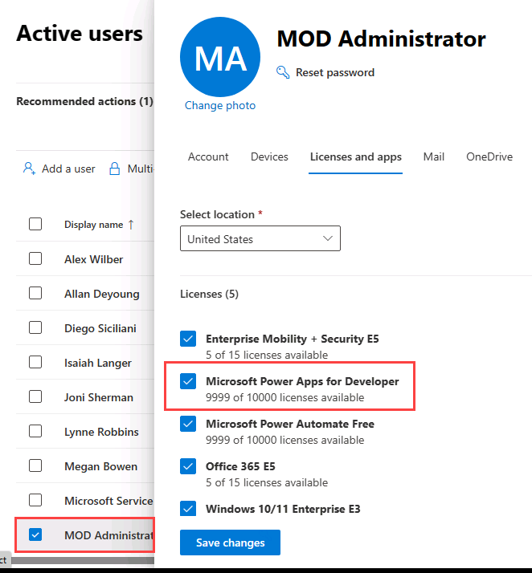
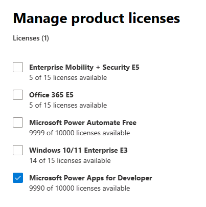

---
lab:
    title: 'Lab 0: Validate lab environment'
    module: 'Learning Path 0: Course Introduction'
---

# Practice Lab 0 - Validate lab environment

> **IMPORTANT:** This lab provides you with a Microsoft 365 tenant and licenses for the Power Platform applications you will be using in this course. You will only be provided with one tenant for the practice labs in this course. The settings and actions you take within this tenant do not roll-back or reset, whereas the virtual machine you are provided with does reset each time you close the lab session. Please be aware that Microsoft 365 and Power Platform are evolving all the time. The instructions in this document may be different from what you experience in your actual tenant. It is also possible to experience a delay of several minutes before the virtual machine has network connectivity to begin the labs.

## WWL Tenants - Terms of Use

If you are being provided with a tenant as a part of an instructor-led training delivery, please note that the tenant is made available for the purpose of supporting the hands-on labs in the instructor-led training.

Tenants should not be shared or used for purposes outside of hands-on labs. The tenant used in this course is a trial tenant and cannot be used or accessed after the class is over and are not eligible for extension.

Tenants must not be converted to a paid subscription. Tenants obtained as a part of this course remain the property of Microsoft Corporation and we reserve the right to obtain access and repossess at any time.

## Exercise 1 – Microsoft Power Platform license

In this exercise, you will add a Power Apps for Developer license to the tenant and assign licenses to users.

### Task 1.1 – Sign up for Power Apps for Developer

1. Verify that you have your **Microsoft 365 credentials** from the Authorized Lab Host available.

1. In a new browser tab, navigate to `https://powerapps.microsoft.com` and select **Try free**.

1. Select **Start building apps**.

1. Enter the `email address` provided by the Authorized Lab Host.

1. Select **Next**.

1. Select **Sign in**.

1. Enter the `password` provided by the Authorized Lab Host.

1. Select **Yes** to stay signed in.

1. Leave the Country or Region as the default value.

1. Enter `0123456789` for business phone number.

1. Select **Get Started**.

1. Select **Get Started** again.

1. The Power Apps maker portal will load in a new tab.

1. If prompted, enter `0123456789` for business phone number and select **Submit**.

### Task 1.2 – Verify your Power Apps license has been assigned to your user

1. In a new browser tab, navigate to `https://admin.microsoft.com`

1. In the left-hand navigation, expand **Users** and select **Active users**.

1. Select your user **MOD Administrator** to open the user details panel and select the **Licenses and apps** tab.

1. Verify an appropriate **Power Apps** license is selected. If not, retry Task 1.1.

   > **Note:** Find out more about Power Apps licensing on [Microsoft Learn](https://learn.microsoft.com/power-platform/admin/signup-for-powerapps-admin).

1. Select the **X** in the top right of the pane to close the panel.

### Task 1.3 – Assign Power Apps licenses to other users

1. In the left-hand navigation, expand **Users** and select **Active users**.

1. Check the boxes next to the other users, select the **ellipses (...)** menu in the action bar, and select **Manage product licenses**.

   

1. Select **Assign more** and select an appropriate **Power Apps** license.

   > **Note:** Find out more about Power Apps licensing on [Microsoft Learn](https://learn.microsoft.com/power-platform/admin/signup-for-powerapps-admin).

   

1. Select **Save changes**.

1. Select **Done**.
