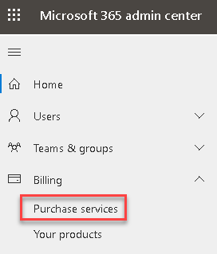
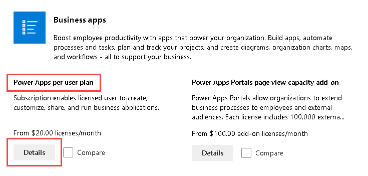
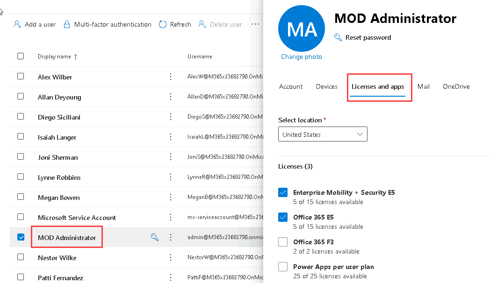
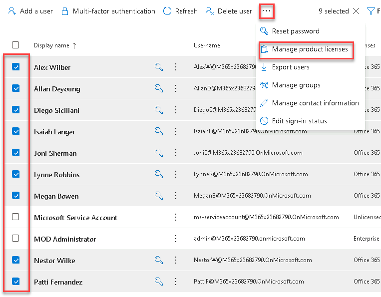
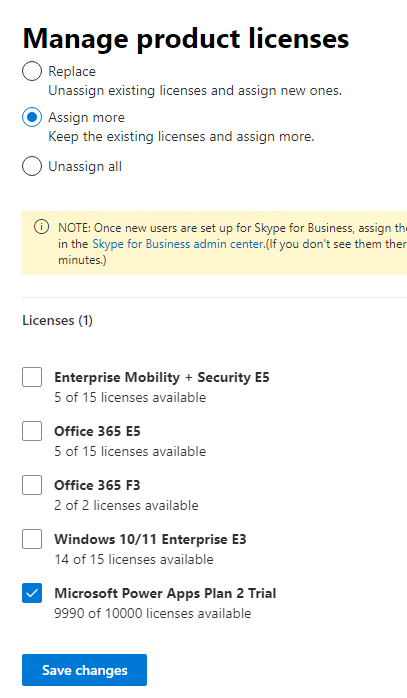

---
lab:
    title: 'Lab 0: Validate lab environment'
    module: 'Module 0: Course Introduction'
---

# Practice Lab 0 - Validate lab environment

> **IMPORTANT:** This lab provides you with a Microsoft 365 tenant and licenses for the Power Platform applications you will be using in this course. You will only be provided with one tenant for the practice labs in this course. The settings and actions you take within this tenant do not roll-back or reset, whereas the virtual machine you are provided with does reset each time you close the lab session. Please be aware that Microsoft 365 and Power Platform are evolving all the time. The instructions in this document may be different from what you experience in your actual tenant. It is also possible to experience a delay of several minutes before the virtual machine has network connectivity to begin the labs.

## Scenario

In this lab, you will download the files required for the labs and acquire a Power Platform trial.

## Exercise 1 - Download lab files

In this exercise, you will download and extract the files required for the labs.

### Task 1.1 - Download lab files from GitHub

1. From the lab virtual machine, click Start and search for PowerShell then open PowerShell as Administrator.

1. Run the following command to create a folder on the D: drive for the  latest version of the lab files.

    ```powershell
    New-Item -Path "D:\" -Name "PL200" -ItemType "directory"
    ```

1. Run the following command to download the latest version of the lab files to the virtual machine.

    ```powershell
    Start-BitsTransfer -Source "https://github.com/MicrosoftLearning/PL-200-Power-Platform-Functional-Consultant/archive/refs/heads/master.zip" -Destination "D:\PL200"
    ```

1. Run the following command to extract the files from the zip file.

    ```powershell
    Expand-Archive -Path 'D:\PL200\master.zip' -DestinationPath 'D:\PL200'
    ```

1. Run the following command to extract the files from the zip file.

    ```powershell
    Move-item -Path "D:\PL200\PL-200-Power-Platform-Functional-Consultant-master\Allfiles\*" -Destination "D:\PL200" -confirm:$false
    ```

> Note: If any of the commands fail simply re-run them and they will successfully complete the second time.

## Exercise 2 – Acquire a Microsoft Power Platform trial

In this exercise, you will add a Power Apps trial to the tenant and assign licenses to users.

### Task 2.1 – Sign up for a Power Apps per user trial

1. Navigate to <https://admin.microsoft.com>.

1. Enter the email address from your Microsoft 365 credentials in the text box that says **Email, phone, or Skype** .

1. Click **Next**.

1. Enter the password from your Microsoft 365 credentials.

1. Click **Sign in**.

1. Select **Yes** to stay signed in.

1. In the left-hand navigation, expand **Billing** and select **Purchase services**.

    

1. In the search all product categories text box, enter **PowerApps** and press **Enter**.

1. Scroll down and locate the **Power Apps per user plan** and click on **Details**.

    

1. Click **Start free trial**.

1. Click **Try now**.

1. Click **Continue**.

### Task 2.2 – Assign Power Apps licenses to your user

1. In the left-hand navigation, expand **Users** and select **Active users**.

1. Select your user **MOD Administrator** to open the user details panel and select the **Licenses and apps** tab. 

1. Check the box for **Power Apps per user plan**.

1. Click **Save changes**.

1. Click on **X** in the top right of the pane to close the panel.

### Task 2.3 – Assign Power Apps licenses to other users

1. In the left-hand navigation, expand **Users** and select **Active users**.

1. Check the boxes next to the other users, click on the **ellipses (...**) in the action bar, and select **Manage product licenses**.

    

1. Select **Assign more** and check the box for **Power Apps per user plan**.

    

1. Click **Save changes**.

1. Click **Done**.
