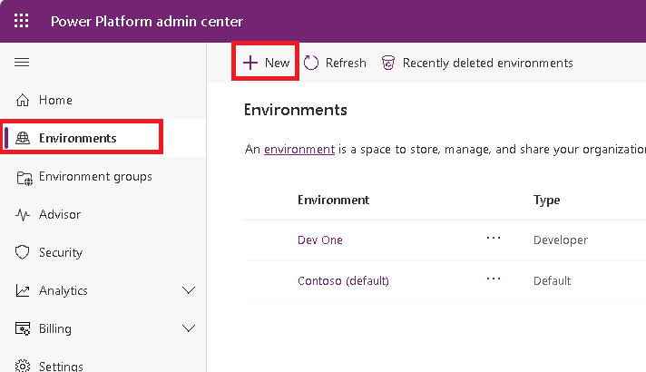
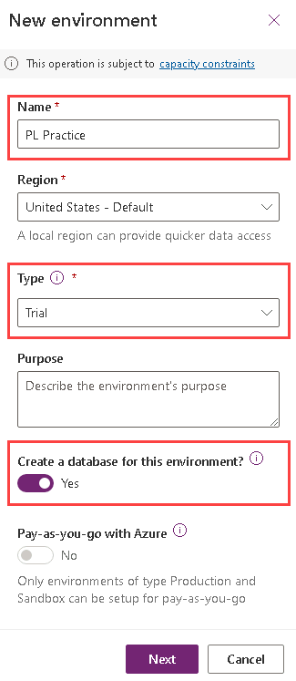
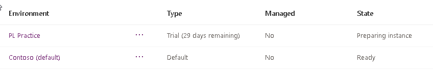
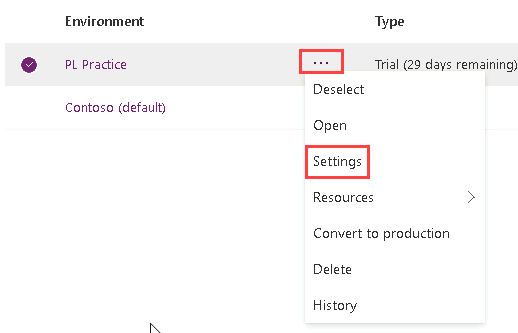
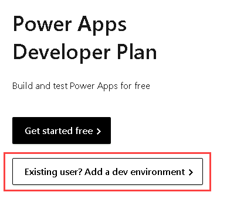
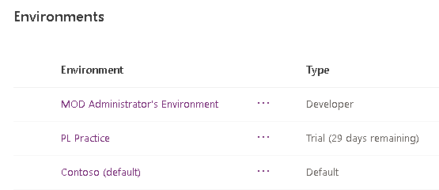
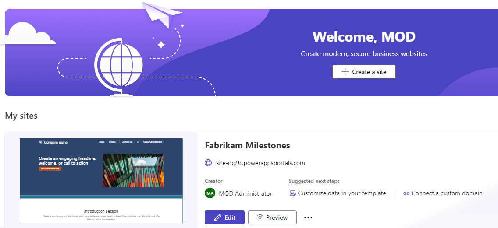

---
lab:
    title: 'Lab 1.1: Environments'
    module: 'Module 1: Work with Microsoft Dataverse'
---

# Practice Lab 1.1 - Create environments

## Scenario

In this lab, you create environments for use during the remainder of the labs.

## Exercise 1 - Create environments

In this exercise, you will create the **Practice** environment that you will do the majority of your lab work in and a developer environment to use to deploy solutions.

**NOTE** Depending on the browser that you are using, it is suggested that you disable any pop-up blockers that maybe enabled. This will prevent popup screens from not appearing as they should.

### Task 1.1 – Create trial environment

1. Navigate to the Power Platform admin center <https://admin.powerplatform.microsoft.com> and sign in with your Microsoft 365 credentials if prompted again.

1. Click **Get Started** if a Welcome to the Power Platform admin center popup is shown.

1. Select **Environments** from the left navigation pane. There should be a single environment, Contoso (default).

1. Click **+ New**.

    

1. In the **Name** text box, enter **[my initials] Practice**. (Example: PL Practice).

1. In the **Type** drop down, select **Trial**. You may see an option for **Trial (subscription-based)**, only select the option that says **Trial**.

1. On the **Create a database for this environment?** toggle, change to **Yes**.

1. Leave all other selections as default and select **Next**.

    

1. On the **Add database** tab, click **Save**.

1. Your **Practice** environment should now show in the list of environments.

    

1. Your Practice environment may take a few minutes to provision. Refresh the page if needed. When your environment shows as Ready, select your **Practice** environment by clicking on the ellipses (...) next to its name to expand the drop down menu and select **Settings**.

    

1. Explore the different areas in **Settings** that you may be interested in but do not make any changes yet.

### Task 1.2 – Create developer environment

1. Navigate to <https://powerapps.microsoft.com/developerplan>.

1. Click **Existing user? Add a dev environment**.

    

1. On the next page, leave the country as United States and click on **Accept**.

1. Your developer environment will be provisioned and the Power Apps maker portal will be opened. If you are prompted to enter a phone number, use 0123456789 and **Submit**.

1. Navigate to the Power Platform admin center <https://admin.powerplatform.microsoft.com/environments>.

1. You should now see three environments; Contoso (default), Practice, and MOD Administrator's Environment.

    

1. You will use the Practice environment for all customizations in the labs. The MOD Administrator's Environment will act as your test/production environment.

## Exercise 2 – Sign up for Power Pages

In this exercise, you will provision a Power Pages site. This can take a while, so you will follow these steps to start the provisioning process in the background while you progress through your labs. You will configure the site in a future lab.

### Task 1.1 - Create a Power Pages site

1. Navigate to the Power Pages portal <https://make.powerpages.microsoft.com/> and sign in with your Microsoft 365 credentials if prompted.

1. Use the Environment selector to switch to your **Practice** environment.

1. Click **Get started**.

1. If you are asked about your experience creating websites, click **Skip**.

1. Select the default design template, **Site Design 001**, and select **Choose this template**.

1. Enter **Fabrikam Milestones** for **Give your site a name**.

1. Use the autogenerated web address.

1. Click **Done**.

> The portal site will deploy. It can take around an hour for your site to fully deploy. You can continue to the next labs while this completes. 

