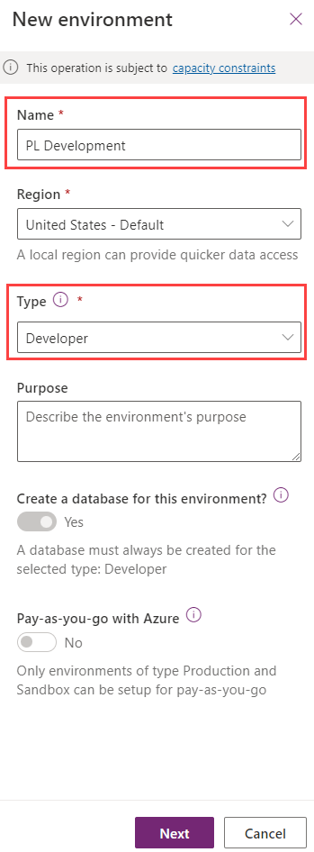
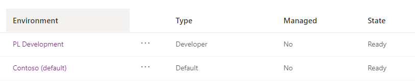
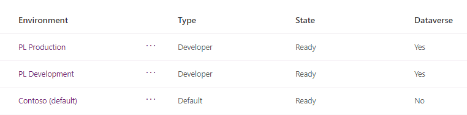

---
lab:
    title: 'Lab 1.1: Environments'
    module: 'Learning Path 1: Work with Microsoft Dataverse'
---

# Practice Lab 1.1 - Create environments

## Scenario

In this lab, you create environments for use during the remainder of the labs.

## Exercise 1 - Create environments

In this exercise, you will create a *Development* environment that you will do the majority of your lab work in and a *Production* environment to deploy solutions into. You will use the *Developer* environment type for both environments that you create.

**Note:** Depending on the browser that you are using, it is suggested that you disable any pop-up blockers that maybe enabled. This will allow pop-up windows to appear as they should.

### Task 1.1 – Create the development environment

1. Navigate to the Power Platform admin center `https://aka.ms/ppac` and sign in with your Microsoft 365 credentials if prompted again.

1. Select **Get Started** or close the Welcome pop-up.

1. Select **Environments** from the left navigation pane. There should be a default environment, Contoso (default), and possibly other environments.

1. Select **+ New**.

   

1. In the **Name** text box, enter **[my initials] Development**. (Example: PL Development).

1. In the **Type** drop down, select **Developer**.

1. Leave all other selections as default and select **Next**.

   

1. On the **Add Dataverse** tab, select **Save**.

1. Your **Development** environment should now show in the list of environments.

   

1. Your Development environment may take a few minutes to provision. Select **Refresh** if needed. When your environment **State** shows as **Ready**, select your **Development** environment by clicking on the ellipses (...) next to its name to expand the drop down menu and select **Settings**.

   

1. Explore the different areas in **Settings** that you may be interested in but do not make any changes yet.

### Task 1.2 – Create the production environment

1. Navigate to environments in the Power Platform admin center `https://admin.powerplatform.microsoft.com/environments`.

1. Select **+ New**.

1. In the **Name** text box, enter **[my initials] Production**. (Example: PL Production).

1. In the **Type** drop-down, select **Developer**.

1. Leave all other selections as default and select **Next**.

1. On the **Add Dataverse** tab, select **Save**.

1. You should now see the following environments; Contoso (default), Development, and Production.

   

   > **Note:** You will use the *Development* environment for all customizations in the labs. The *Production* environment will act as your production environment to import solutions into.

### Task 1.3 – Enable classic solution explorer

1. Navigate to environments in the Power Platform admin center `https://admin.powerplatform.microsoft.com/environments`.

1. Select the *Development* environment you created.

1. Select **Settings**.

1. Expand **Product** and select **Behavior**.

1. Toggle *How the Switch to classic button in Power Apps* to **On**.

1. Select **Save**.
