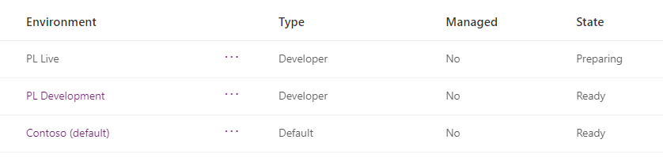

---
lab:
    title: 'Lab 1.1: Environments'
    module: 'Module 1: Work with Microsoft Dataverse'
---

# Practice Lab 1.1 - Create environments

## Scenario

In this lab, you create environments for use during the remainder of the labs.

## Exercise 1 - Create environments

In this exercise, you will create a *Live* environment to deploy solutions into.

**Note:** Depending on the browser that you are using, it is suggested that you disable any pop-up blockers that maybe enabled. This will allow pop-up windows to appear as they should.

### Task 1.1 – Create development environment

1.  Navigate to the Power Platform admin center `https://aka.ms/ppac` and sign in with your Microsoft 365 credentials if prompted again.

1.  Select **Get Started** or close the Welcome pop-up.

1.  Select **Environments** from the left navigation pane. There should be two environments, Contoso (default) and Dev One.

1.  Select **+ New**. 

1.  In the **Name** text box, enter **[my initials] Live**. (Example: PL Live).

1.  In the **Type** drop-down, select **Developer**.

1.  Leave all other selections as default and select **Next**.

1.  On the **Add Dataverse** tab, select **Save**.

1.  You should now see three environments; Contoso (default), Dev One, and Live.

    

    > **Note:** You will use the *Dev One* environment for all customizations in the labs. The *Live* environment will act as your test/production environment.
