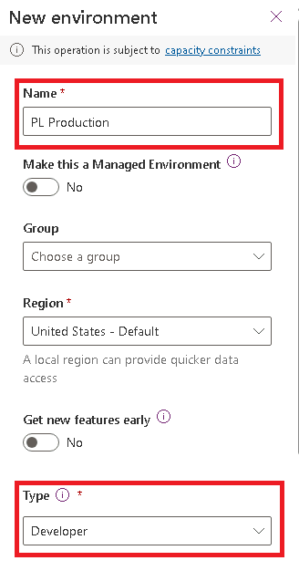

---
lab:
    title: 'Lab 1.1: Environments'
    module: 'Learning Path 1: Work with Microsoft Dataverse'
---

# Practice Lab 1.1 - Environments

## Scenario

The tenant includes an environment named **Dev One** that you will do the majority of your lab work in. In this lab, you create another environment for use during the remainder of the labs. You will use the *Developer* environment type for both environments.

**Note:** Depending on the browser that you are using, it is suggested that you disable any pop-up blockers that maybe enabled. This will allow pop-up windows to appear as they should.

## Exercise 1 - Explore and create environments

In this exercise, you will review the **Dev One** environment and create a *Production* environment to deploy solutions into.

### Task 1.1 - Explore the development environment

1.  Navigate to the Power Platform admin center `https://aka.ms/ppac` and sign in with your Microsoft 365 credentials, if prompted again.

1.  Select **Get Started** or close the Welcome pop-up.

1.  Select **Manage** and then select **Environments** from the left navigation pane. There should be two environments, Contoso (default) and Dev One..

    

1.  Select the **Dev One** environment by selecting the ellipsis **...** drop-down menu, and select **Settings**.

1.  Explore the different areas in **Settings** that you may be interested in but do not make any changes yet.

### Task 1.2 – Create the production environment

1.  Navigate to **Environments** in the Power Platform admin center `https://admin.powerplatform.microsoft.com/manage/environments`

1. Select **Manage** and select **Environments.**
  
1.  Select **+ New**.

1.  In the **Name** text box, enter **[my initials] Production**. (Example: PL Production).

1.  In the **Type** drop-down, select **Developer**.

    

1.  Leave all other selections as default and select **Next**.

1.  On the **Add Dataverse** tab, select **Save**.

1.  Wait while the Production environment takes a few minutes to provision. Select **Refresh** if needed. It is finished when the **State** shows as **Ready**. 

1.  You should now see the following environments; Production, Contoso (default) and Dev One.

    

    > **Note:** You will use the *Dev One* environment for all customizations in the labs. The *Production* environment will act as your live environment to import completed solutions into.

### Task 1.3 – Verify Classic solution explorer is enabled

1.  Navigate to environments in the Power Platform admin center `https://admin.powerplatform.microsoft.com/manage/environments`

1.  Select the **Dev One** environment. 

1.  Select **Settings**. 

1.  Expand **Product** and select **Behavior**. 

1.  Under **Display behavior**, verify that **Show the Switch to classic buttons in Power Apps** is set to **On**.

1.  If necessary, select **Save**. Otherwise, **close** the tab. 

