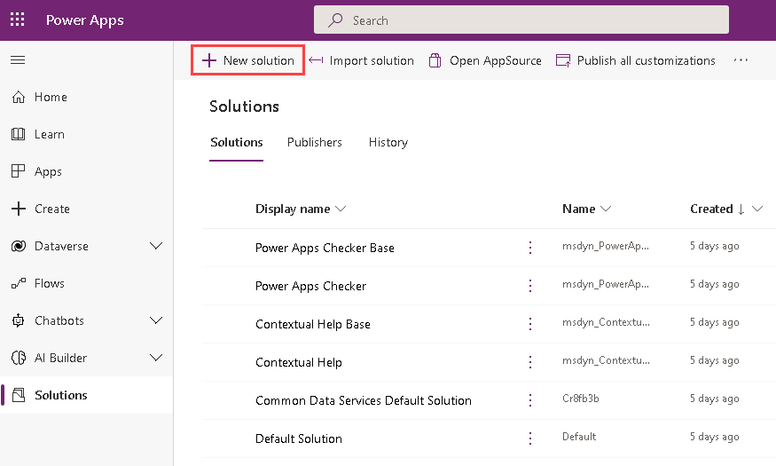
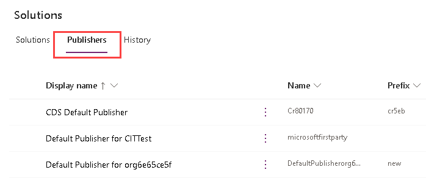

---
lab:
    title: 'Lab 1.2: Publisher and Solution'
    module: 'Module 1: Work with Microsoft Dataverse'
---

# Practice Lab 1.2 - Publisher and Solution

## Scenario

In this lab, you create a publisher and a solution.

## Exercise 1 - Create publisher and solution

In this exercise, you will access the Power Apps maker portal, the **Practice** environment and create a new solution.

### Task 1 – Maker portal

1. Navigate to the Power Apps Maker portal <https://make.powerapps.com> and sign in with your Microsoft 365 credentials if prompted again.

1. Switch environments by using the Environment Selector in the upper right corner of the screen. The Contoso (Default) environment will be selected by default.

1. Select the **Practice** environment from the list. 

1. Select **Apps** from the left navigation pane. You should see a single app, Solution Health Hub, listed.

1. Select and expand **Dataverse** from the left navigation pane. Select **Tables**. You should see the standard tables from the Common Data Model.

### Task 2 – Create a publisher

1. Select **Solutions** from the left navigation pane. You should see several solutions including the Default solution and the Common Data Services solution. 

1. Select the **Publishers** tab. 

1. Click **+ New publisher**.

1. In the **Display name** text box, enter **Fabrikam**.

1. In the **Name** text box, enter **fabrikam**.

1. In the **Prefix** text box, enter **fab**.

1. Click **Save**. 

### Task 3 – Create a solution

1. Select the **Solutions** tab.

1. Click **+ New solution**.

1. In the **Display name** text box, enter **[my initials] Practice solution**. The Name text box should be automatically populated.

1. In the Publisher drop-down, select **Fabrikam**.

1. Click **Save**. 

## Exercise 2 - Add components to the solution

In this exercise, you will access the Power Apps maker portal and select the **Practice** environment.

### Task 1 – Add table

1. Navigate to the Power Apps Maker portal <https://make.powerapps.com>.

1. Make sure you are in the Practice environment.

1. Select **Solutions**.

1. Select the Practice solution you created in the previous exercise. 

1. Click on **Add existing** and select **Table**. 

1. Select the **Account** table. 

1. Click **Next**.

1. Click **Select Objects**.

1. In the **Columns** tab, select the **Account Number** column.

1. Select the **Views** tab.

1. Select the **Active Accounts** view.

1. Select the **Forms** tab.

1. Select the **Account** form.

1. Click on **Add**.

1. You should have selected 1 view, 1 form, and 1 column for the account able. 

1. Click on **Add**.
