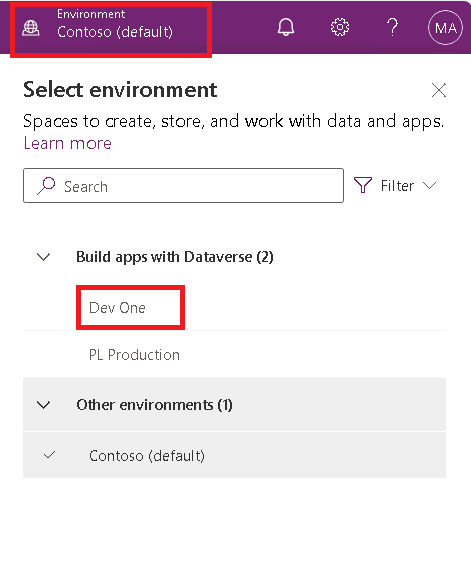
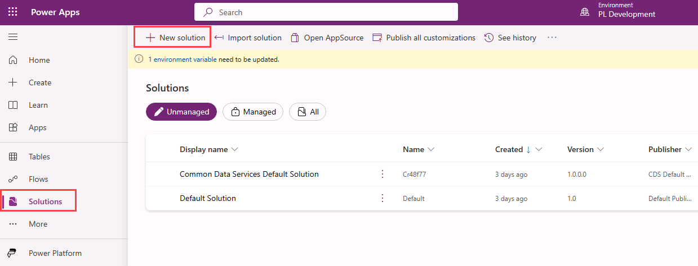
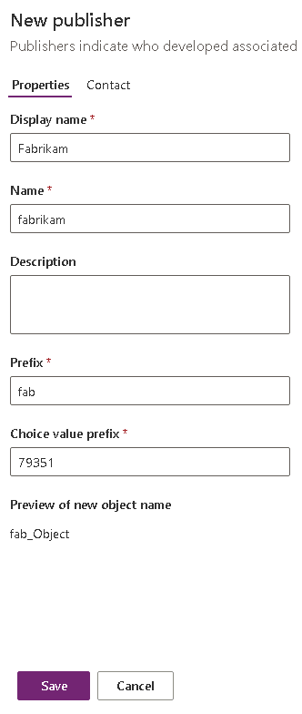
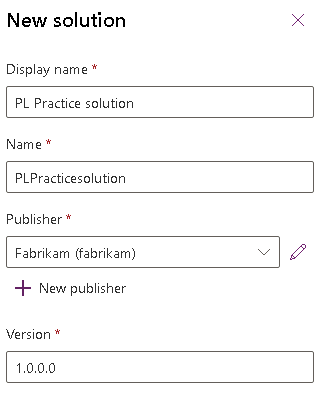
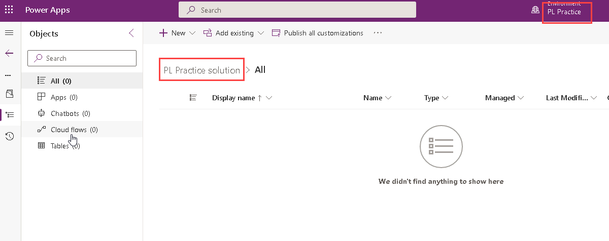
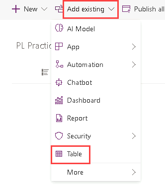
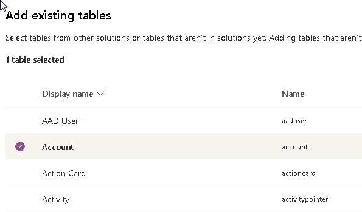
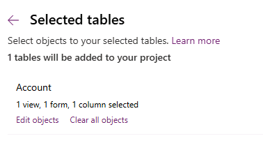

---
lab:
    title: 'Lab 1.2: Publisher and Solution'
    module: 'Learning Path 1: Work with Microsoft Dataverse'
---

# Practice Lab 1.2 - Publisher and Solution

## Scenario

In this lab, you will create a publisher and a solution.

## Exercise 1 - Create publisher and solution

In this exercise, you will access the Power Apps maker portal, the Developer environment and create a new solution.

### Task 1.1 – Maker portal

1.  In a new tab, navigate to the Power Apps Maker portal `https://make.powerapps.com` and sign in with your Microsoft 365 credentials if prompted again.

1.  If you are prompted for a **Phone number** enter `0123456789` and select **Submit**.

1.  Switch environments by using the Environment Selector in the upper right corner of the screen.

1.  Select the **Dev One** environment from the list.

    

1.  Select **Apps** from the left navigation pane and then select **All**. You should see several apps including, Power Platform Environment Settings, Solution Health Hub, and Power Pages Management listed.

1.  Select **Tables** from the left navigation pane. You should see the standard tables from the *Common Data Model* including Account and Contact.

### Task 1.2 – Create solution and publisher

1.  Select **Solutions** from the left navigation pane. You should see several solutions including the *Default Solution* and the *Common Data Services Default Solution*.

    

1.  Select **+ New solution**.

1.  In the **Display name** text box, enter **`[my initials] Practice solution`**

1.  Verify that **Name** is automatically populated.

1.  Select **+ New publisher** below the **Publisher** drop-down.

1.  For **Display name**, enter `Fabrikam`

1.  For **Name**, enter `fabrikam`

1.  For **Prefix**, enter `fab`

    

1.  Select **Save**.

1.  In the **Publisher** drop-down, select **Fabrikam (fabrikam)**.

1.  Select **Create**.

    

## Exercise 2 - Add components to the solution

In this exercise, you will add an existing table to the solution.

### Task 2.1 – Add table

1.  Navigate to the Power Apps Maker portal `https://make.powerapps.com`

1.  Make sure you are in the **Dev One** environment.

1.  Select **Solutions**.

1.  Select the **Practice solution**, from the previous exercise.

    

1.  Select **Add existing** and choose **Table**.

    

1.  Select the **Account** table.

    

1.  Select **Next**.

1.  Under the **Account** table, select the **Edit objects** link.

1.  In the **Columns** tab, select the **Account Number** column.

1.  Select the **Views** tab.

1.  Select the **Active Accounts** view.

1.  Select the **Forms** tab.

1.  Select the **Account** form.

1.  Select **Add**.

    > **Note:** You should have selected 1 view, 1 form, and 1 column for the **Account** table.

    

1.  Select **Add**.

