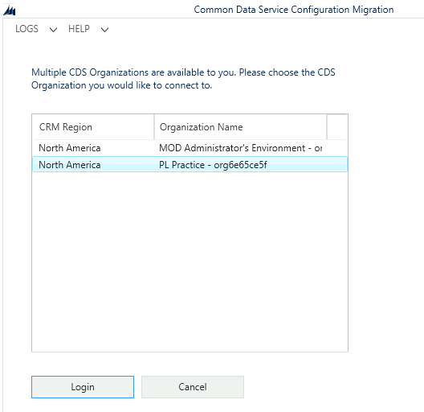

---
lab:
    title: 'Lab 1.3: Import solution'
    module: 'Module 1: Work with Microsoft Dataverse'
---

# Practice Lab 1.3 - Import solution

## Scenario

Fabrikam is an environmental consultancy that advises customers on programs and related projects covering water, air, and soil.

Fabrikam works long-term with its customers to improve the sustainability of natural resources. A Power Platform solution has been built by Contoso for Fabrikam to support the delivery of programs and projects.

You are a Power Platform functional consultant and have been assigned to the Fabrikam project for the next stage of the project.

You need to prepare your development environment by importing solutions and data.

The solutions contain:

- Microsoft Dataverse data model
- Security roles
- Business rules
- Classic workflows
- Model-driven apps
- Charts and dashboards
- Canvas app
- Cloud flows
- Business process flows
- Power Virtual Agents chatbot

In this lab, you will import the developed solutions and data.

## Exercise 1 - Import starter solutions

In this exercise, you will import the main solution into the **Practice** environment.

### Task 1.1 – Main solution

1. Navigate to <https://make.powerapps.com>.

1. Make sure you are in your **Practice** environment.

1. Select **Solutions**.

1. Click **Import solution**.

1. Click **Browse** and locate the **FabrikamEnvironmental_1_1_11_3.zip** file and click **Open**.

> This file is located in the Documents\PL-200 folder on your machine.
    

1. Click **Next**.

1. Click **Next** again.

1. You need to create connections for the solution.

    

1. For the Approvals connection click **Select a connection** and then **+ New connection**.

1. A new tab will open in the browser. Click **Create**.

    

1. Switch back to the tab where you are importing the solution and click **Refresh**.

1. For the Microsoft Dataverse connection, click **Select a connection** and then **+ New connection**.

1. A new tab will open in the browser. Click **Create**. If prompted, sign in with your Microsoft 365 credentials.

1. Switch back to the tab where you are importing the solution and click **Refresh**.

1. Both connections should be selected.

    

1. Click **Import**. 
    
    The solution will import in the background. This may take a few minutes. Wait until the import has completed.

    

### Task 1.2 – Power Virtual Agents solution

1. Navigate to <https://make.powerapps.com>.

1. Make sure you are in your **Practice** environment.

1. Select **Solutions**.

1. Click **Import solution**.

1. Click **Browse** and locate the **FabrikamChatbot_1_1_1_1.zip** file and click **Open**.

> This file is located in the Documents\PL-200 folder on your machine.

1. Click **Next**.

1. Click **Import**. The solution will import in the background.

## Exercise 2 - Import data

In this exercise, you will import data the into the **Practice** environment using the Configuration Migration Tool.

### Task 2.1 - Import data

1. In your lab virtual machine, open **File Explorer**.

1. Navigate to **Documents\PL-200\ConfigurationMigration**.

1. Double-click on **DataMigrationUtility.exe**

    

1. Select **Import data**.

1. Click **Continue**.

1. Select **Office 365** for **Deployment Type**.

1. Check the **Display list of available organizations** box.

1. Enter your Microsoft 365 tenant credentials.

    

1. Click **Login**.

    

1. Select your **Practice** environment.

1. Click **Login**.

    

1. Click on the ellipses (...) and locate and select **Fabrikam Environment data.zip** file

> This file is located in the Documents\PL-200 folder on your machine.

1. Click **Open**. The data file will be validated.

1. Click **Import Data**. The import process will take approximately a minute.

1. Click **Exit**.

1. Click on **X** to close the Configuration Migration Tool.
