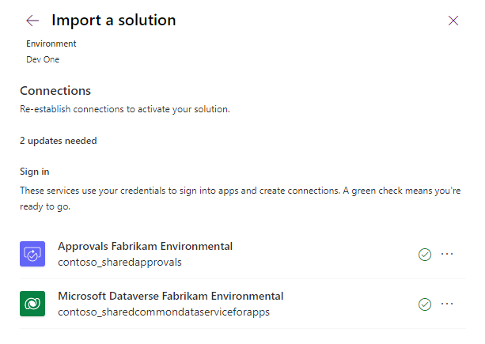
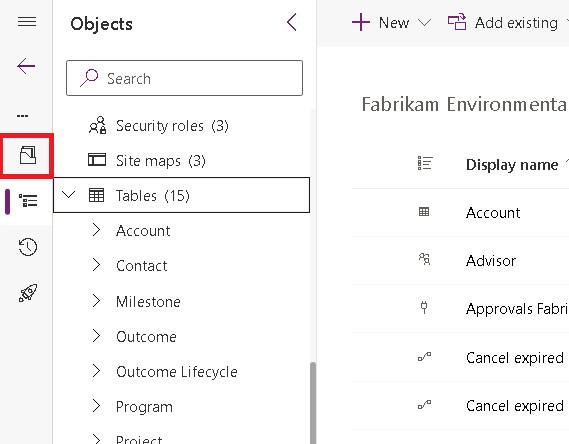

---
lab:
    title: 'Lab 1.3: Import solution'
    module: 'Learning Path 1: Work with Microsoft Dataverse'
---

# Practice Lab 1.3 - Import solution

## Scenario

Fabrikam is an environmental consultancy that advises customers on programs and related projects covering water, air, and soil.

Fabrikam works long-term with its customers to improve the sustainability of natural resources. A Power Platform solution has been built by Contoso for Fabrikam to support the delivery of programs and projects.

You are a Power Platform functional consultant and have been assigned to the Fabrikam project for the next stage of the project.

You need to prepare your development environment by importing solutions and data.

The solutions contain:

- Microsoft Dataverse data model
- Security roles
- Business rules
- Dataverse classic workflows
- Model-driven apps
- Charts and dashboards
- Canvas app
- Cloud flows
- Business process flows

In this lab, you will import the developed solutions and data.

## Exercise 1 - Import Fabrikam solutions

In this exercise, you will import the main solution into the **Development** environment.

### Task 1.1 – Main solution

1. Navigate to `https://make.powerapps.com`

1. Make sure you are in your **Development** environment.

1. Select **Solutions**.

1. Select **Import solution**.

1. Select **Browse** and locate the **FabrikamEnvironmental_1_1_11_3.zip** file and select **Open**.

   > **Note:** This file is located in the Documents\PL-200 folder on your machine.

   

1. Select **Next**.

1. Select **Next** again.

1. You need to create connections for the solution.

   

1. For the Approvals connection, in the **Select a connection** drop-down, choose **+ New connection**.

1. A new tab will open in the browser. Select **Create**.

   

1. Switch back to the tab where you are importing the solution and select **Refresh**.

1. For the Microsoft Dataverse connection, in the **Select a connection** drop-down, choose **+ New connection**.

1. A new tab will open in the browser. Select **Create**. If prompted, sign in with your Microsoft 365 credentials.

1. Switch back to the tab where you are importing the solution and select **Refresh**.

1. Both connections should now be configured.

   

1. Select **Import**.

   The solution will import in the background. This may take a few minutes.

   

   > **Alert:** Wait until the solution has finished importing before continuing to the next step.

1. When the solution has imported successfully, open the **Fabrikam Environmental** solution.

1. In the solution, select the **Overview** page.

   

1. Select **Publish all customizations**.

## Exercise 2 - Import data

In this exercise, you will import data the into the **Development** environment using the Configuration Migration Tool and import Outcome rows into your Microsoft Dataverse environment using a dataflow.

### Task 2.1 - Import data

1. In your lab virtual machine, open **File Explorer**.

1. Navigate to **Documents\PL-200\ConfigurationMigration**.

1. Double-click on **DataMigrationUtility.exe**

   

1. Choose **Import data**.

1. Select **Continue**.

1. Select **Office 365** for **Deployment Type**.

1. Check the **Display list of available organizations** box.

1. Enter your Microsoft 365 tenant credentials.

   

1. Select **Login**.

   

1. Choose your **Development** environment.

1. Select **Login**.

   

1. Select the ellipses (...) and locate and select **Fabrikam Environment data.zip** file.

   > **Note:** This file is located in the Documents\PL-200 folder on your machine.

1. Select **Open**. The data file will be validated.

1. Select **Import Data**. The import process will take approximately a minute.

1. Select **Exit**.

1. Select the **X** to close the Configuration Migration Tool.

### Task 2.2 – Load Excel file to OneDrive

1. Navigate to the Power Apps Maker portal `https://make.powerapps.com`

1. Select the **Waffle** button in the upper left corner to change applications and select **OneDrive**. (It may take a moment for your OneDrive to be set up. Click **Your OneDrive is ready** when you see it on the screen.)

1. Select **+ Add New** and select **Files upload**.

1. Locate and select the **Outcome data.xlsx** file and select **Open**.

    > This file should be located in the Documents\PL-200 folder on your machine.

### Task 2.3 – Create a dataflow

1. Navigate to the Power Apps Maker portal `https://make.powerapps.com`

1. Make sure you are in your **Development** environment.

1. Select **Tables** from the left navigation menu.

1. Select **Import** from the action menu, then select **Import data**.

1. In the **Choose data source** dialog, select **Excel workbook**.

1. Select **Browse OneDrive**. If prompted, sign in with your Microsoft 365 credentials.

1. Select the **Outcome data.xlsx** file you uploaded to OneDrive.

1. Select **Next**.

1. Check the box next to **Table1**.

1. Select **Next**. Do not navigate away from this page.

1. Select the first three **Do Not Modify** columns. Tip: You can hold **Ctrl** on the keyboard and select with the mouse to select multiple columns.

1. On the **Home** tab of the ribbon, select **Remove columns** to remove these three columns.

1. Select the **Estimated Completion Date** column.

1. Right-click on the **Estimated Completion Date** column and select **Replace values**.

1. Enter `null` for **Value to find**.

1. For **Replace with**, enter a date in three months time. Use date format **MM/DD/YYYY**.

1. Select **OK**. The Estimated Completion Dates should show the date chosen.

1. Select **Next**.

1. Select **Load to existing table**.

1. Select **contoso_outcome** from the **Destination table** drop-down.

1. Under **Column mapping**, map **Estimated Completion Date**, **Goal**, **Outcome Description**, **Outcome status**, **Outcome Title**,  and **Target Aim** to their corresponding destination columns.

1. Select **Next**.

1. Select **Refresh manually**.

1. Select **Publish**.

### Task 2.4 – Test Your work

1. Navigate to the Power Apps Maker portal `https://make.powerapps.com`

1. Select **Tables**.

1. Locate and open the **Outcome** table.

1. You should see all the imported **Outcome** rows.

1. In the Maker portal, select **Apps**.

1. For the **Environmental Project Delivery** model-driven app, select the ellipses (...) and select **Play**, signing in with your Microsoft 365 credentials if prompted.

1. In the left-hand navigation of the app, select **Outcomes**.

1. The imported **Outcome** records should be in the view.

1. Select the title to open one of the imported **Outcome** records.

1. Verify the **Estimated Completion Date** column is set to the future date.

1. Verify the **Outcome Lifecycle** business process flow is visible at the top of the form.

## Exercise 3 - Sign up for Power Pages

In this exercise, you will provision a Power Pages site. This can take a while, so you will follow these steps to start the provisioning process in the background while you progress through your labs. You will configure the site in a future lab.

### Task 3.1 - Create a Power Pages site

1. Navigate to the Power Pages portal `https://make.powerpages.microsoft.com/` and sign in with your Microsoft 365 credentials if prompted.

1. Use the Environment selector to switch to your **Development** environment.

1. Select **Get started**.

1. If you are asked about your experience creating websites, select **Skip**.

1. Choose the default design template, **Starter layout 1**, and select **Choose this template**.

   

1. Enter `Fabrikam Milestones` for **Give your site a name**.

1. Use the autogenerated web address.

1. Select **Done**.

   > The portal site will deploy. It can take around an hour for your site to fully deploy.

   
