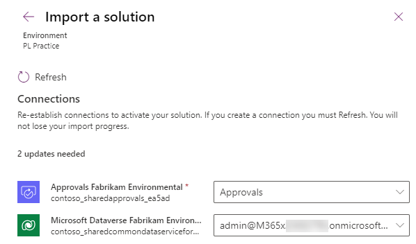

---
lab:
    title: 'Lab 1.3: Import solution'
    module: 'Module 1: Work with Microsoft Dataverse'
---

# Practice Lab 1.3 - Import solution

## Scenario

Fabrikam are an environmental consultancy that advises customers on programs and related projects covering water, air, and soil.

Fabrikam work long-term with their customers to improve the sustainability of natural resources. A Power Platform solution has been built by Contoso for Fabrikam to support the delivery of programs and projects.

You are a Power Platform functional consultant and have been assigned to the Fabrikam project for the next stage of the project.

You need to prepare your development environment by importing solutions and data.

The solutions contain:

- Microsoft Dataverse data model
- Security roles
- Business rules
- Classic workflows
- Model-driven apps
- Charts and dashboards
- Canvas app
- Cloud flows
- Business process flows
- Power Virtual Agents chatbot

In this lab, you will import the developed solutions and data.

## Exercise 1 - Import starter solutions

In this exercise, you will import the main solution into the **Practice** environment.

### Task 1.1 – Main solution

1. Navigate to <https://make.powerapps.com>.

1. Make sure you are in the **Practice** environment you created. 

1. Select **Solutions**.

1. Click **Import solution**. 

1. Click **Browse** and navigate to the **D:\PL200\Labs** folder and select the **FabrikamEnvironmental_1_1_11_3.zip** file and click on **Open**. 

1. Click **Next**.

1. Click **Next**. 

1. You need to create connections for the solution. 

1. For the Approvals connection click **Select a connection** and then **+ New connection**.

1. A new tab will open in the browser. Click **Create**. 

1. Switch back to the tab where you are importing the solution and click **Refresh**.

1. For the Microsoft Dataverse connection click **Select a connection** and then **+ New connection**.

1. A new tab will open in the browser. Click **Create**. If prompted, sign in with your Microsoft 365 credentials. 

1. Switch back to the tab where you are importing the solution and click **Refresh**.

1. Both connections should be selected. 

1. Click **Import**. The solution will import in the background. Wait until the import has completed. 

### Task 1.2 – Power Virtual Agents solution

1. Navigate to <https://make.powerapps.com>.

1. Make sure you are in the **Practice** environment you created.

1. Select **Solutions**.

1. Click **Import solution**.

1. Click **Browse** and navigate to the **D:\PL200\Labs** folder and select the **FabrikamChatbot_1_1_1_1.zip** file and click on **Open**.

1. Click **Next**.

1. Click **Next**.

1. Click **Import**. The solution will import in the background.
