---
lab:
    title: 'Lab 1.6: Relationships'
    module: 'Learning Path 1: Work with Microsoft Dataverse'
---

# Practice Lab 1.6 – Relationships

## Scenario

You are a Power Platform functional consultant and have been assigned to the Fabrikam project for the next stage of the project.

In this practice lab, you will be modifying the properties of existing relationships, creating new relationships, and creating rollup columns.

You will then export your customizations from the solution and import them into another environment.

## Exercise 1 – Change relationship behaviors

In this exercise, you will be modifying the cascade relationships for the project table. The Region to Project relationship will be changed to referential, restricted and the Project to Milestone relationship will be changed to custom.

### Task 1.1 – Region-Project relationship

1. Navigate to the Power Apps Maker portal `https://make.powerapps.com`

1. Make sure you are in your **Development** environment.

1. Select **Solutions**.

1. Open the **Fabrikam Environmental** solution.

1. In the **Objects** pane on the left, expand **Tables**.

1. Select the **Project** table.

1. Under **Schema**, select **Relationships**.

1. Scroll down and select the **Region** relationship.

1. In the **Many-to-one** pane that appears on the right-hand side of the screen, expand **Advanced options**.

1. Change the **Delete** drop-down to **Restrict**.

1. Select **Done**.

    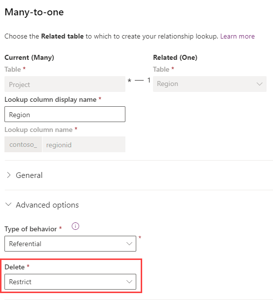

### Task 1.2 – Project-Milestone relationship

1. In the **Project** table **Relationships**, select **Project** from the table. Note that this relationship uses **Project** as the Display name and **contoso_project_milestone** as the Name.

1. In the **One-to-many** pane that appears on the right-hand side of the screen, expand **Advanced options**.

1. Change the **Type of behavior** drop-down to **Custom**.

1. Change the **Delete** drop-down to **Restrict**.

1. Change the **Assign** drop-down to **Cascade Active**.

1. Change the **Share** drop-down to **Cascade User-Owned**.

1. Change the **Unshare** drop-down to **Cascade User-Owned**.

1. Select **Done**.

    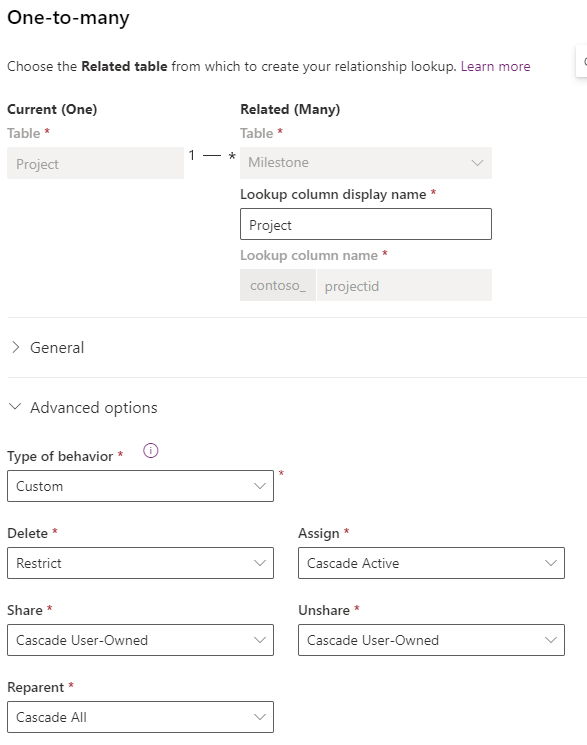

## Exercise 2 – Add new relationship

In this exercise, you will create a new relationship between the Resource and Project tables to create a lookup for the Lead Resource on the Project.

### Task 2.1 – Create new Project Lead relationship

1. Navigate to the Power Apps Maker portal `https://make.powerapps.com`

1. Make sure you are in your **Development** environment.

1. Select **Solutions**.

1. Open the **Fabrikam Environmental** solution.

1. In the **Objects** pane on the left, expand **Tables**.

1. Select the **Project** table.

1. Under **Schema**, select **Relationships**.

1. Select **+ New relationship** and choose **Many-to-one**.

1. In the **Many-to-one** pane that appears on the right-hand side of the screen, select **Resource** in the **Related (One)** drop-down.

1. Enter `Project Lead` for **Lookup column display name**.

1. Enter `projectleadresourceid` for **Lookup column name**.

1. Expand **General**.

1. Enter `resource_project_projectlead` for **Relationship name**.

1. Expand **Advanced options**.

1. Change the **Delete** drop-down to **Restrict**.

1. Select **Done**.

    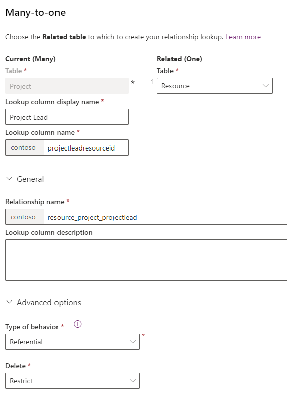

1. In the **Objects** pane on the left, select **Columns** for the **Project** table.

1. Select the **Project Lead** column.

1. In the **Edit column** pane that appears on the right-hand side of the screen, expand **Advanced options** and scroll down.

1. Check the **Enable auditing** box.

1. Select **Save**.

## Exercise 3 – Hierarchical relationship

In this exercise, you will create a new hierarchical relationship on the region table.

### Task 3.1 – Create new hierarchical relationship

1. Navigate to the Power Apps Maker portal <https://make.powerapps.com>.

1. Make sure you are in your **Development** environment.

1. Select **Solutions**.

1. Open the **Fabrikam Environmental** solution.

1. In the **Objects** pane on the left, expand **Tables**.

1. Select the **Region** table.

1. Select **+ New**, and then select **Relationship** and then select **+ One-to-many**.

1. In the **One-to-many** pane that appears on the right-hand side of the screen, select **Region** in the **Related (Many)** drop-down.

1. Enter `Parent Region` for **Lookup column display name**.

1. Enter `parentregionid` for **Lookup column name**.

1. Check the **Hierarchical** box.

1. Expand **General**.

1. Enter `parentregion_region` for **Relationship name**.

1. Expand **Advanced options**.

1. Change the **Delete** drop-down to **Restrict**.

1. Select **Done**.

    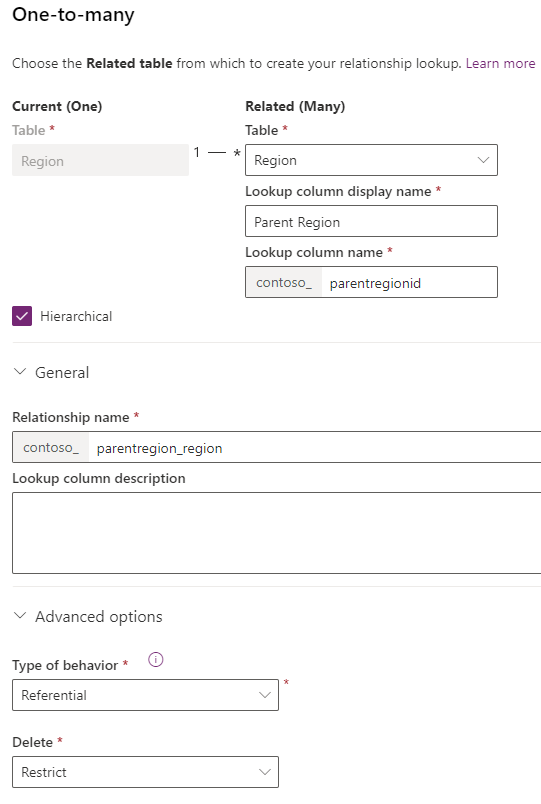

## Exercise 4 – Project Outcome relationships

In this exercise, you will create two many-to-one relationships for the Project Outcome table to the Project and Outcome tables. These relationships will be used to replace the many-to-many relationship between the Project and Outcome tables.

### Task 4.1 – Create new relationship to Project

1. Navigate to the Power Apps Maker portal `https://make.powerapps.com`

1. Make sure you are in your **Development** environment.

1. Select **Solutions**.

1. Open the **Fabrikam Environmental** solution.

1. In the **Objects** pane on the left, expand **Tables**.

1. Select the **Project Outcome** table.

1. Under **Schema**, select **Relationships**.

1. Select **+ New relationship** and then select **Many-to-one**.

1. In the **Many-to-one** pane that appears on the right-hand side of the screen, select **Project** in the **Related (One)** drop-down.

1. Enter `Project` for **Lookup column display name**.

1. Enter `projectid` for **Lookup column name**.

1. Expand **General**.

1. Enter `project_projectoutcome` for **Relationship name**.

1. Expand **Advanced options**.

1. Change the **Type of behavior** drop-down to **Parental**.

1. Select **Done**.

### Task 4.2 – Create new relationship to Outcome

1. Select **+ New relationship** and then select **Many-to-one**.

1. In the **Many-to-one** pane that appears on the right-hand side of the screen, select **Outcome** in the **Related (One)** drop-down.

1. Enter `Outcome` for **Lookup column display name**.

1. Enter `outcomeid` for **Lookup column name**.

1. Expand **General**.

1. Enter `outcome_projectoutcome` for **Relationship name**.

1. Expand **Advanced options**.

1. Change the **Type of behavior** drop-down to **Parental**.

1. Select **Done**.

    > **Note:** An error will be shown saying that you cannot create another parental relation with the contoso_outcome table.

1. Change the **Type of behavior** drop-down to **Referential**.

1. Change the **Delete** drop-down to **Restrict**.

1. Select **Done**.

### Task 4.3 – Set required and enable auditing on new lookup columns

1. In the **Objects** pane on the left, select **Columns** for the **Project Outcome** table.

1. Select the **Project** column.

1. In the **Edit column** pane that appears on the right-hand side of the screen, change the **Required** drop-down to **Business required**.

1. Expand **Advanced options** and scroll down.

1. Check the **Enable auditing** box.

1. Select **Save**.

1. Select the **Outcome** column.

1. In the **Edit column** pane that appears on the right-hand side of the screen, change the **Required** drop-down to **Business required**.

1. Expand **Advanced options** and scroll down.

1. Check the **Enable auditing** box.

1. Select **Save**.

### Task 4.4 – Mappings

1. In the **Fabrikam Environmental** solution, select the **Objects** page and select **All**.

1. Select the ellipses **...** and select **Switch to classic**.

1. In Solution Explorer, expand **Entities**.

1. Expand **Project**.

1. Select **1:N Relationships**.

    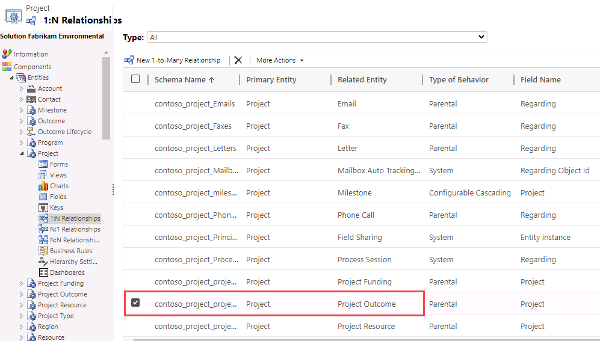

1. Select the relationship between **Project** and **Project Outcome**

    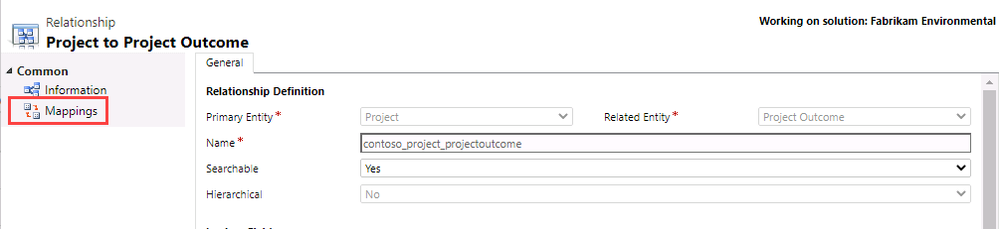

1. Select **More Actions** and select **Edit**.

1. Select **Mappings**.

    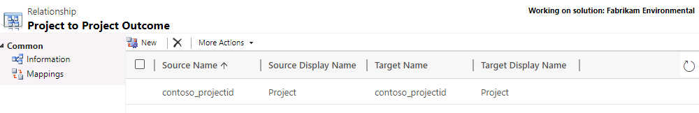

1. Select **New**.

1. In the left-hand side, select **contoso_projecttitle**.

1. In the right-hand side, select **contoso_title**.

1. Select **OK**.

    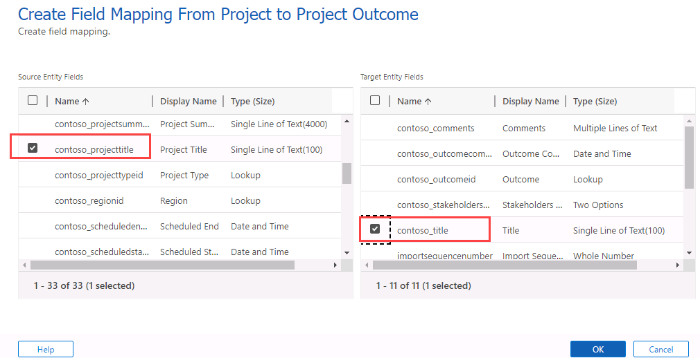

1. Select **New**.

1. In the left-hand side, select **contoso_projectsummary**.

1. In the right-hand side, select **contoso_comments**.

1. Select **OK**.

    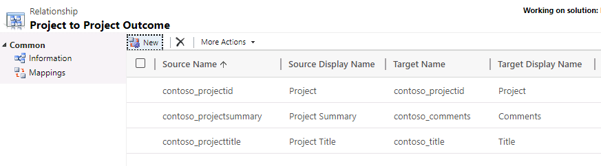

1. Select **Save and Close**.

1. Close the **Solutions Explorer** tab.

## Exercise 5 – Connections

In this exercise, you will enable connections for the resource and milestone tables.

### Task 5.1 – Enable connections on Resource

1. Navigate to the Power Apps Maker portal `https://make.powerapps.com`

1. Make sure you are in your **Development** environment.

1. Select **Solutions**.

1. Open the **Fabrikam Environmental** solution.

1. In the **Objects** pane on the left, expand **Tables**.

1. Select the **Resource** table.

1. Select **Properties**.

1. In the **Edit table** pane that appears on the right-hand side of the screen, expand **Advanced options** and scroll down.

1. Check the **Can have connections** box.

1. Select **Save**.

### Task 5.2 – Enable connections on Milestone

1. Navigate to the Power Apps Maker portal `https://make.powerapps.com`

1. Make sure you are in your **Development** environment.

1. Select **Solutions**.

1. Open the **Fabrikam Environmental** solution.

1. In the **Objects** pane on the left, expand **Tables**.

1. Select the **Milestone** table.

1. Select **Properties**.

1. In the **Edit table** pane that appears on the right-hand side of the screen, expand **Advanced options** and scroll down.

1. Check the **Can have connections** box.

1. Select **Save**.

### Task 5.3 – Publish changes

1. In the solution, select the **Overview** page.

    

1. Select **Publish all customizations**.

### Task 5.4 – Add connection roles

1. In the **Fabrikam Environmental** solution, select the **Objects** page and select **All**.

1. Select **+ New** > **More** and then select **Connection Role**.

1. Enter `Contributor` for **Name**.

1. Select the **Only these record types** radio button.

1. Select **Resource**.

1. Select the **Save** icon.

    

1. Under **Matching Connection Roles**, select **New**.

    > **Note:** You may need to disable the pop-up blocker in your browser.

1. Enter `Contributed to` for **Name**.

1. Select the **Only these record types** radio button.

1. Select **Milestone**.

1. Select the **Save and Close** icon.

1. Select the **Save and Close** icon.

1. Select **Done**.

1. Select **+ New** > **More** and then select **Connection Role**.

1. Enter `Advisor` for **Name**.

1. Select the **Only these record types** radio button.

1. Select **Resource**.

1. Select the **Save** icon.

1. Under **Matching Connection Roles**, select **Add Existing**.

1. Add **Contributed to** to the **selected records** by selecting the row using the **Select** button.

1. Select **Add**.

1. Select the **Save and Close** icon.

1. Select **Done**.

## Exercise 6 – Calculated and rollup columns

In this exercise, you will use relationships to create calculated and rollup fields. The calculated column will add the email address for the approver to the outcome table. The rollup column will sum the funding values of projects.

### Task 6.1 – Calculated column for a many-to-one relationship

1. Navigate to the Power Apps Maker portal `https://make.powerapps.com`

1. Make sure you are in your **Development** environment.

1. Select **Solutions**.

1. Open the **Fabrikam Environmental** solution.

1. In the **Objects** pane on the left, expand **Tables**.

1. Select the **Outcome** table.

1. Select **+ New** > **Column**.

1. Enter `Approver Email` for **Display Name**.

1. Enter `Email address for approver` for **Description**.

1. Select **Single line of text** in the **Data type** drop-down.

1. Select **Text** in the **Format** drop-down.

1. Change the **Behavior** drop-down to **Calculated**.

1. Select **Save and edit**.

1. When the new browser window opens, select **+ Add condition**.

1. Select **Approver** for **Field**.

1. Select **Contains data** for **Operator**.

1. Select the green check mark.

    > NOTE: You may need to resize the window to see the check marks.

1. Select **+ Add action**.

1. Enter the following formula:

    ```contoso_approveruserid.internalemailaddress```

    > NOTE: You can use intellisense to type and select the elements in the formula.

1. Select the blue check mark.

    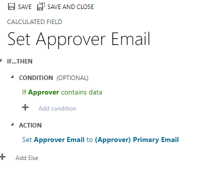

1. Select **SAVE AND CLOSE**.

### Task 6.2 – Rollup column for the project one-to-many relationship

1. In the **Objects** pane on the left, expand **Tables**.

1. Select the **Project** table.

1. Select **+ New** > **Column**.

1. Enter `Total Project Funding` for **Display Name**.

1. Select **Currency** in the **Data type** drop-down.

1. Change the **Behavior** drop-down to **Rollup**.

1. Select **Save and edit**.

1. When the new browser window opens, select **+ Add related entity**.

1. Select **Project Funding (Project)** for **Related**.

1. Select the blue check mark.

1. Select **+ Add condition**.

1. Choose **Status** for **Field**.

1. Choose **Equals** for **Operator**.

1. Verify **Active** is selected for **Value**.

1. Select the green check mark.

1. Select **+ Add aggregation**.

1. Select **SUM** for **Aggregate Function**.

1. Select **(Project Funding) Funding amount** for **Aggregate Related Entity Field**.

1. Select the green check mark.

1. Select **SAVE AND CLOSE**.

    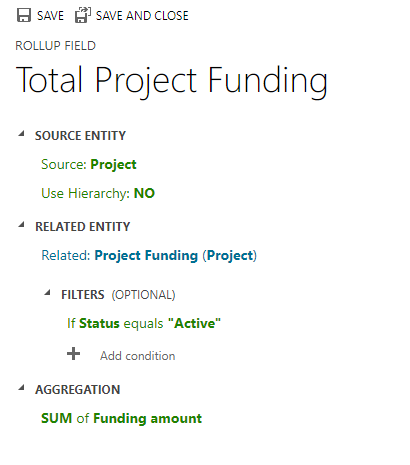

### Task 6.3 – Publish changes

1. In the solution, select the **Overview** page.

1. Select **Publish all customizations**.

## Exercise 7 – Solutions

In this exercise, you will export the solution from the Development environment and import it into the Production environment.

### Task 7.1 – Solution checker

1. Navigate to the Power Apps Maker portal <https://make.powerapps.com>.

1. Make sure you are in the **Development** environment.

1. Select **Solutions**.

1. Select the **Fabrikam Environmental** solution row but do not open it.

1. Select **Solution checker** > **Run**.

1. Wait a few minutes for the solution checker to complete.

1. Select **Solution checker** > **View results**.

1. You should see several warnings for the canvas app in the solution.

1. Select the **back arrow** to return to solutions.

### Task 7.2 – Export managed solution

1. Select the **Fabrikam Environmental** solution row but do not open it.

1. Select **Export solution**.

1. Select **Next**.

1. The version number should have been incremented to **1.1.11.4**.
 
1. Change the version number to `1.1.11.6`.

1. Select **Managed** for **Export As**.

1. Select **Export**.

1. The export will be prepared in the background. When the solution is ready, select the **Download** button.

### Task 7.3 – Export unmanaged solution

1. Select the **Fabrikam Environmental** solution row but do not open it.

1. Select **Export Solution**.

1. Select **Next**.

1. The version number should have been incremented to **1.1.11.7**.

1. Change the version number to `1.1.11.6`.

1. Select **Unmanaged** for **Export As**.

1. Select **Export**.

1. The export will be prepared in the background, when the solution is ready click the **Download** button.

### Task 7.4 – Import managed solution

1. Switch environments by using the Environment Selector in the upper right corner of the Maker portal.

1. Select the **Production** environment from the list.

1. Select **Solutions**.

1. Select **Import solution**.

1. Select **Browse**, change to the **Downloads** folder and select **FabrikamEnvironmental_1_1_11_6_managed.zip** and select **Open**.

1. Select **Next**.

1. Select **Next**.

    You need to create connections for the solution.

1. For the **Approvals** connection, select **Select a connection** > **+ New connection**.

1. A new tab will open in the browser. Select **Create**.

1. Switch back to the tab where you are importing the solution and select **Refresh**.

1. For the **Microsoft Dataverse** connection, select **Select a connection** > **+ New connection**.

1. A new tab will open in the browser. Select **Create**. If prompted, sign in with your Microsoft 365 credentials.

1. Switch back to the tab where you are importing the solution and select **Refresh**.

1. Both connections should be selected.

1. Select **Import**. The solution will import in the background.

## Challenge (Optional)

Under Processes, examine the classic workflow, Project Funding Name, and create a new workflow to set the Title column on the Project Outcome table, when a new record is created or when a project or an outcome lookup column is changed.
