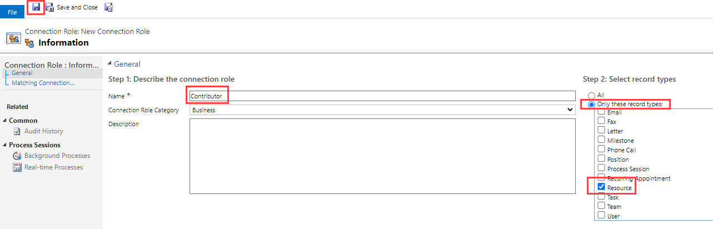

---
lab:
    title: 'Lab 1.6: Relationships'
    module: 'Module 1: Work with Microsoft Dataverse'
---

# Practice Lab 1.6 – Relationships

## Scenario

You are a Power Platform functional consultant and have been assigned to the Fabrikam project for the next stage of the project.

In this practice lab, you will be modifying the properties of existing relationships, creating new relationships, and creating rollup columns.

You will then export your customizations from the solution and import them into another environment.

## Exercise 1 – Change relationship behaviors

In this exercise, you will be modifying the cascade relationships for the project table. The Region to Project relationship will be changed to referential, restricted and the Project to Milestone relationship will be changed to custom.

### Task 1.1 – Region-Project relationship

1. Navigate to the Power Apps Maker portal <https://make.powerapps.com>.

1. Make sure you are in your **Development** environment.

1. Select **Solutions**.

1. Click to open the **Fabrikam Environmental** solution.

1. In the **Objects** pane on the left, click and expand **Tables**.

1. Select the **Project** table.

1. Under **Schema**, click on **Relationships**.

1. Scroll down and select the **Region** relationship.

1. In the Many-to-one pane that appears on the right-hand side of the screen, expand **Advanced options**.

1. Change the **Delete** drop-down to **Restrict**.

1. Click **Done**.

    

### Task 1.2 – Project-Milestone relationship

1. Select the **Milestone** relationship in the **Project** table. Note that this relationship uses Project as the Display name and contoso_project_milestone as the Name. 

1. In the One-to-many pane that appears on the right-hand side of the screen, expand **Advanced options**.

1. Change the **Type of behavior** drop-down to **Custom**.

1. Change the **Delete** drop-down to **Restrict**.

1. Change the **Assign** drop-down to **Cascade Active**.

1. Change the **Share** drop-down to **Cascade User-Owned**.

1. Change the **Unshare** drop-down to **Cascade User-Owned**.

1. Click **Done**.

    

## Exercise 2 – Add new relationship

In this exercise, you will create a new relationship between the Resource and Project tables to create a lookup for the Lead Resource on the Project.

### Task 2.1 – Create new Project Lead relationship

1. Navigate to the Power Apps Maker portal <https://make.powerapps.com>.

1. Make sure you are in your **Development** environment.

1. Select **Solutions**.

1. Click to open the **Fabrikam Environmental** solution.

1. In the **Objects** pane on the left, click and expand **Tables**.

1. Select the **Project** table.

1. Under **Schema**, click on **Relationships**.

1. Click **+ New relationship** and then select **Many-to-one**.

1. In the Many-to-one pane that appears on the right-hand side of the screen, select **Resource** in the **Related (One)** drop-down.

1. Enter **Project Lead** for **Lookup column display name**.

1. Enter **projectleadresourceid** for **Lookup column name**.

1. Expand **General**.

1. Enter **resource_project_projectlead** for **Relationship name**.

1. Expand **Advanced options**.

1. Change the **Delete** drop-down to **Restrict**.

1. Click **Done**.

    

1. In the **Objects** pane on the left, click **Columns** for the **Project** table.

1. Select the **Project Lead** column.

1. In the Edit column pane that appears on the right-hand side of the screen, expand **Advanced options** and scroll down.

1. Check the **Enable auditing** box.

1. Click **Save**.

## Exercise 3 – Hierarchical relationship

In this exercise, you will create a new hierarchical relationship on the region table.

### Task 3.1 – Create new hierarchical relationship

1. Navigate to the Power Apps Maker portal <https://make.powerapps.com>.

1. Make sure you are in your **Development** environment.

1. Select **Solutions**.

1. Click to open the **Fabrikam Environmental** solution.

1. In the **Objects** pane on the left, click and expand **Tables**.

1. Select the **Region** table.

1. Click **+ New**, and then select **Relationship** and then select **+ One-to-many**.

1. In the One-to-many pane that appears on the right-hand side of the screen, select **Region** in the **Related (Many)** drop-down.

1. Enter **Parent Region** for **Lookup column display name**.

1. Enter **parentregionid** for **Lookup column name**.

1. Check the **Hierarchical** box.

1. Expand **General**.

1. Enter **parentregion_region** for **Relationship name**.

1. Expand **Advanced options**.

1. Change the **Delete** drop-down to **Restrict**.

1. Click **Done**.

    

## Exercise 4 – Project Outcome relationships

In this exercise, you will create two many-to-one relationships for the Project Outcome table to the Project and Outcome tables. These relationships will be used to replace the many-to-many relationship between the Project and Outcome tables.

### Task 4.1 – Create new relationship to Project

1. Navigate to the Power Apps Maker portal <https://make.powerapps.com>.

1. Make sure you are in your **Development** environment.

1. Select **Solutions**.

1. Click to open the **Fabrikam Environmental** solution.

1. In the **Objects** pane on the left, click and expand **Tables**.

1. Select the **Project Outcome** table.

1. Under **Schema**, click on **Relationships**.

1. Click **+ New relationship** and then select **Many-to-one**.

1. In the Many-to-one pane that appears on the right-hand side of the screen, select **Project** in the **Related (One)** drop-down.

1. Enter **Project** for **Lookup column display name**.

1. Enter **projectid** for **Lookup column name**.

1. Expand **General**.

1. Enter **project_projectoutcome** for **Relationship name**.

1. Expand **Advanced options**.

1. Change the **Type of behavior** drop-down to **Parental**.

1. Click **Done**.

### Task 4.2 – Create new relationship to Outcome

1. Click **+ New relationship** and then select **Many-to-one**.

1. In the Many-to-one pane that appears on the right-hand side of the screen, select **Outcome** in the **Related (One)** drop-down.

1. Enter **Outcome** for **Lookup column display name**.

1. Enter **outcomeid** for **Lookup column name**.

1. Expand **General**.

1. Enter **outcome_projectoutcome** for **Relationship name**.

1. Expand **Advanced options**.

1. Change the **Type of behavior** drop-down to **Parental**.

1. Click **Done**.

    > NOTE: An error will be shown saying that you cannot create another parental relation with the contoso_outcome table.

1. Change the **Type of behavior** drop-down to **Referential**.

1. Change the **Delete** drop-down to **Restrict**.

1. Click **Done**.

### Task 4.3 – Set required and enable auditing on new lookup columns

1. In the **Objects** pane on the left, select **Columns** for the **Project Outcome** table.

1. Select the **Project** column.

1. In the Edit column pane that appears on the right-hand side of the screen, expand **Advanced options** and scroll down.

1. Change the **Required** drop-down to **Business required**.

1. Check the **Enable auditing** box.

1. Click **Save**.

1. Select the **Outcome** column.

1. In the Edit column pane that appears on the right-hand side of the screen, expand **Advanced options** and scroll down.

1. Change the **Required** drop-down to **Business required**.

1. Check the **Enable auditing** box.

1. Click **Save**.

## Exercise 5 – Connections

In this exercise, you will enable connections for the resource and milestone tables.

### Task 5.1 – Enable connections on Resource

1. Navigate to the Power Apps Maker portal <https://make.powerapps.com>.

1. Make sure you are in your **Development** environment.

1. Select **Solutions**.

1. Click to open the **Fabrikam Environmental** solution.

1. In the **Objects** pane on the left, click and expand **Tables**.

1. Select the **Resource** table.

1. Click on **Properties**.

1. In the Edit table pane that appears on the right-hand side of the screen, expand **Advanced options** and scroll down.

1. Check the **Can have connections** box.

1. Click **Save**.

### Task 5.2 – Enable connections on Milestone

1. Navigate to the Power Apps Maker portal <https://make.powerapps.com>.

1. Make sure you are in your **Development** environment.

1. Select **Solutions**.

1. Click to open the **Fabrikam Environmental** solution.

1. In the **Objects** pane on the left, click and expand **Tables**.

1. Select the **Milestone** table.

1. Click on **Properties**.

1. In the Edit table pane that appears on the right-hand side of the screen, expand **Advanced options** and scroll down.

1. Check the **Can have connections** box.

1. Click **Save**.

### Task 5.3 – Publish changes

1. In the solution select the **Overview** page.

    

1. Click on **Publish all customizations**.

### Task 5.4 – Add connection roles

1. Within the solution, select the **Objects** page and select **All**.

1. Click **+ New**, and then select **More** and then select **Connection Role**.

1. Enter **Contributor** for **Name**.

1. Select the **Only these record types** radio button.

1. Select **Resource**.

1. Click the **Save** icon.

    

1. Under Matching connection roles, click **New**.

    > NOTE: You may need to disable the pop-up blocker in your browser.

1. Enter **Contributed to** for **Name**.

1. Select the **Only these record types** radio button.

1. Select **Milestone**.

1. Click the **Save and Close** icon.

1. Click the **Save and Close** icon.

1. Click **Done**.

1. Click **+ New**, and then select **More** and then select **Connection Role**.

1. Enter **Advisor** for **Name**.

1. Select the **Only these record types** radio button.

1. Select **Resource**.

1. Click the **Save** icon.

1. Under Matching connection roles, click **Add Existing**.

1. Check **Contributed to** and click **Select**.

1. Click **Add**.

1. Click the **Save and Close** icon.

1. Click **Done**.

## Exercise 6 – Calculated and rollup columns

In this exercise, you will use relationships to create calculated and rollup fields. The calculated column will add the email address for the approver to the outcome table. The rollup column will sum the funding values of projects.

### Task 6.1 – Calculated column for a many-to-one relationship

1. Navigate to the Power Apps Maker portal <https://make.powerapps.com>.

1. Make sure you are in your **Development** environment.

1. Select **Solutions**.

1. Click to open the **Fabrikam Environmental** solution.

1. In the **Objects** pane on the left, click and expand **Tables**.

1. Select the **Outcome** table.

1. Click **+ New**, and then select **Column**.

1. Enter **Approver Email** for **Display Name**.

1. Enter **Email address for approver** for **Description**.

1. Select **Single line of text** in the **Data type** drop-down.

1. Select **Text** in the **Format** drop-down.

1. Change the **Behavior** drop-down to **Calculated**.

1. Click on **Save and edit**.

1. When the new browser window opens, click **+ Add condition**.

1. Select **Approver** for **Field**.

1. Select **Contains data** for **Operator**.

1. Click the green check mark.

    > NOTE: You may need to resize the window to see the check marks.

1. Click **+ Add Action**.

1. Enter the following formula:

    ```contoso_approveruserid.internalemailaddress```

    > NOTE: You can use intellisense to type and select the elements in the formula.

1. Click the blue check mark.

    

1. Click **SAVE AND CLOSE**.

### Task 6.2 – Rollup column for the project one-to-many relationship

1. In the **Objects** pane on the left, click and expand **Tables**.

1. Select the **Project** table.

1. Click **+ New**, and then select **Column**.

1. Enter **Total Project Funding** for **Display Name**.

1. Select **Currency** in the **Data type** drop-down.

1. Change the **Behavior** drop-down to **Rollup**.

1. Click on **Save and edit**.

1. When the new browser window opens, click **+ Add related entity**.

1. Select **Project Funding (Project)** for Related.

1. Click the blue check mark.

1. Click **+ Add condition**.

1. Select **Status** for **Field**.

1. Select **Equals** for **Operator**.

1. Verify **Active** is selected for **Value**.

1. Click the green check mark.

1. Click **+ Add aggregation**.

1. Select **SUM** for **Aggregate Function**.

1. Select **(Project Funding) Funding amount** for **Aggregate Related Entity Field**.

1. Click the green check mark.

1. Click **SAVE AND CLOSE**.

    

### Task 6.3 – Publish changes

1. In the solution select the **Overview** page.

1. Click on **Publish all customizations**.

## Exercise 7 – Solutions

In this exercise, you will export the solution from the Development environment and import it into the Live environment.

### Task 7.1 – Solution checker

1. Navigate to the Power Apps Maker portal <https://make.powerapps.com>.

1. Make sure you are in the **Development** environment.

1. Select **Solutions**.

1. Select the **Fabrikam Environmental** solution but do not open it.

1. Select the caret to the right of **Solution checker** and then select **Run**.

1. Wait a few minutes for the checker to complete.

1. Select the caret to the right of **Solution checker** and then select **View results**.

1. You should see several warnings for the canvas app in the solution.

1. Click the back arrow to return to solutions.

### Task 7.2 – Export managed solution

1. Select the **Fabrikam Environmental** solution.

1. Select **Export Solution**.

1. Click **Next**.

1. The version number should have been incremented to **1.1.11.4**.

1. Select **Managed** for **Export As**.

1. Click **Export**.

1. The export will be prepared in the background, when the solution is ready click the **Download** button.

### Task 7.3 – Export unmanaged solution

1. Select the **Fabrikam Environmental** solution.

1. Select **Export Solution**.

1. Click **Next**.

1. The version number should have been incremented to **1.1.11.5**.

1. Select **Unmanaged** for **Export As**.

1. Click **Export**.

1. The export will be prepared in the background, when the solution is ready click the **Download** button.

### Task 7.4 – Import managed solution

1. Switch environments by using the Environment Selector in the upper right corner of the Maker portal.

1. Select the **Live** environment from the list.

1. Select **Solutions**.

1. Select **Import solution**.

1. Select **Browse**,  change to the **Downloads** folder and select **FabrikamEnvironmental_1_1_11_4_managed.zip** and select **Open**.

1. Click **Next**.

1. Click **Next**.

1. You need to create connections for the solution.

1. For the Approvals connection click **Select a connection** and then **+ New connection**.

1. A new tab will open in the browser. Click **Create**.

1. Switch back to the tab where you are importing the solution and click **Refresh**.

1. For the Microsoft Dataverse connection click **Select a connection** and then **+ New connection**.

1. A new tab will open in the browser. Click **Create**. If prompted, sign in with your Microsoft 365 credentials.

1. Switch back to the tab where you are importing the solution and click **Refresh**.

1. Both connections should be selected.

1. Click **Import**. The solution will import in the background.

## Challenge (Optional)

Under Processes, examine the classic workflow, Project Funding Name, and create a new workflow to set the Title column on the Project Outcome table, when a new record is created or when a project or an outcome lookup column is changed.
