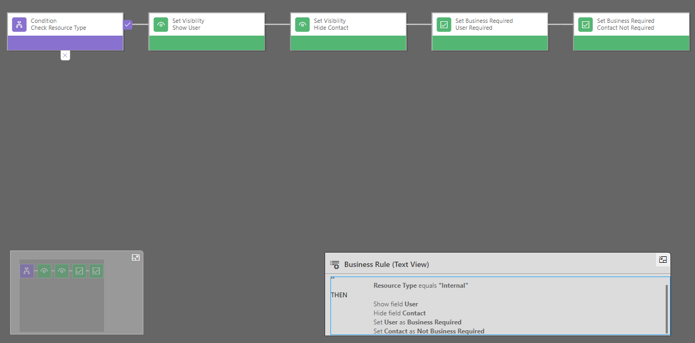

---
lab:
    title: 'Lab 2.1: Business rules'
    module: 'Module 2: Manage Microsoft Dataverse'
---

# Practice Lab 2.1 – Business rules

## Scenario

You are a Power Platform functional consultant and have been assigned to the Fabrikam project for the next stage of the project.

In this practice lab, you will be creating business rules to show and hide the lookup columns in the model-driven app form for the Resource table and to set the status of Milestone rows to completed when the percentage complete is 100%.

## Exercise 1 – Create Business Rule

### Task 1.1 – Create Resource business rules

1. Navigate to the Power Apps Maker portal <https://make.powerapps.com>.

1. Make sure you are in your **Practice** environment.

1. Select **Solutions**.

1. Click to open the **Fabrikam Environmental** solution.

1. In the **Objects** pane on the left, click and expand **Tables**.

1. Select the **Resource** table.

1. Under **Customizations**, click on **Business rules**.

1. Click on the existing business rule, **Set Resource Name**, to open the business rule designer. Analyze how this business rule works. This business rule controls the visibility and requirement for the resource name based on the selection of resource type.

1. Close the Business rule designer.

1. Click **Done**.

1. Click **+ New business rule**.

1. Next to **New business rule** name at the top of the screen, click on the drop-down caret.

1. Enter **Resource Type Internal** for **Business Rule Name**. You can click on the drop-down caret again to collapse this section.

1. In the Scope drop-down in the top-right of the business rules designer select **All Forms**.

1. Select the **Condition** tile in the canvas and in the Properties pane enter **Check Resource Type** for **Display Name.**.

1. In the **Rule 1** section, select **Resource Type** for **Field**, select **Equals** for **Operator**, select **Value** for **Type**, and check **Internal** for **Value**.

1. Click **Apply**.

1. Select the **Components** tab.

1. Drag the **Set Visibility** action and place it on the **True** side (on the right-hand side) of the condition.

1. Enter **Show User** for **Display Name**, select **User** for **Field**, select **Yes** for **Visible** and click **Apply**.

1. Drag the **Set Visibility** action and place it on the right-hand side of the **Show User** tile.

1. Enter **Hide Contact** for **Display Name**, select **Contact** for **Field**, select **No** for **Visible** and click **Apply**.

1. Click on **+ Add** and select **Add Set Business Required** and then click the plus icon to the right of the Hide Contact tile.

1. Enter **User Required** for **Display Name**, select **User** for **Field**, select **Business Required** for **Status** and click **Apply**.

1. Click on **+ Add** and select **Add Set Business Required** and then click the plus icon to the right of the User Required tile.

1. Enter **Contact Not Required** for **Display Name**, select **Contact** for **Field**, select **Not Business Required** for **Status** and click **Apply**.

    

1. The Business Rule (Text View) should look as follows:

    ```dos
    IF
     Resource Type equals "Internal"
    THEN
     Show field User
     Hide field Contact
     Set User as Business Required
     Set Contact as Not Business Required
    ```

1. Click **Save**. You should see the message Validation successful.

1. Click **Activate**.

1. In the Process activation confirmation dialog, click **Activate**.

1. Click **Save As**.

1. Next to **New business rule** name at the top of the screen, click on the drop-down caret.

1. Enter **Resource Type External** for **Business Rule Name**.

1. Select the **Check Resource Type** tile.

1. In the **Rule 1** section, uncheck **Internal** and check **External**.

1. Click **Apply**.

1. Select the **Show User** tile.

1. Enter **Hide User** for **Display Name**, select **No** for **Visible** and click **Apply**.

1. Select the **Hide Contact** tile.

1. Enter **Show Contact** for **Display Name**, select **Yes** for **Visible** and click **Apply**.

1. Select the **User Required** tile.

1. Enter **User Not Required** for **Display Name**, select **Not Business Required** for **Status** and click **Apply**.

1. Select the **Contact Not Required** tile.

1. Enter **Contact Required** for **Display Name**, select **Business Required** for **Status** and click **Apply**.

1. The Business Rule (Text View) should look as follows:

    ```dos
    IF
     Resource Type equals "External"
    THEN
     Hide field User
     Show field Contact
     Set User as Not Business Required
     Set Contact as Business Required
    ```

1. Click **Save**. You should see the message that Validation was successful.

1. Click **Activate**.

1. In the Process activation confirmation dialog, click **Activate**.

1. Close the business rule designer tab.

1. Click **Done**.

### Task 1.2 – Create Milestone business rules

1. In the **Objects** pane on the left, select the **Milestone** table.

1. Under **Customizations**, click on **Business rules**.

1. Click **+ New business rule**.

1. Next to **New business rule** name at the top of the screen, click on the drop-down caret.

1. Enter **Milestone Completed** for **Business Rule Name**.

1. In the Scope drop-down in the top-right of the business rules designer select **Entity**.

1. Select the **Condition** tile in the canvas and in the Properties pane enter **Percentage Complete** for **Display Name.**.

1. In the **Rule 1** section, select **Milestone Percentage Complete** for **Field**, select **Equals** for **Operator**, select **Value** for **Type**, and enter **100** for **Value**.

1. Above **Rule 1**, click **+ New** to add **Rule 2**.

1. In the **Rule 2** section, select **Milestone status** for **Field**, select **Does not equal** for **Operator**, select **Value** for **Type**, and check **Completed** and **Cancelled** for **Value**.

1. Select **AND** for **Rule Logic**.

1. Click **Apply**.

1. The Condition Expression (Text View) should look as follows

    ```dos
    (Milestone Percentage Complete Equals [100]) AND (Milestone status Does not equal [Completed,Cancelled])
    ```

1. Click on **+ Add** and select **Add Set Field Value** and then click the plus icon to the right of the Condition tile.

1. Enter **Mark Complete** for **Display Name**, select **Milestone status** for **Field**, select **Value** for **Type**, and select **Completed** for **Value**.

1. Click **Apply**.

1. The Business Rule (Text View) should look as follows:

    ```dos
    IF
     Milestone Percentage Complete equals 100 AND Milestone status does not equal "Completed,Cancelled"
    THEN
     Set Milestone status to "Completed"
    ```

1. Click **Save**. You should see the message that Validation was successful.

1. Click **Activate**.

1. In the Process activation confirmation dialog, click **Activate**.

1. Close the business rule designer tab.

1. Click **Done**.

## Challenge (Optional)

Edit the Set Resource Name business rule on the Resource table to hide both lookup columns if resource type is not selected and set as not business required.
