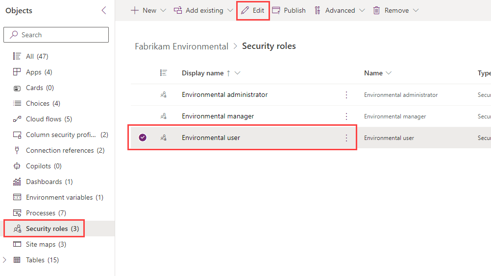
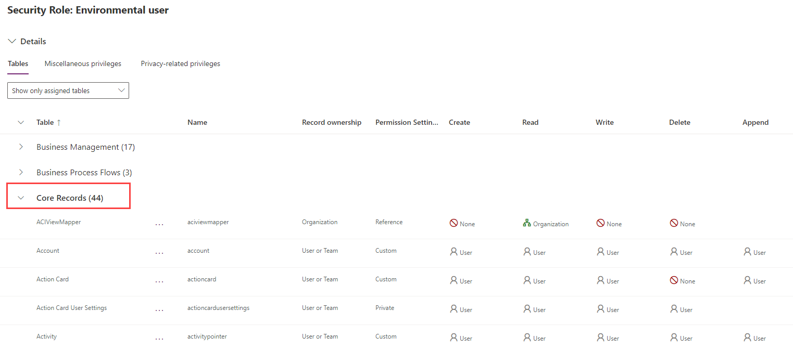
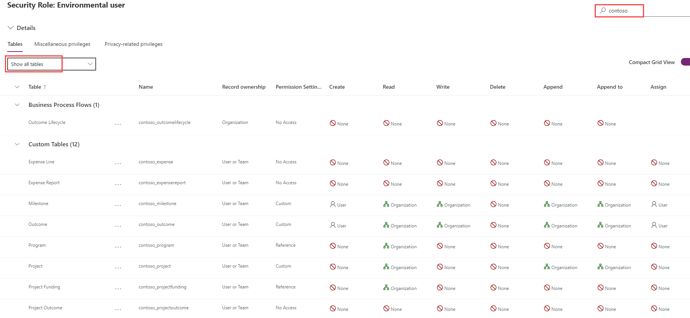
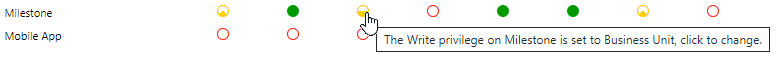
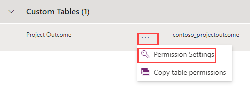
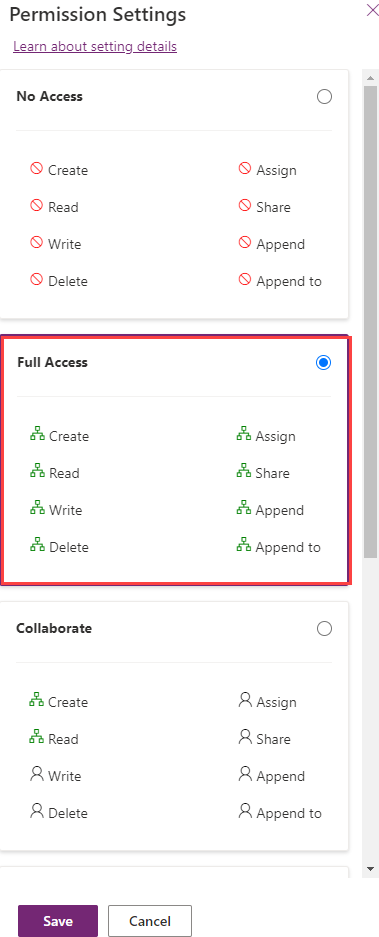

---
lab:
    title: 'Lab 2.1: Security roles'
    module: 'Learning Path 2: Manage Microsoft Dataverse'
---

# Practice Lab 2.1 - Security roles

## Scenario

You are a Power Platform functional consultant and have been assigned to the Fabrikam project for the next stage of the project.

In this practice lab, you will be modifying security roles.

There are three security roles in the solution:

- Environmental administrator
- Environmental manager
- Environmental user

You need to add privileges for the new Project Outcome table.

You need to adjust the Write privileges for the Milestone and Outcome tables on the Environmental user role. Currently, users can edit all records on these tables. Users should only be able to edit the records in their business unit.

You need to remove privileges for importing and exporting of data, deleting account and contacts, and add privileges for connection roles and audit history.

## Exercise 1 – Modify the Environmental user security role

### Task 1.1 – Evaluate security role

1. Navigate to the Power Apps Maker portal <https://make.powerapps.com>.

1. Make sure you are in the **Dev One** environment.

1. Select **Solutions**.

1. Open the **Fabrikam Environmental** solution.

1. In the **Objects** pane on the left, select **Security Roles**.

1. Select the **Environmental user** role and click **Edit**.

    

1. Scroll down to the **Core Records** section.

    

1. Scroll down and review the privileges the security role has for the **Core Records**.

1. Scroll down to the **Custom Tables** section.

1. Select **Show all tables**.

1. Enter `contoso` in the **Search by table name or table privilege** field.

    

1. Review the privileges the security role has for the tables in the Fabrikam solution. Do not navigate away from this page.

### Task 1.2 – Modify Milestone and Outcome privileges

1. In the **Custom Tables** section for the **Environmental user** role, locate the **Milestone** table privileges.

1. Select the drop-down for the **Write** privilege and select **Business Unit**.

    

1. Locate the **Outcome** table privileges.

1. Select the drop-down for the **Write** privilege and select **Business Unit**.

    

1. Select **Save**. Do not navigate away from this page.

### Task 1.3 – Add privileges for Project Outcome

1. In the **Custom Tables** section for the **Environmental user** role, locate the **Project Outcome** table privileges.

1. Select the ellipses and select **Permission Settings**.

    

1. Select **Full Access**.

    

1. Select **Save**.

1. Select the drop-down for the **Delete** privilege and select **None**.

    

1. Select **Save**. Do not navigate away from this page.

### Task 1.4 – Modify standard table privileges

1. Enter `data` in the **Search by table name or table privilege** field.

1. Locate the **Data Import** table privileges.

1. Select the ellipses and select **Permission Settings**.

1. Select **No Access**.

1. Select **Save**.

1. Locate the **Data Map** table privileges.

1. Select the ellipses and select **Permission Settings**.

1. Select **No Access**.

1. Select **Save**.

1. Enter `import` in the **Search by table name or table privilege** field .

1. Locate the **Import Source File** table privileges.

1. Select the ellipses and select **Permission Settings**.

1. Select **No Access**.

1. Select **Save**.

1. Enter `connection` in the **Search by table name or table privilege** field.

1. Locate the **Connection** table privileges.

1. Verify that the **Append** privilege access level is set to **Organization**.

1. Verify that the **Append To** privilege access level is set to **Organization**.

1. Enter `account` in the **Search by table name or table privilege** field.

1. Locate the **Account** table privileges.

1. Select the drop-down for the **Delete** privilege and select **None**.

1. Enter `contact` in the **Search by table name or table privilege** field .

1. Locate the **Contact** table privileges.

1. Select the drop-down for the **Delete** privilege and select **None**.

1. Select **Save**. Do not navigate away from this page.

### Task 1.5 – Modify miscellaneous privileges

1. Select the **Miscellaneous privileges** tab.

1. Select **Show all privileges**.

1. Enter `audit` in the **Search miscellaneous privileges** field.

1. Select the drop-down for the **View Audit History** privilege and select **Organization**.

1. Enter `bulk` in the **Search miscellaneous privileges** field.

1. Select the drop-down for the **Bulk Edit** privilege and select **None**.

1. Enter `merge` in the **Search miscellaneous privileges** field.

1. Select the drop-down for the **Merge** privilege and select **None**.

1. Select **Save**. Do not navigate away from this page.

### Task 1.6 – Modify privacy privileges

1. Select the **Privacy-related privileges** tab.

1. Select **Show all privileges**.

1. Enter `export` in the **Search privacy-related privileges** field.

1. Select the drop-down for the **Export to Excel** privilege and select **None**.

1. Enter `print` in the **Search privacy-related privileges** field.

1. Select the drop-down for the **Print** privilege and select **None**.

1. Select **Save**.

1. Select **<- Back**.

## Exercise 2 – Solutions

In this exercise, you will export the solution from the Development environment and import it into the Production environment.

### Task 2.1 – Export managed solution

1. Navigate to the Power Apps Maker portal <https://make.powerapps.com>.

1. Make sure you are in the **Dev One** environment.

1. Select **Solutions**.

1. Select the **Fabrikam Environmental** solution but do not open it.

1. Select **Export solution**.

1. Select **Publish** to publish all of your recent changes.

1. Select **Next**, and then select **Next** again.

1. Change the version number to `1.1.11.8`.

1. Select **Managed** for **Export as**.

1. Select **Export**.

1. The export will be prepared in the background, when the solution is ready select the **Download** button.

### Task 2.2 – Export unmanaged solution

1. Select the **Fabrikam Environmental** solution.

1. Select **Export solution**.

1. Select **Next**, and then select **Next** again.

1. Change the version number to `1.1.11.8`.

1. Select **Unmanaged** for **Export as**.

1. Select **Export**.

1. The export will be prepared in the background, when the solution is ready select the **Download** button.

### Task 2.3 – Import managed solution

1. Switch environments by using the Environment Selector in the upper right corner of the Maker portal.

1. Select the **Production** environment from the list.

1. Select **Solutions**.

1. Select **Import solution**.

1. Select **Browse**,  change to the **Downloads** folder and select **FabrikamEnvironmental_1_1_11_8_managed.zip** and select **Open**.

1. Select **Next**.

    > **Note:** You should see a notification that the solution package contains an update for a solution that is already installed.

1. Expand **Advanced settings**.

1. Select **Upgrade** for **Solution action**.

1. Select **Next**, and then select **Next** again.

1. Select **Import**. The solution will import in the background.
