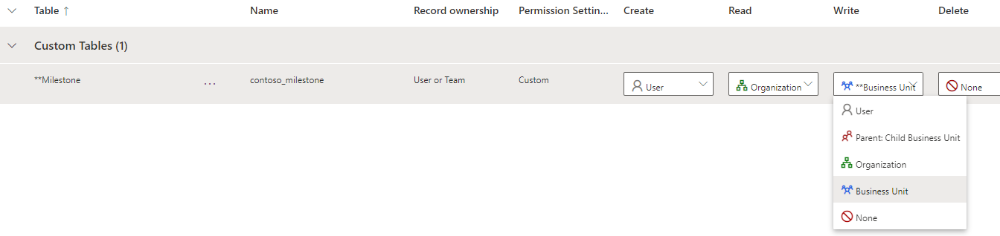
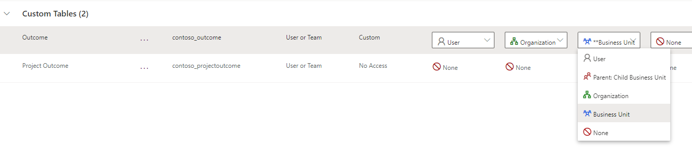
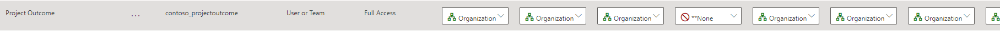

---
lab:
    title: 'Lab 2.4: Security roles'
    module: 'Module 2: Manage Microsoft Dataverse'
---

# Practice Lab 2.4 - Security roles

## Scenario

You are a Power Platform functional consultant and have been assigned to the Fabrikam project for the next stage of the project.

In this practice lab, you will be modifying security roles.

There are three security roles in the solution:

- Environmental administrator
- Environmental manager
- Environmental user

You need to add privileges for the new Project Outcome table.

You need to adjust the Write privileges for the Milestone and Outcome tables on the Environmental user role. Currently, users can edit all records on these tables. Users should only be able to edit the records in their business unit.

You need to remove privileges for importing and exporting of data, deleting account and contacts, and add privileges for connection roles and audit history.

## Exercise 1 – Modify the Environmental user security role

### Task 1.1 – Evaluate security role

1. Navigate to the Power Apps Maker portal <https://make.powerapps.com>.

1. Make sure you are in the **Development** environment.

1. Select **Solutions**.

1. Click to open the **Fabrikam Environmental** solution.

1. In the **Objects** pane on the left, select **Security roles**.

1. Select the **Environmental user** role and click **Edit**.

1. Select the **Core Records** tab.

1. Scroll down and see the privileges the security role has for the **Core Records**.

1. Select the **Custom Entities** tab.

1. Scroll down and see the privileges the security role has for the tables in the Fabrikam solution. Do not navigate away from this page.

### Task 1.2 – Modify Milestone and Outcome privileges

1. In the **Custom Entities** tab for the **Environmental user** role, locate the **Milestone** table privileges.

1. Click on the **Write** privilege (third circle from the left) twice to change the access level circle to **Business Unit**.

    

1. Locate the **Outcome** table privileges.

1. Click on the **Write** privilege twice to change the access level circle to **Business Unit**.

    

1. Click **Save**.

### Task 1.3 – Add privileges for Project Outcome

1. In the **Custom Entities** tab for the **Environmental user** role, locate the **Project Outcome** table privileges.

1. Click on **Project Outcome** name 4 times to change all privilege access levels to **Organization**.

1. Click on the **Delete** privilege (fourth circle from the left) once to change the access level circle to **None**.

    

1. Click **Save**.

### Task 1.4 – Modify miscellaneous privileges

1. Select the **Core Records** tab.

1. Click on **Data Import** name 4 times to change all privilege access levels to **None**.

1. Click on **Data Map** name 3 times to change all privilege access levels to **None**.

1. Click on **Import Source File** name 4 times to change all privilege access levels to **None**.

1. Locate the **Connection** table privileges.

1. Verify that the **Append** privilege access level is set to **Organization**.

1. Verify that the **Append To** privilege taccess level is set to **Organization**.

1. Locate the **Account** table privileges.

1. Click on the **Delete** privilege 4 times to change the access level circle to **None**.

1. Locate the **Contact** table privileges.

1. Click on the **Delete** privilege 4 times to change the access level circle to **None**.

1. Scroll down to **Miscellaneous Privileges**.

1. Click on the **View Audit History** privilege to change the access level circle to **Organization**.

1. Select the **Business Management** tab.

1. Scroll down to **Privacy Related Privileges**.

1. Click on the **Export to Excel** privilege to change the access level circle to **None**.

1. Click on the **Print** privilege to change the access level circle to **None**.

1. Scroll down to **Miscellaneous Privileges**.

1. Click on the **Bulk Edit** privilege to change the access level circle to **None**.

1. Click on the **Merge** privilege to change the access level circle to **None**.

1. Click **Save and Close**.

1. Click **Done**.

## Exercise 2 – Solutions

In this exercise, you will export the solution from the Development environment and import it into the Live environment.

### Task 2.1 – Export managed solution

1. Navigate to the Power Apps Maker portal <https://make.powerapps.com>.

1. Make sure you are in the **Development** environment.

1. Select **Solutions**.

1. Select the **Fabrikam Environmental** solution but do not open it.

1. Select **Export solution**.

1. Click **Publish** to publish all of your recent changes.

1. Click **Next**.

1. The version number should have been incremented to **1.1.11.6**.

1. Select **Managed** for **Export As**.

1. Click **Export**.

1. The export will be prepared in the background, when the solution is ready click the **Download** button.

### Task 2.2 – Export unmanaged solution

1. Select the **Fabrikam Environmental** solution.

1. Select **Export solution**.

1. Click **Next**.

1. The version number should have been incremented to **1.1.11.7**.

1. Select **Unmanaged** for **Export As**.

1. Click **Export**.

1. The export will be prepared in the background, when the solution is ready click the **Download** button.

### Task 2.3 – Import managed solution

1. Switch environments by using the Environment Selector in the upper right corner of the Maker portal.

1. Select the **Live** environment from the list.

1. Select **Solutions**.

1. Select **Import solution**.

1. Select **Browse**,  change to the **Downloads** folder and select **FabrikamEnvironmental_1_1_11_6_managed.zip** and select **Open**.

1. Click **Next**.

> NOTE: You should see a notification that the solution package contains an update for a solution that is already installed.

1. Expand **Advanced settings**.

1. Select **Upgrade** for **Solution action**.

1. Click **Import**. The solution will import in the background.
