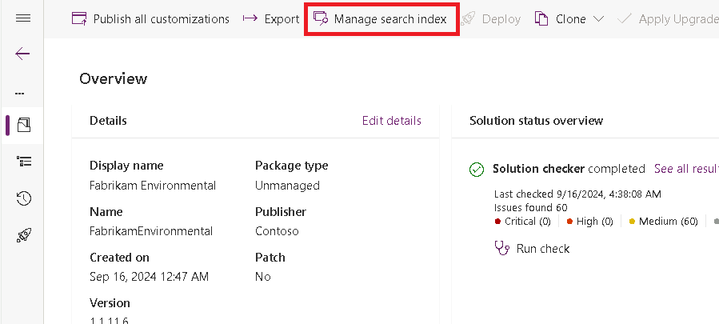
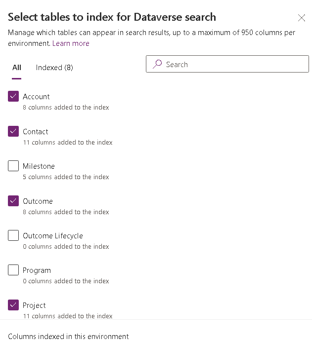

---
lab:
    title: 'Lab 3.2: Views'
    module: 'Module 3: Create model-driven apps in Power Apps'
---

# Practice Lab 3.2 – Views

## Scenario

You are a Power Platform functional consultant and have been assigned to the Fabrikam project for the next stage of the project.

In this practice lab, you will be modifying the views for the Fabrikam Environment model-driven apps.

You will be:

- adding the columns you created in the earlier lab to the view
- creating a new view for completed Projects
- adding the funding amount to views
- editing the lookup view for Outcomes
- adding find columns to the Outcomes quick find view
- configuring default view for Project Outcome
- changing Milestone sub-grid on Project to an editable grid
- restricting views in the app
- Enabling Dataverse search

## Exercise 1 – Project views

In this exercise, you will make changes to the views for the Project table.

### Task 1.1 – Modify the Project public view

In this task, you will perform the following changes to the form:

- add columns to views

1. Navigate to the Power Apps Maker portal <https://make.powerapps.com>.

1. Make sure you are in your **Development** environment.

1. Select **Solutions**.

1. Click to open the **Fabrikam Environmental** solution.

1. In the **Objects** pane on the left, click and expand **Tables**.

1. Select the **Project** table.

1. Under **Data experiences**, click on **Views**.

1. Select the **Active Projects** view, click on the ellipses (...), and select **Edit in new tab**.

1. Click on the **Total Project Funding** column to add to the view.

1. Drag the **Total Project Funding** column to the left of **Project Status**.

1. Click **Save**. Do not navigate away from this page.

### Task 1.2 – Create new completed projects view

In this task, you will perform the following changes to the form:

- create a new view
- set filter
- remove column

1. Select the caret next to the **Save** button and select **Save As**.

1. Enter **Completed Projects** for **Display Name**.

1. Click **Save**

1. Select the caret next to the **Project Status** column and select **Filter by**.

1. Select **Equals** and **Completed**.

1. Click **Apply**.

1. Select the caret next to the **Project Status** column and select **Remove**.

1. Click **Save**.

1. Close the view designer.

1. Click **Done**.

## Exercise 2 – Project Funding views

In this exercise, you will make changes to the views for the Project Funding table.

### Task 2.1 – Modify the Project Funding public view

In this task, you will perform the following changes to the form:

- add columns to views

1. Navigate to the Power Apps Maker portal <https://make.powerapps.com>.

1. Make sure you are in the **Development** environment.

1. Select **Solutions**.

1. Click to open the **Fabrikam Environmental** solution.

1. In the **Objects** pane on the left, click and expand **Tables**.

1. Select the **Project Funding** table.

1. Under **Data experiences**, click on **Views**.

1. Select the **Active Project Funding** view, click on the ellipses (...), and select **Edit in new tab**.

1. Drag the **Funding amount** column between the **Funder** and **Funding Percentage** columns in the view.

1. Click **Save**.

1. Close the view designer.

1. Click **Done**.

## Exercise 3 – Outcome views

In this exercise, you will make changes to the views for the Outcome table.

### Task 3.1 – Modify the Active Outcomes public view

In this task, you will perform the following changes to the form:

- add the Milestone status to public view
- remove the status reason column

1. Navigate to the Power Apps Maker portal <https://make.powerapps.com>.

1. Make sure you are in the **Development** environment.

1. Select **Solutions**.

1. Click to open the **Fabrikam Environmental** solution.

1. In the **Objects** pane on the left, click and expand **Tables**.

1. Select the **Outcome** table.

1. Under **Data experiences**, click on **Views**.

1. Select the **Active Outcomes** view, click on the ellipses (...), and select **Edit in new tab**.

1. Drag the **Outcome status** column to the left of the **Owner** column in the view.

1. Select the caret next to the **Status Reason** column and select **Remove**.

1. Click **Save**.

1. Close the view designer.

1. Click **Done**.

### Task 3.2 – Modify the Outcome lookup view

In this task, you will perform the following changes to the form:

- change the columns in the lookup view for Outcomes

1. Select the **Outcome Lookup View** view, click on the ellipses (...), and select **Edit in new tab**.

1. Select the caret next to the **Created On** column and select **Remove**.

1. Click the **Target Aim** column to add to the view.

1. Click the **Outcome status** column to add to the view.

1. Click **Save**.

1. Close the view designer.

1. Click **Done**.

### Task 3.3 – Modify the Outcome Quick Find view

In this task, you will perform the following changes to the form:

- change the find columns in the quick find view

1. Select the **Quick Find Active Outcomes** view, click on the ellipses (...), and select **Edit in new tab**.

1. Select the caret next to the **Created On** column and select **Remove**.

1. Click the **Target Aim** column to add to the view.

1. Click the **Outcome Status** column to add to the view.

1. Click the **Estimated Completion Date** column to add to the view.

1. In the Quick Find Active Outcomes pane on the right-hand side, click on **Edit find table columns**.

1. Select the following columns and click **Apply**.

    - Goal
    - Outcome Code
    - Outcome Description
    - Outcome Title
    - Target Aim

1. Click **Save**.

1. Close the view designer.

1. Click **Done**.

## Exercise 4 – Milestone views

In this exercise, you will make changes to the views for the Milestone table.

### Task 4.1 – Modify the Active Milestones public view

In this task, you will perform the following changes to the form:

- add the Milestone Status to the public view
- remove the Status Reason column

1. Navigate to the Power Apps Maker portal <https://make.powerapps.com>.

1. Make sure you are in the **Development** environment.

1. Select **Solutions**.

1. Click to open the **Fabrikam Environmental** solution.

1. In the **Objects** pane on the left, click and expand **Tables**.

1. Select the **Milestone** table.

1. Under **Data experiences**, click on **Views**.

1. Select the **Active Milestones** view, click on the ellipses (...), and select **Edit in new tab**.

1. Drag the **Number of Open Tasks** column to the right of the **Milestone Title** column in the view.

1. Drag the **Milestone status** column to the left of the **Owner** column in the view.

1. Select the caret next to the **Status Reason** column and select **Remove**.

1. Click **Save**.

1. Close the view designer.

1. Click **Done**.

### Task 4.2 – Modify the My Pending Milestones public view

In this task, you will perform the following changes to the form:

- add the Milestone Status to the public view
- remove the Status Reason column
- edit the filter

1. Select the **My Pending Milestones** view, click on the ellipses (...), and select **Edit in new tab**.

1. Drag the **Milestone Status** column to the right of the **Status Reason** column in the view.

1. Select the caret next to the **Status Reason** column and select **Remove**.

1. In the My Pending Milestones pane on the right-hand side, click on **Edit filters**.

1. In the Edit filters pane, change **Status Reason** to **Milestone status**.

1. Change the **Operator** to **Does not equal**.

1. Select **Completed** and **Cancelled**.

    

1. Click **OK**.

1. Click **Save**.

1. Close the view designer.

1. Click **Done**.

### Task 4.3 – Modify the Milestones SubGrid view

In this task, you will perform the following changes to the form:

- add the Milestone Description to the view
- add the Milestone Status to the view
- remove the Status Reason column

1. Select the **Milestones SubGrid** view, click on the ellipses (...), and select **Edit in new tab**.

1. Drag the **Milestone Description** column to the right of the **Milestone Title** column in the view.

1. Drag the **Milestone Status** column to the right of the **Status Reason** column in the view.

1. Select the caret next to the **Status Reason** column and select **Remove**.

1. Click **Save**.

1. Close the view designer.

1. Click **Done**.

## Exercise 5 – Project Outcome views

In this exercise, you will make changes to the views for the Project Outcome table.

### Task 5.1 – Modify the Active Project Outcomes public view

In this task, you will perform the following changes to the form:

- Configure the default views created when the table was created

1. Navigate to the Power Apps Maker portal <https://make.powerapps.com>.

1. Make sure you are in the **Development** environment.

1. Select **Solutions**.

1. Click to open the **Fabrikam Environmental** solution.

1. In the **Objects** pane on the left, click and expand **Tables**.

1. Select the **Project Outcome** table.

1. Under **Data experiences**, click on **Views**.

1. Select the **Active Project Outcomes** view, click on the ellipses (...), and select **Edit in new tab**.

1. Select the caret next to the **Created On** column and select **Remove**.

1. Click the **Outcome** column to add to the view.

1. Click the **Comments** column to add to the view.

1. Click the **Outcome Completed Date** column to add to the view.

1. Select the caret next to the **Title** column and select **Remove**.

1. In the Active Project Outcomes pane on the right-hand side, click on **Sort by** and select **Outcome completed date**.

1. Click on the **up** arrow to change the sorting to descending.

1. Click **Save**.

1. Close the view designer.

1. Click **Done**.

### Task 5.2 – Publish changes

1. In the  **Objects** pane on the left, select **All**.

1. Click on **Publish all customizations**.

## Exercise 6 – Editable grid

In this exercise, you will make changes to a sub-grid in the main form for the Project table to make it editable.

### Task 6.1 – Modify the Project main form

In this task, you will perform the following changes to the form:

- change the Milestone sub-grid to be an editable grid

1. Navigate to the Power Apps Maker portal <https://make.powerapps.com>.

1. Make sure you are in the **Development** environment.

1. Select **Solutions**.

1. Click to open the **Fabrikam Environmental** solution.

1. In the **Objects** pane on the left, click and expand **Tables**.

1. Select the **Project** table.

1. Under **Data experiences**, click on **Forms**.

1. Select the **Main** form, click on the ellipses (...), and select **Edit in new tab**.

1. Select the **Milestones** tab.

1. Select the **Milestones** sub-grid.

1. In the Properties pane on the right-hand side, expand **Components**.

1. Click **+ Add component**.

1. Select **Editable Grid**.

1. Select **Milestones** for **Table**.

1. Select **Milestones SubGrid** for **View**.

1. Select **Project (Lookup)** for **Table column**.

1. Click **Done**.

1. Click **Save**.

1. Click **Publish**.

1. Close the form designer.

1. Click **Done**.

## Exercise 7 – Modify model-driven apps

In this exercise, you will be restricting views in model-driven apps.

### Task 7.1 – Environmental Project Delivery app

In this task, you will perform the following changes to the app:

- restrict Project views
- restrict Milestone views
- restrict Outcome views

1. Navigate to the Power Apps Maker portal <https://make.powerapps.com>.

1. Make sure you are in the **Development** environment.

1. Select **Solutions**.

1. Click to open the **Fabrikam Environmental** solution.

1. In the **Objects** pane on the left, click and expand **Apps**.

1. Select the **Environmental Project Delivery** app, click on the ellipses (...), and select **Edit in new tab**.

1. Expand **Project** in the Pages pane on the left-hand side.

1. Select **Project view**.

1. In the pane on the right-hand side, click **+ Add view**.

1. Add the following views:

    - Active Projects
    - Completed Projects
    - My Active Projects

1. Expand **Milestone** in the Pages pane on the left-hand side.

1. Select **Milestone view**.

1. In the pane on the right-hand side, click **+ Add view**.

1. Add the following views:

    - Active Milestones
    - Inactive Milestones
    - My Pending Milestones

1. Expand **Outcome** in the Pages pane on the left-hand side.

1. Select **Outcome view**.

1. In the pane on the right-hand side, click **+ Add view**.

1. Add the following views:

    - Active Outcomes
    - Inactive Outcomes

1. Click **Save**.

1. Click **Publish**.

1. Click **Play**. Explore the Environmental Project Delivery model-driven app. 

1. Close the app and the app designer tabs.

1. Click **Done**.

## Exercise 8 – Enable Dataverse Search

In this exercise, you will enable Dataverse search for your environment.

The find columns on the quick find views define the searchable fields in the Dataverse search index.

### Task 8.1 – Search settings

1. Navigate to the Power Platform admin center <https://admin.powerplatform.microsoft.com>.

1. Select **Environments** from the left navigation pane.

1. Select your **Development** environment.

1. Select **Settings**.

1. Expand **Product**.

1. Select **Features**.

1. Toggle **Dataverse search** to **On**.

1. Click **Save** at the bottom.

### Task 8.2 – Search index

1. Navigate to the Power Apps Maker portal <https://make.powerapps.com>.

1. Make sure you are in your **Development** environment.

1. Select **Solutions**.

1. Click to open the **Fabrikam Environmental** solution.

1. In the solution select the **Overview** page.

    

1. Click on **Manage search index**.

    

1. In the **Select tables to index for Dataverse search** pane, add the following tables and click **Save**.

    - Outcome
    - Project Funding
    - Resource

    

### Task 8.3 – Publish changes

1. Click on **Publish all customizations**.
