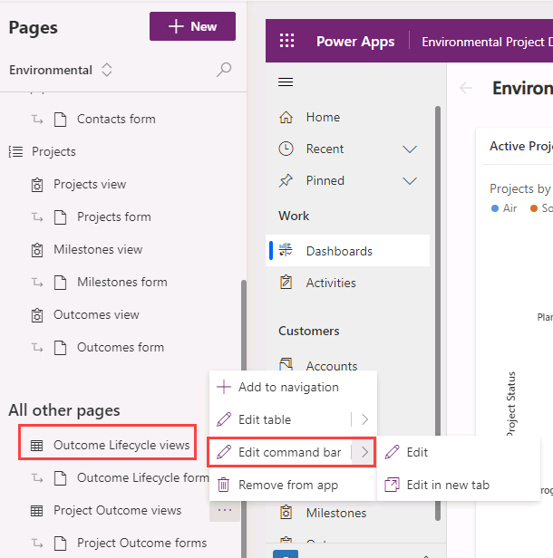
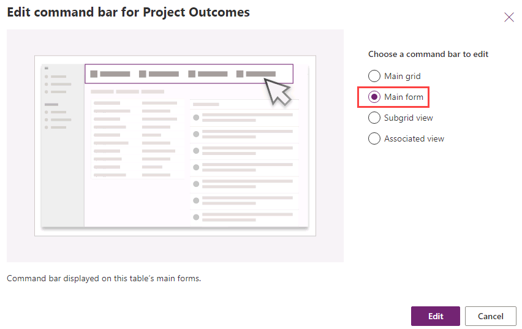
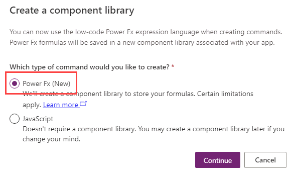

---
lab:
    title: 'Lab 3.3: Command bar'
    module: 'Learning Path 3: Create model-driven apps'
---

# Practice Lab 3.3 – Command bar

## Scenario

You are a Power Platform functional consultant and have been assigned to the Fabrikam project for the next stage of the project.

In this practice lab, you will be modifying the forms for the Fabrikam Environment model-driven apps.

You will be adding a command button to the project outcome form in the Environental Project Delivery app.

## Exercise 1 – Add command button

In this exercise, you will configure the default form for the Project Outcome table.

### Task 1.1 – Add command button to main form

In this task, you will perform the following changes to the Project Outcome form:

- add a command button to Project Outcomes in the app designer

1. Navigate to the Power Apps Maker portal `https://make.powerapps.com`

1. Make sure you are in the **Dev One** environment.

1. Select **Solutions**.

1. Open the **Fabrikam Environmental** solution.

1. In the **Objects** pane on the left, select  **Apps**.

1. Select the **Environmental Project Delivery** app, select the **Commands** menu (...), and select **Edit** > **Edit in new tab**.

1. Select the **Pages** tab, Hover over **Project Outcomes views** and select the ellipses **...** button.

1. Select **Edit command bar** and select **Edit in new tab**.

    

1. Select **Main form** and then select **Edit**.

    

1. Select **+ New** and then select **Command**.

1. Select **Power Fx** and then select **Continue**.

    

1. Configure command bar button

   - Enter `Complete` for Label.

   - Select **Use Icon** for Icon and then select the **Accept** icon.

   - Select **Run formula** for Action.

   - Select **Open formula bar**.

   - Enter the formula

    ```powerappsfl
    Patch('Project Outcomes', Self.Selected.Item, {'Outcome Completed Date': Now()})
    ```

   - Enter `Project Outcome complete` for Tooltip title.

   - Enter `Set Outcome completed date` for Tooltip description.

1. Select **Save and Publish**.

1. **Close** the Command bar editor and the app designer.
