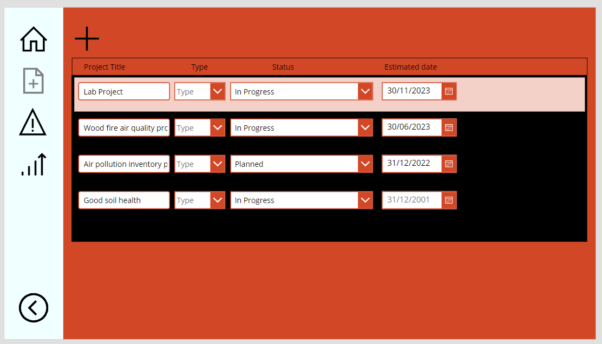
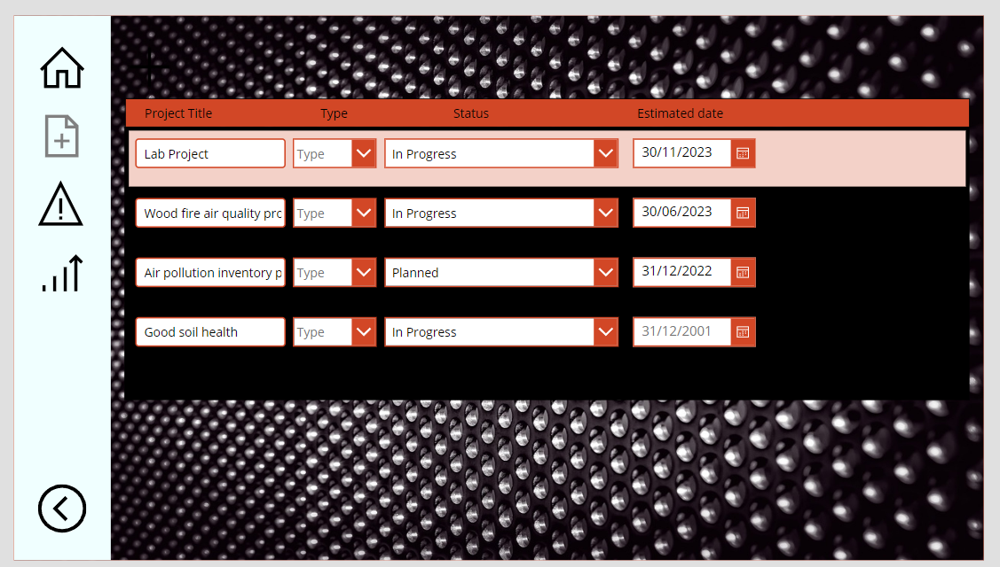
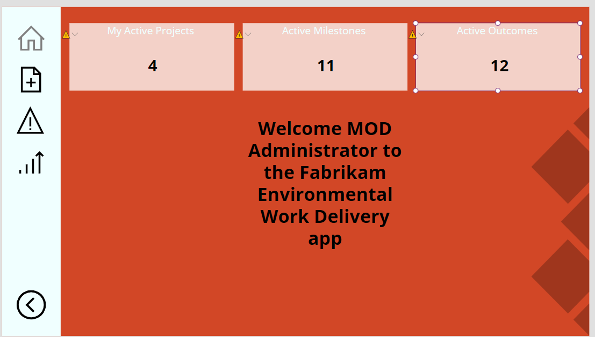
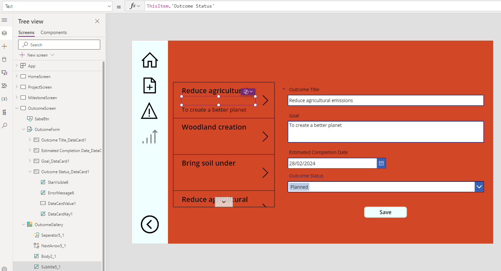
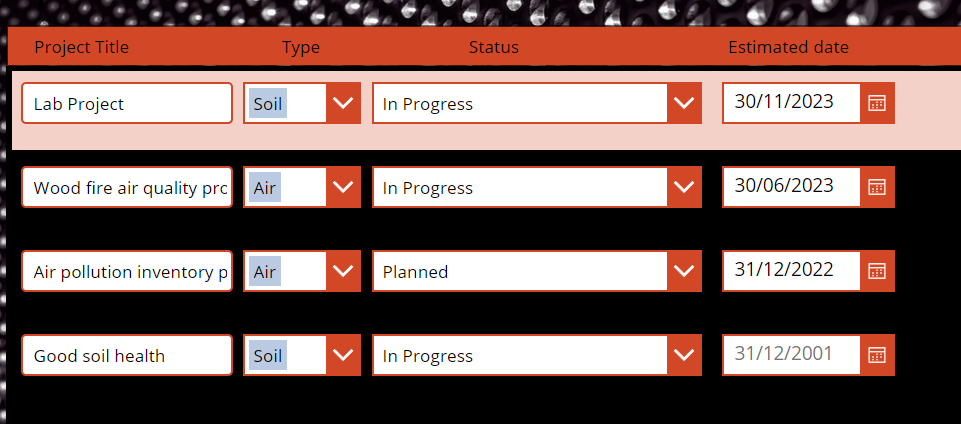

---
lab:
    title: 'Lab 4.1: Enhance a canvas app'
    module: 'Learning Path 4: Create canvas apps'
---

# Practice Lab 4.1 – Enhance a canvas app

## Scenario

You are a Power Platform functional consultant and have been assigned to the Fabrikam project for the next stage of the project.

You have been assigned to create a simple canvas app so that users can access important details about project milestones. 

In this practice lab, you will create a canvas app from the existing Milestones table. You will make small interface changes and then add the app into the solution.

If your browser is not set to English, the syntax of Power Fx formulas might change. See Build global support into canvas apps <https://learn.microsoft.com/power-apps/maker/canvas-apps/global-apps> for more information.

## Exercise 1 – Examine the canvas app

In this exercise, you will learn about the canvas app.

### Task 1.1 - Run the app

1. Navigate to the Power Apps Maker portal <https://make.powerapps.com>.

1. Make sure you are in the **Dev One** environment.

1. Select **Solutions**.

1. Open the **Fabrikam Environmental** solution.

1. In the **Objects** pane on the left, select **Apps**.

1. Select the **Environmental Work Delivery** app, select the **Commands** menu (...), and select **Play**.

1. Sign in with your Microsoft 365 credentials, if prompted.

1. The app has 4 screens which are navigated using the left-hand navigation bar:

    - **Home**: Contains three tiles that show the count of Projects, Milestones, and Outcomes.
    - **Projects**: Create and edit Projects
    - **Milestones**: Set Percentage Complete on Milestones
    - **Outcomes**: Update the details of Outcomes

1. Note that the label for **Outcomes** is incorrect. This is an issue your client, Fabrikam, has raised that needs to be fixed.

1. Select the **Projects** screen (second icon).

1. Note that **Type** is blank for existing projects.

1. Note that the colors for the drop down controls are blue.

1. Select the **+** icon. A New Project row is added.

1. Enter `Lab Project` for **Project Title**.

1. Select any **Type**.

1. Select **In Progress** in the **Status** drop-down.

1. Select a date in the next month in the **Estimated date** date picker and select **OK**.

1. Select the **Back arrow** icon in the bottom-left of the screen to return to the **Home** screen. The number in the first tile will have incremented.

1. Select the **Milestones** screen (third icon).

1. Enter `50` in **Milestone Percentage Complete**

1. Select the **Outcomes** screen (fourth icon).

1. Enter `To create a better planet` in **Goal**.

1. Select **Completed** in the **Status Reason** drop-down.

1. Select **Save**.

1. Select the **Home** screen (first icon).

1. Close the app.

### Task 1.2 - Review the app in Power Apps Studio

1. Select the **Environmental Work Delivery** app, select the **Commands** menu (...), and select **Edit** > **Edit in new tab**.

1. If a Welcome to Power Apps Studio dialog appears, check **Don't show me this again**, and select **Skip**

1. In the **Tree view**, expand **Card1**.

1. Select **Card1LabelValue** and select **Text** in the **Property Selector**.

1. Review the formula. Note that the filter uses the **My Active Projects** view.

1. In the **Tree view**, select and expand **ProjectScreen**.

1. In the **Tree view**, select and expand **ProjectGallery**.

1. Select **ProjectStatusDropDown** and select **Items** in the **Property Selector**.

1. Review the formula. Note the use of **Choices**.

1. Select **ProjectStatusDropDown** and select **OnChange** in the **Property Selector**.

1. Review the formula. Note the use of **Patch**.

1. Select **ProjectTitleTextInput** and select **OnChange** in the **Property Selector**.

1. Review the formula. Note the use of **Patch**.

1. In the **Tree view**, select and expand **MilestoneScreen**.

1. Select and expand **MilestoneForm**.

1. Select and expand **Milestone Percentage Complete**

1. Select **DataCardValue2** and select **OnChange** in the **Property Selector**.

1. Review the formula. Note the use of **SubmitForm**.

1. In the **Tree view**, select and expand **OutcomeScreen**.

1. Select and expand **OutcomeForm**.

1. Select **Button2** and select **OnSelect** in the **Property Selector**.

1. Review the formula. Note the use of **SubmitForm**.

1. Select **HomeScreen**.

1. In the **Tree view**, select **App**.

1. Select **OnStart** in the **Property Selector**.

1. Review the formulas.

1. Select the ellipsis menu (...) to the right of **App** and select **Run OnStart**.

1. In the left navigation, select **(𝑥) Variables**.

1. Expand **Global variables** and review the variables for column widths and heights. The controls on screens use these variables for their X, Y, Height, and Width.

1. Review the Color variables. The controls on screens use these variables for color properties.

1. In the left navigation, select **Tree view**.

1. Select **TitleLabel** under **HomeScreen**.

1. Select **X** in the **Property Selector** and note the use of a variable.

1. Select **Y** in the **Property Selector** and note the use of variables in the formula.

1. In the left navigation, select **(𝑥) Variables**.

1. Expand **Collections**.

1. Review the data in the collections by selecting the ellipisis menu (...) on each and selecting **View table**. Select **Cancel** to close the pop-up.

1. **Close** the tab and select **Leave** to discard any changes. Select **Done**.

## Exercise 2 – Change the visual experience of the canvas app

In this exercise, you will change the layout and colors used in the canvas app so that you can see how the layout of the app has been created.

### Task 2.1 - Layout

In this task, you will perform the following changes to the app:

- change the variables used for column and row layout

1. Navigate to the Power Apps Maker portal `https://make.powerapps.com`

1. Make sure you are in the **Dev One** environment.

1. Select **Solutions**.

1. Open the **Fabrikam Environmental** solution.

1. In the **Objects** pane on the left, select **Apps**.

1. Select the **Environmental Work Delivery** app, select the **Commands** menu (...), and select **Edit** > **Edit in new tab**.

1. In the **Tree view**, select **App**.

1. Select **OnStart** in the **Property Selector**.

1. In the OnStart, change **Set(BarrierSize,20)** to `Set(BarrierSize,10)`

    **Note:** You can select the caret to the right of the formula bar to expand it.

1. Select the ellipsis (...) to the right of **App** and select **Run OnStart**. Verify that the layout adjusts and the tiles become bigger.

1. In the OnStart, change **Set(LeftHandWidth,App.Width/10)** to `Set(LeftHandWidth,App.Width/12)`

1. Select the ellipsis (...) to the right on App and select **Run OnStart**. Note that the layout adjusts.

1. **Close** the tab and select **Leave** to discard any changes. Select **Done**.

### Task 2.2 - Colors

In this task, you will perform the following changes to standardize colors for the controls in the app:

- change the variables used for colors
- update the colors used for controls in the gallery

1. Select the **Environmental Work Delivery** app, select the **Commands** menu (...), and select **Edit** > **Edit in new tab**.

1. In the **Tree view**, select **App**.

1. Select **OnStart** in the **Property Selector**.

1. In the OnStart, change **Set(FabrikamBackColor,RGBA(0,0,0,1))** to `Set(FabrikamBackColor,Color.Azure)`

1. In the OnStart, change **Set(FabrikamFrontColor,RGBA(255,255,255,1))** to `Set(FabrikamFrontColor,Color.Black)`

1. Select the ellipsis (...) to the right of App and select **Run OnStart**. Note that the colors change.

1. Select **Save**.

1. In the **Tree view**, select and expand **ProjectScreen**.

1. Select and expand **ProjectGallery**.

1. Select **ProjectTitleTextInput** and select **BorderColor** in the **Property Selector**.

1. Replace the RGBA value in the formula bar with `FabrikamColor`

1. Select **ProjectTypeComboBox** and select **ChevronBackground** in the **Property Selector**.

1. Replace the RGBA value in the formula bar with `FabrikamColor`

1. Select **BorderColor** in the **Property Selector** for the **ProjectTypeComboBox**.

1. Replace the RGBA value in the formula bar with `FabrikamColor`

1. Repeat the steps to change the **BorderColor** and **ChevronBackground** color to `FabrikamColor` for **ProjectStatusDropDown**.

1. Repeat the steps to change the **BorderColor** and **IconBackground** color to `FabrikamColor` for **EstimatedCompletionDate**.

    

1. Select **Save**.

### Task 2.3 - Background

In this task, you will perform the following changes to a screen:

- add an image as a background

1. In the **Tree view**, select **ProjectScreen**.

1. In the **Properties** pane on the right side, select **Background image** > **+ Upload**.

1. Locate and select the **Texture.jpg** file and select **Open**.

    > This file is located in the Documents\PL-200 folder on your machine.

1. The image will be added as the background for the screen.

1. Select **Fit** in the **Image position** drop-down.

    

1. Select **Save**.

### Task 2.4 - Label

In this task, you will perform the following changes to a label:

- correct the card label on the home screen

1. In the **Tree view**, select and expand **HomeScreen**.

1. Select and expand **Card3**.

1. Select **Card3LabelValue** and view the **Text** Property. Note that this card is displaying the count of Active Outcomes, but the label incorrectly says Active Milestones.

1. Select **Card3LabelHeader** and select **Text** in the **Property Selector**.

1. In the formula bar, change **Active Milestones** to `"Active Outcomes"`

    

1. Select **Save**.

### Task 2.5 - Button

In this task, you will perform the following changes to the button:

- change the name of the button
- set the button as disabled if there are no rows

1. In the **Tree view**, select and expand **OutcomeScreen**.

1. Select the ellipsis (...) next to **Button2** and select **Rename**.

1. Enter `SaveBtn`

1. With the button still selected, select **Display mode** in the **Property Selector**.

1. Enter the following formula:

    ```If(CountRows(OutcomeGallery.AllItems) > 0, DisplayMode.Edit, DisplayMode.Disabled)```

1. Select **Save**.

1. Select **Publish**.

1. Select **Publish this version**.

## Exercise 3 – Logic

In this exercise, you will update formulas and logic in the canvas app. There are several issues with logic in the app:

- the forms used on Milestone and Outcome screens only update Dataverse for the first row in the gallery.
- the project types are not displayed for existing projects.

### Task 3.1 - Outcome Status

In this task, you will perform the following changes to the screen:

- remove the Status Reason column and replace with the new Status choice column

1. Navigate to the Power Apps Maker portal <https://make.powerapps.com>.

1. Make sure you are in the **Dev One** environment.

1. Select **Solutions**.

1. Open the **Fabrikam Environmental** solution.

1. In the **Objects** pane on the left, select **Apps**.

1. Select the **Environmental Work Delivery** app, select the **Commands** menu (...), and select **Edit** > **Edit in new tab**.

1. In the **Tree view**, select and expand **OutcomeScreen**.

1. Select and expand **OutcomeForm**.

1. In the **Properties** pane, select **Edit fields**.

1. Select **+ Add field**.

1. Select `Outcome Status`

1. Select **Add**.

1. Select the **More actions** menu (...) next to **Status Reason** and select **Remove**.

1. Select and expand **OutcomeGallery**.

1. Select **Subtitle5_1** and select **Text** in the **Property Selector**.

1. In the formula bar, replace **ThisItem.'Status Reason'** with `ThisItem.'Outcome Status'`

    

1. Select **Save**.

### Task 3.2 - Outcome form

In this task, you will perform the following changes to the screen:

- correct the initialization of the form
- use the LookUp formula with a Dataverse table

1. Select and expand **OutcomeGallery**.

1. Select **NextArrow5_1** and select **OnSelect** in the **Property Selector**.

1. In the formula bar, replace **NewForm(OutcomeForm)** with `Select(Parent)`

1. Select **OutcomeForm** and select **Item** in the **Property Selector**.

1. Enter the following formula:

    ```LookUp(Outcomes, Outcome = OutcomeGallery.Selected.Outcome)```

1. Select **Save**.

### Task 3.3 - Milestone form

In this task, you will perform the following changes to the screen:

- correct the initialization of the form

1. In the **Tree view**, select and expand **MilestoneScreen**.

1. Select and expand **MilestoneGallery**.

1. Select **NextArrow5** and select **OnSelect** in the **Property Selector**.

1. In the formula bar, replace **NewForm(MilestoneForm)** with `Select(Parent)`

1. Select **Save**.

### Task 3.4 - Project type

In this task, you will perform the following changes to the screen:

- display the Project Type for existing records

1. In the **Tree view**, select and expand **ProjectScreen**.

1. Select and expand **ProjectGallery**.

1. Select **ProjectTypeComboBox** and select **DefaultSelectedItems** in the **Property Selector**.

1. In the formula bar, enter `ThisItem.'Project Type'`

    

1. Select **Save**.

1. Select **Publish**.

1. Select **Publish this version**.

1. **Close** the canvas app designer tab.

1. Select **Done**.

## Exercise 4 – Solutions

In this exercise, you will export the solution from the Development environment and import it into the Production environment.

### Task 4.1 – Export managed solution

1. Navigate to the Power Apps Maker portal `https://make.powerapps.com`

1. Make sure you are in the **Dev One** environment.

1. Select **Solutions**.

1. Select the **Fabrikam Environmental** solution but do not open it.

1. Select **Export solution**.

1. Select **Next**.

1. Select **Next** again.

1. Change the version number to `1.1.11.13`.

1. Select **Managed** for **Export as**.

1. Select **Export**.

1. The export will be prepared in the background. When the solution is ready, select the **Download** button.

### Task 4.2 – Export unmanaged solution

1. Select the **Fabrikam Environmental** solution.

1. Select **Export solution**.

1. Select **Next**.

1. Select **Next** again.

1. Change the version number to `1.1.11.13`.

1. Select **Unmanaged** for **Export as**.

1. Select **Export**.

1. The export will be prepared in the background. When the solution is ready, select the **Download** button.

### Task 4.3 – Import managed solution

1. Switch to the **Production** environment using the **Environment Selector** in the upper right corner of the Maker portal.

1. Select **Solutions**.

1. Select **Import solution**.

1. Select **Browse**, change to the **Downloads** folder and select **FabrikamEnvironmental_1_1_11_13_managed.zip** and select **Open**.

1. Select **Next** until Import

1. Select **Import**. The solution will import in the background.
