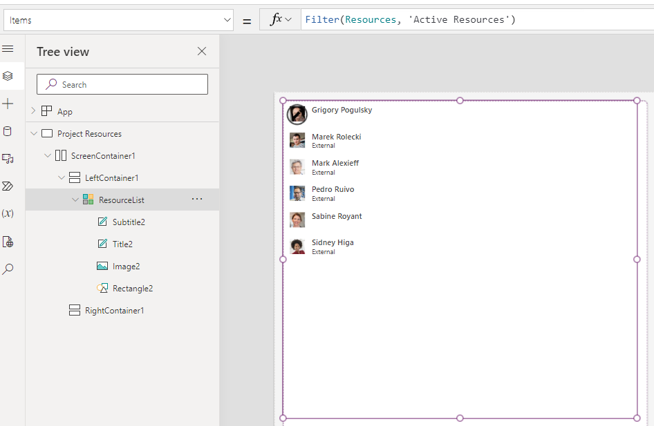

---
lab:
    title: 'Lab 4.2: Create a custom page'
    module: 'Learning Path 4: Create canvas apps'
---

# Practice Lab 4.2 – Create a custom page

## Scenario

You are a Power Platform functional consultant and have been assigned to the Fabrikam project for the next stage of the project.

You have been assigned to add a custom page to a model-driven app.

## Exercise 1 – Add an image to the Resource table

In this exercise, you will be adding an image column to the Resource table.

### Task 1.1 – Create an image column

1. Navigate to the Power Apps Maker portal `https://make.powerapps.com`

1. Make sure you are in the **Dev One** environment.

1. Select **Solutions**.

1. Open the **Fabrikam Environmental** solution.

1. In the **Objects** pane on the left, expand **Tables**.

1. Select the **Resource** table.

1. Under **Schema**, select **Columns**.

1. Select **+ New column**.

1. Enter `Picture` for **Display name**.

1. Select **File** and then **Image** in the **Data type** drop-down.

1. Check the **Primary image** box.

    

1. Select **Save**.

### Task 1.2 – Add images to resources

1. Navigate to the Power Apps Maker portal `https://make.powerapps.com`

1. Make sure you are in the **Dev One** environment.

1. Select **Solutions**.

1. Open the **Fabrikam Environmental** solution.

1. In the **Objects** pane on the left, select **Apps**.

1. Select the **Environmental Administration** app, and select **Play**.

1. Select **Resources**.

1. Edit each of the resources and upload an image by clicking the circle in the top-left of the form.

    
> You will find images in *Labs/images* folder

## Exercise 2 – Build custom page

In this exercise, you will build a custom page to manage project resources.

### Task 2.1 - Create a custom page

1. Navigate to the Power Apps Maker portal `https://make.powerapps.com`

1. Make sure you are in the **Dev One** environment.

1. Select **Solutions**.

1. Open the **Fabrikam Environmental** solution.

1. In the **Objects** pane on the left, select **Apps**.

1. Select the **+ New** drop-down and select **App** then **Page**.

1. Select **With layout** and select **Split screen**.

1. Select **Settings** which may be behind the ellipsis (...) menu in the command bar.

1. Enter `Project Resources page` for **Name**.

1. **Close** Settings.

1. Rename *Screen1* to `Project Resources`.


### Task 2.2 - Add gallery for resources

1. In the **Tree view**, expand **ScreenContainer1**.

1. Select **LeftContainer1**.

1. In **LeftContainer1**, select the **+** icon and select **Vertical gallery**.

1. Search for `Resources` and select the **Resources** table.

1. On the **Properties** tab for the gallery, select **Active Resources** for **Views**.

1. On the **Properties** tab for the gallery, under **Fields** select **5 selected**.

1. Select **contoso_resourcetype** for *Subtitle1*.

1. Rename the gallery to `ResourceList`

    

1. Close the **Data** panel.


### Task 2.3 - Add gallery for project resources

1. In the **Tree view**, expand **ScreenContainer1**.

1. Select **RightContainer1**.

1. In **RightContainer1**, select the **+** icon and select **Vertical gallery**.

1. Search for `Resources` and select the **Project Resources** table.

1. On the **Properties** tab for the gallery, select **Project Resources SubGrid** for **Views**.

1. On the **Properties** tab for the gallery, select **Title, subtitle, and body** for **Layout**.

1. On the **Properties** tab for the gallery, under **Fields** select **5 selected**.

1. Select **statuscode** for **Body**.

1. Select **contoso_projectrole** for **Subtitle**.

1. Select or enter `ThisItem.Name` for **Title**.

    

1. Select the gallery and select **Items** in the property selector.

   ```powerappsfl  
   Filter('Project Resources_1', Resource.Resource = ResourceList.Selected.Resource)
   ```

1. Rename the gallery to `ProjectResourceList`

1. Preview the page and verify that two projects are listed for Sidney.

    

1. Close the preview.

1. Select **Save**.

1. Select **Publish**.

1. Select **Publish this version**.

1. Select **🡠 Back**.

### Task 2.4 – Add custom page

In this task, you will add the custom page to a model-driven app.

1. Navigate to the Power Apps Maker portal `https://make.powerapps.com`

1. Make sure you are in the **Dev One** environment.

1. Select **Solutions**.

1. Open the **Fabrikam Environmental** solution.

1. In the **Objects** pane on the left, select **Apps**.

1. Select the **Environmental Project Delivery** app, select the **Commands** menu (...), and select **Edit** > **Edit in new tab**.

1. In the **Pages** pane on the left side, select **projects**.

1. Select the ellipsis (**...**) for **Projects** and select **New page**.

1. Select **Custom page**.

1. Select **Project Resources page**.

1. Select **Add**.

1. Select **Save**.

1. Select **Publish**.

1. Select **Play**.

    

1. Select **Project Resources page** under **Projects** and verify that resources are displayed and then **close** the app and app designer browser tabs.

1. Select **Done**.

