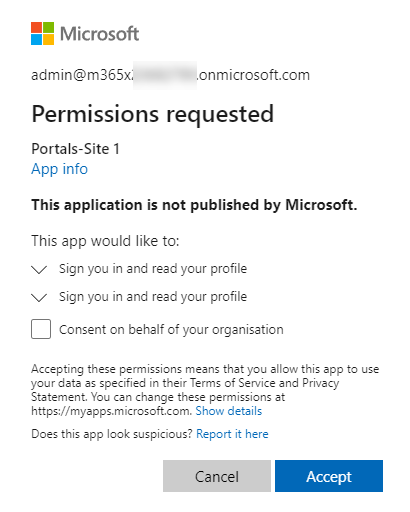
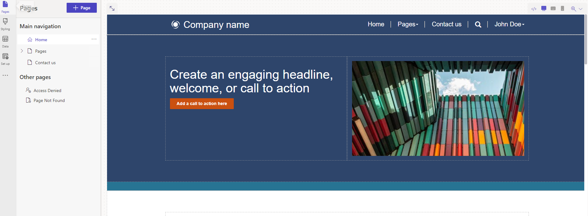
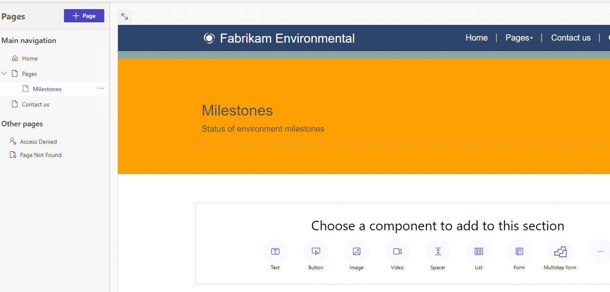
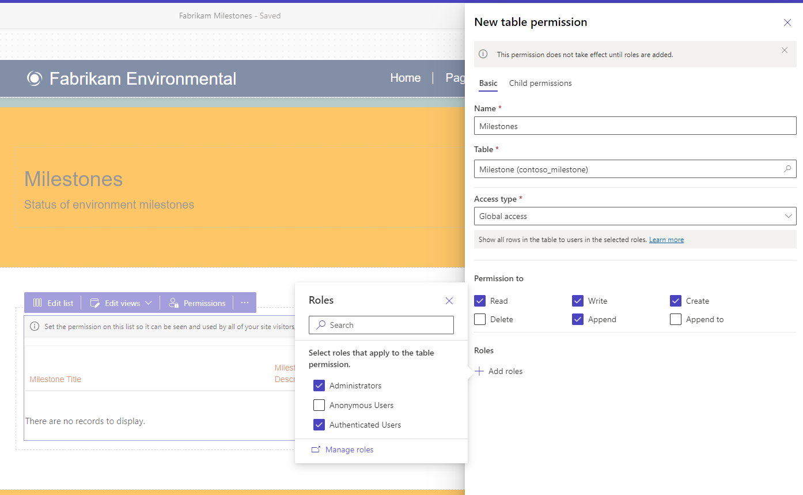
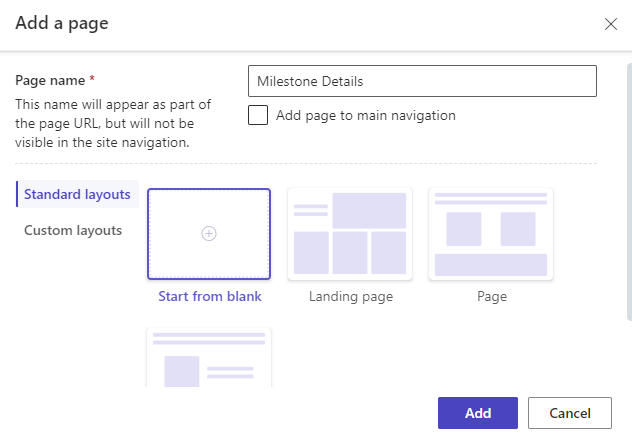

---
lab:
    title: 'Lab 5.1: Build a Power Pages portal'
    module: 'Module 5: Make portals in Power Pages'
---

## Practice Lab 5.1 – Build a Power Pages portal

## Scenario

You are a Power Platform functional consultant and have been assigned to the Fabrikam project for the next stage of the project.

In this practice lab, you will explore your Power Pages portal and expose Milestone data to customers.

## Exercise 1 - Explore and configure a Power Pages site

In this exercise, you will explore a Power Pages site and the Power Pages tools. You will make minor changes to the site content.

> IMPORTANT: At the time of writing, Power Pages is in technical preview and the steps may differ. Refer to <https://docs.microsoft.com/power-pages/getting-started/create-manage> for the latest documentation.

### Task 1.1 - Review the Power Pages site

1. Navigate to the Power Pages portal <https://make.powerpages.microsoft.com/>.

1. Make sure you are in the **Practice** environment.

1. Click on **Preview** and then select **Desktop**.

1. In the portal site, note the name of the tab in the browser, **Home - Starter Portal**.

1. Scroll down to the bottom of the page and note the page footer.

1. In the menu, select **Pages** and then select **Subpage 2**. You should see an empty page.

1. In the menu, select **Contact us**. You should see a form.

1. Complete the **Fill in your details** form with dummy data and click **Submit**.

### Task 1.2 - Sign in to the Power Pages site

1. In the menu, select  **Sign in**.

1. Click **Azure AD**. This will sign you in with your Microsoft 365 credentials.

    

1. In the permissions requested dialog, click **Accept**.

Your user has been added to the portal site.

### Task 1.3 - Review the Portal Management model-driven app

1. Navigate to the Power Apps Maker portal <https://make.powerapps.com>.

1. Make sure you are in your **Practice** environment.

1. Select **Apps**.

1. Select the **Portal Management** app, click on the ellipses (...), and select **Play**.

1. In the left-hand navigation, select **Web Pages**. You should see 9 pages including **Subpage 2**.

1. Select and edit **Subpage 2**. You should see that this page uses the **Default studio template** page template.

1. Click **Default studio template**. You should see that this page uses the **Default studio template** web template.

1. Click **Default studio template**. You should see the source for the web template.

1. In the left-hand navigation, select **Web Templates**. You should see many web templates.

1. In the left-hand navigation, select **Contacts**.

1. A contact has been created for your user, **MOD Administrator**.

1. Select and edit **MOD Administrator**.

1. Click the caret at the top-left of the form and select the **Portal Contact** form.

1. Select the **Web Authentication** tab. You are authenticating using **https://sts.windows.net** which is Azure Active Directory.

1. Select the **Related** tab and then select **Web Roles**. You have been added to the **Administrators** web role.

1. In the left-hand navigation, select **Web Roles**. You will see three web roles:

    - Administrators
    - Anonymous Users
    - Authenticated Users

### Task 1.4 - Edit the site footer in Portal Management

1. In the left-hand navigation, select **Content Snippets**.

1. Select and edit **Footer**. Do not navigate away from this page.

1. Select the **HTML** tab.

1. Replace the HTML with the following:

    ```html
    <p class="smallText">Copyright ©Fabrikam </p>
    <p class="smallText">{{ now | date: 'yyyy' }}</p>
    ```

1. Click **Save & Close**.

    > NOTE: The footer on the site is not updated immediately.

### Task 1.5 - Review Portal Designer

1. Navigate to the Power Pages portal <https://make.powerpages.microsoft.com/>.

1. Make sure you are in the **Practice** environment.

1. Edit **Edit**.

    

1. Scroll to the bottom of the page. You should see the footer that you changed in the earlier task.

1. In the **Pages** pane on the left-hand side, click to expand **Pages**. You should see **Subpage 2**.

1. Select **Subpage 2**. Do not navigate away from this page.

### Task 1.6 - Update pages in the Portal Designer

1. Select the ellipses (...) and select **Page settings**.

1. Enter **Milestones** for **Name**.

1. Enter **milestones** for **Partial URL**.

1. Click **OK**.

1. In the canvas, click on the heading, **Subpage 2**, and enter **Milestones**.

1. In the canvas, click the line of text underneath the heading and enter **Status of envirionmental miletones**.

1. Click on the background in the canvas above the heading and select the section.

1. Click on **Edit background**.

1. Pick the **Yellow** color under Brand colors.

1. In the **Pages** pane on the left-hand side, select **Subpage 1**.

1. Select the ellipses (...) and select **Delete**.

1. Click **Delete**.

1. In the **Pages** pane on the left-hand side, select **Home**.

1. Click on **Company name** at the top of the page.

1. Enter **Fabrikam Environmental**.

    

### Task 1.7 - View the changes to the site

1. In the top-right of the Power Pages designer, click on **Sync**.

1. Click on **Preview** and then select **Desktop**.

1. Verify your changes have been made.

## Exercise 2 – Expose Dataverse data

In this exercise, you will add a list of Milestone rows to the page, add a form to edit rows, and configure security to allow the data to be changed in the portal site.

> IMPORTANT: At the time of writing, Power Pages is in technical preview and the steps may differ. Refer to <https://docs.microsoft.com/power-pages/getting-started/what-is-dataverse> for the latest documentation.

### Task 2.1 - Display Dataverse records

1. Navigate to the Power Pages portal <https://make.powerpages.microsoft.com/>.

1. Make sure you are in the **Practice** environment.

1. Edit **Edit**.

1. In the **Pages** pane on the left-hand side, click to expand **Pages**, and select **Milestones**.

1. In the canvas under **Choose a component to add to this section**, select the **List** icon.

1. Select **Milestone (contoso_milestone)** for **Choose a table**.

1. Select **Milestones SubGrid** for **Select Dataverse views**.

1. Enter **Milestones** for **Name your copy of the select list**.

1. Click **OK**.

### Task 2.2 - Security

1. Click on **Permissions** in the list component editor (you may need to hover over the list to see this).

1. In the **Table Permissions** pane on the right-hand side, click **+ New permission**

1. Enter **Milestones** for **Name**.

1. Select **Milestone (contoso_milestone)** for **Table**.

1. Select **Global access** for **Access type**.

1. Check the following permissions:

    - Read
    - Write
    - Create
    - Append
    - Append To

1. Click **+ Add Roles**

1. Check the following permissions:

    - Administrators
    - Authenticated Users

1. Click **Save**.

    

1. In the **Table Permissions** pane on the right-hand side, click **New table permission**

1. Enter **Project** for **Name**.

1. Select **Project (contoso_project)** for **Table**.

1. Select **Global access** for **Access type**.

1. Check the following permissions:

    - Read
    - Append To

1. Click **+ Add Roles**

1. Check the following permissions:

    - Administrators
    - Authenticated Users

1. Click **Save**.

1. Click **Close** to close the Table permissions pane.

1. In the top-right of the Power Pages designer, click on **Sync**.

1. Click on **Preview** and then select **Desktop**.

1. Verify that milestone records are listed in the Power Pages site.

1. Close the Starter Portal tab.

### Task 2.3 - Form

1. In the **Pages** pane on the left-hand side, and select **Pages**.

1. Select the ellipses (...) and select **Add a new subpage**.

1. Enter **Milestone Details**

1. Uncheck **Add this page to main navigation**

1. Select **Start from blank**.

    

1. Click **Add**

1. In the canvas under **Choose a component to add to this section**, select the **Form** icon.

1. Click **+ New form**.

1. Select **Milestone (contoso_milestone)** for **Choose a table**.

1. Select **Information** for **Select a form**.

1. Enter **Milestone** for **Name your copy of the select form**.

1. Select **Data**.

1. Select **Updates an existing record** for **Data from this form**.

1. Select **On submit**.

1. Select **Redirect to a page** for **When this form is submitted** and then select the **Milestones** page.

1. Select **CAPTCHA**.

1. Uncheck both boxes.

1. Click **OK**.

1. In the **Pages** pane on the left-hand side, and select **Milestones**.

1. Select the ellipses (...) and select **Promote this subpage**.

1. In the **Pages** pane on the left-hand side, and select **Pages**.

1. Select the ellipses (...) and select **Delete**.

1. In the **Pages** pane on the left-hand side, and select **Milestones**.

1. In the canvas, select the **Milestones list component**.

1. In the list component editor, select **Edit list**.

1. Select **Data**.

1. Toggle **View details** to **On**.

1. Select **Form** for **Target type**.

1. Select **Milestone** for **Forms**.

1. Toggle **Create a new record** to **On**.

1. Select **Form** for **Target type**.

1. Select **Milestone** for **Form**.

1. Click **OK**.

1. In the top-right of the Power Pages designer, click on **Sync**.

1. Click on **Preview** and then select **Desktop**.

1. Test viewing and editing Milestones.
