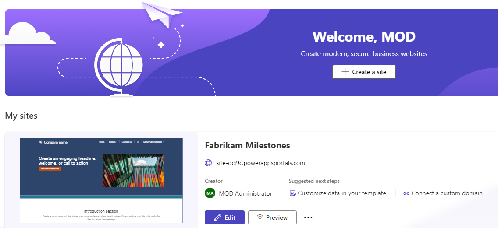

---
lab:
    title: 'Lab 5.1: Build a Power Pages portal'
    module: 'Learning Path 5: Make portals in Power Pages'
---

# Practice Lab 5.1 – Build a Power Pages portal

## Scenario

You are a Power Platform functional consultant and have been assigned to the Fabrikam project for the next stage of the project.

In this practice lab, you will deploy a Power Pages portal and expose Milestone data to customers.

## Exercise 1 - Sign up for Power Pages

In this exercise, you will provision a Power Pages site using a starter template.

### Task 1.1 - Create a Power Pages site

1. Navigate to the Power Pages portal `https://make.powerpages.microsoft.com/` and sign in with your Microsoft 365 credentials if prompted.

1. Use the Environment selector to switch to the **Dev One** environment.

1. Select **Get started**.

1. If you are asked about your experience creating websites, select **Skip**.

1. Scroll down and select **Start with a template**.

1. Choose the default design template, **Starter layout 1**, and select **Choose this template**.

    

1. Enter `Fabrikam Milestones` for **Give your site a name**.

1. Use the autogenerated web address.

1. Select **Done**.

    > The portal site will deploy. It can take a while for your site to fully deploy.

    

1. Wait for the site to be deployed.


## Exercise 2 - Explore and configure a Power Pages site

In this exercise, you will explore a Power Pages site and the Power Pages tools. You will make minor changes to the site content.

### Task 2.1 - Review the Power Pages site

1. Navigate to the Power Pages portal `https://make.powerpages.microsoft.com/`.

1. Make sure you are in the **Dev One** environment.

1. Select **Preview** and then select **Desktop**.

1. If permissions are requested, check the **Consent on behalf of your organization** and select **Accept**.

    

1. Scroll down to the bottom of the page and note the page footer.

1. In the menu, select **Pages** and then select **Subpage 2**. You should see an empty page.

1. In the menu, select **Contact us**. You should see a form.

1. Complete the **Fill in your details** form with dummy data and select **Submit**.


### Task 2.2 - Sign in to the Power Pages site

1. In the menu, select  **Sign in**.

1. Select **Azure AD**. This will sign you in with your Microsoft 365 credentials.

1. If permissions are requested, select **Accept**.

    

1. Enter `MOD` and `Administrator` for **First Name** and **Last Name** respectively and select **Update**.


### Task 2.3 - Review the Power Pages Management model-driven app

1. Navigate to the Power Apps Maker portal `https://make.powerapps.com`

1. Make sure you are in the **Dev One** environment.

1. Select **Apps** and select **All**.

1. Select the **Power Pages Management** app, select the ellipsis menu (...), and select **Play**.

1. In the left navigation, select **Web Pages**. You should see 10 rows including **Subpage 2**.

1. Select and edit **Subpage 2**. You should see that this page uses the **Default studio template** page template.

1. Select **Default studio template**. You should see that this page uses the **Default studio template** web template.

1. Select **Default studio template**. You should see the source for the web template.

1. In the left navigation, select **Web Templates**. You should see many web templates.

1. In the left navigation, select **Contacts**.

1. A contact has been created for your user, **MOD Administrator**.

1. Select and edit **MOD Administrator**.

1. Select the caret at the top-left of the form and select the **Portal Contact (enhanced)** form.

1. Select the **Web Authentication** tab. You are authenticating using **https://sts.windows.net** which is Microsoft Entra Id (Azure Active Directory).

1. Select the **General** tab and view the **Web Roles** subgrid. Note that you have the **Administrators** web role.

1. In the left navigation, select **Web Roles**. You will see active Web Roles listed

    - Administrators
    - Anonymous Users
    - Authenticated Users


### Task 2.4 - Edit the site footer in Portal Management

1. In the left navigation, select **Content Snippets**.

1. Select and edit **Footer**. Do not navigate away from this page.

1. Replace the HTML with the following:

    ```html
    <p class="smallText">Copyright ©Fabrikam </p>
    <p class="smallText">{{ now | date: 'yyyy' }}</p>
    ```

1. Select **Save & Close**.

    > **Note**: The footer on the site is not updated immediately.


### Task 2.5 - Review Portal Designer

1. Navigate to the Power Pages portal `https://make.powerpages.microsoft.com/`

1. Make sure you are in the **Dev One** environment.

    

1. Select **Edit** to open the site designer.

    

1. Scroll to the bottom of the page. You should see the footer that you changed in the earlier task.

1. In the **Pages** pane on the left side, select to expand **Pages**. You should see **Subpage 2**.

1. Select **Subpage 2**. Do not navigate away from this page.


### Task 2.6 - Update pages in the Portal Designer

1. Select the ellipsis (...) and select **Page settings**.

1. Enter `Milestones` for **Name**.

1. Enter `milestones` for **Partial URL**.

1. Select **OK**.

1. In the canvas, select the heading, **Subpage 2**, and enter `Milestones`.

1. In the canvas, select the line of text underneath the heading and enter `Status of environmental milestones`.

1. Select the background in the canvas above the heading and select the section.

1. Select **Edit background**.

1. Pick the **Yellow** color under Brand colors.

1. In the **Pages** pane on the left side, select **Subpage 1**.

1. Select the ellipsis (...) and select **Delete**.

1. Select **Delete**.

1. Select **Company name** at the top of the page and select **Edit site header**.

1. Enter **Fabrikam Environmental**.

    


### Task 2.7 - View the changes to the site

1. In the top-right of the Power Pages designer, select **Sync**.

1. Select **Preview** and then select **Desktop**.

1. Verify your changes have been made.

## Exercise 3 – Expose Dataverse data

In this exercise, you will add a list of Milestone rows to the page, add a form to edit rows, and configure security to allow the data to be changed in the portal site.

### Task 3.1 - Display Dataverse records

1. Navigate to the Power Pages portal <https://make.powerpages.microsoft.com/>.

1. Make sure you are in the **Dev One** environment.

1. Select **Edit** to open the site designer.

1. In the **Pages** pane on the left side, select and expand **Pages**, and select **Milestones**.

1. In the canvas under **Choose a component to add to this section**, select the **List** icon.

1. Select **Milestone** for **Choose a table**.

1. Select **Milestones SubGrid** for **Select the data views**.

1. Enter **Milestones** for **Name your list**.

1. Select **Done**.


### Task 3.2 - Security

1. Select **Permissions** in the list component editor (you may need to hover over the list to see this).

1. In the **Table Permissions** pane on the right-hand side, select **+ New permission**

1. Enter **Milestones** for **Name**.

1. Select **Milestone** for **Table**.

1. Select **Global access** for **Access type**.

1. Check the following permissions:

    - Read
    - Update
    - Create
    - Append
    - Append To

1. Select **+ Add roles**

1. Check the following permissions:

    - Administrators
    - Authenticated Users

1. Select **Save**.

    

1. In the **Table Permissions** pane on the right-hand side, select **New table permission**

1. Enter **Projects** for **Name**.

1. Select **Project** for **Table**.

1. Select **Global access** for **Access type**.

1. Check the following permissions:

    - Read
    - Append

1. Select **+ Add roles**

1. Check the following permissions:

    - Administrators
    - Authenticated Users

1. Select **Save**.

1. Select **Close** to close the Table permissions pane.

1. In the top-right of the Power Pages designer, select **Sync**.

1. Select **Preview** and then select **Desktop**.

1. Verify that milestone records are listed in the Power Pages site.


### Task 3.3 - Form

1. In the **Pages** pane on the left side, and select **Pages**.

1. Select the ellipsis (...) and select **Add a new subpage**.

1. Select **Other ways to add a page**.

1. Enter `Milestone Details`.

1. Uncheck **Add page to main navigation**

1. Select **Start from blank**.

    

1. Select **Add**

1. In the canvas under **Choose a component to add to this section**, select the **Form** icon.

1. Select **+ New form**.

1. Select **Milestone** for **Choose a table**.

1. Select **Information** for **Select a form**.

1. Enter `Milestone` for **Name your copy of the selected form**.

1. Select the **Data** tab.

1. Select **Updates an existing record** for **Data from this form**.

1. Select the **On submit** tab.

1. Select **Redirect to a page** for **When the form is submitted** and then select the **Milestones** page.

1. Select the **CAPTCHA** tab.

1. Uncheck both boxes.

1. Select **OK**.

1. In the **Pages** pane on the left side, select **Milestones**.

1. Select the ellipsis (...) and select **Promote this subpage**.

1. In the **Pages** pane on the left side, select **Pages**.

1. Select the ellipsis (...) and select **Delete**.

1. In the **Pages** pane on the left side, select **Milestones**.

1. In the canvas, select the **Milestones list component**.

1. Select **Actions**.

1. Toggle **View details** to **On**.

1. Select **Form** for **Target type**.

1. Select **Milestone** for **Forms**.

1. Toggle **Create a new record** to **On**.

1. Select **Form** for **Target type**.

1. Select **Milestone** for **Form**.

1. Select **OK**.

1. In the top-right of the Power Pages designer, select **Sync**.

1. Select **Preview** and then select **Desktop**.

1. Test viewing and editing Milestones.
