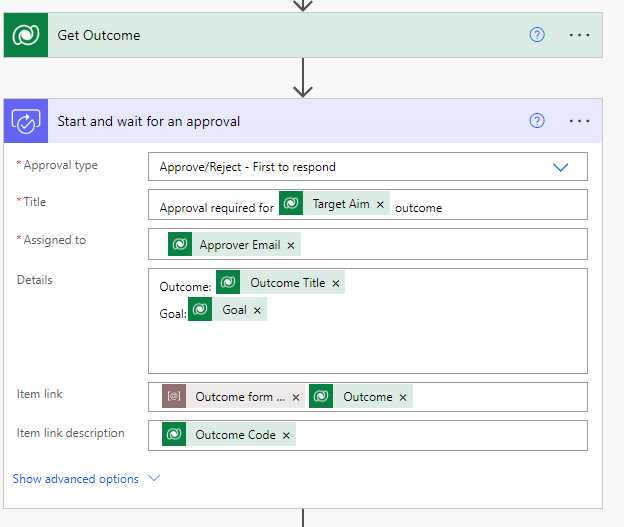

---
lab:
    title: 'Lab 6.1: Cloud flows'
    module: 'Learning Path 6: Build automation with Power Automate'
---

# Practice Lab 6.1 – Cloud flows

## Scenario

You are a Power Platform functional consultant and have been assigned to the Fabrikam project for the next stage of the project.

In this practice lab, you change an existing approvals flow and add error handling. You will also set the value of the environment variable used by the flow. You will also create a new flow to automatically set the actual end date on projects. You will call a Power Automate cloud flow from a canvas app.

## Exercise 1 – Edit approval cloud flow

In this exercise, you will enhance the existing approvals flow.

### Task 1.1 – Change the approver in flow

In this task, you will perform the following changes to the flow:

- Replace the Get Approver row with the calculated column for Approver Email Address

1. Navigate to the Power Apps Maker portal `https://make.powerapps.com`

1. Make sure you are in the **Dev One** environment.

1. Select **Solutions**.

1. Open the **Fabrikam Environmental** solution.

1. In the **Objects** pane on the left, select **Cloud flows**.

1. Select the **Request Approval** flow, select the ellipsis **...**, and select **Edit** > **Edit in new tab**.

1. If a Welcome to Power Automate dialog appears, select **Get started**.

1. Select the **Start and wait for an approval** step.

    > **Note**: The Item link field uses an environment variable, **Outcome form link**.

1. Clear the current contents of the **Assigned To** field.

1. In **Dynamic content**, search for `email` and select **Approver Email**. You may need to scroll down in the Dynamic Content window to see this.

1. On the **Get Approver** step, select the ellipsis (...) and select **Delete** and then **OK**.

    

1. Select **Save**.


### Task 1.2– Check if an approver is assigned to the outcome

In this task, you will perform the following changes to the flow:

- Add check for missing approver

1. Hover the mouse between the **Get Outcome** and **Start and wait for an approval** steps and select the **+** (Insert a new step) > **Add an action**.

1. Select the **Control** connector and then select **Condition**.

1. Select the first **Choose a value** field.

1. In **Dynamic content**, search for **approver** and select **Approver Email**.

1. Change the **Operator** to **is not equal to**.

1. Select the right-hand **Choose a value** field.

1. In **Dynamic content**, select the **Expression** tab.

1. Enter `null` and select **OK**.

1. In the **condition** step, select **+ Add** and then select **Add row**.

1. Select the **Choose a value** field.

1. In **Dynamic content**, select the **Expression** tab.

1. Enter `length()` and position the cursor between the brackets.

1. Select the **Dynamic content** tab, select **See more** for **Get Outcome**, and choose **Approver Email** and select **OK**.

1. The expression should be as follows:

    ```length(outputs('Get_Outcome')?['body/contoso_approveremail'])```

1. Change the **Operator** to **is greater than**.

1. Select the right-hand **Choose a value** field and enter `0`

1. In the condition step, note the **And** drop-down is set to **And**.

    

1. Drag the **Start and wait for an approval** step into the **If yes** branch of the condition.

1. Drag the **Check Approval response** step into the **If yes** branch of the condition.

1. In the **If no** branch of the condition, select **Add an action**.

1. Select the **Control** connector and then select **Terminate**.

1. Select **Failed** for the **Status** drop down.

1. Enter `NO_APPROVER` for **Code**.

1. Enter `No approver for outcome` and in **Dynamic content** select **Outcome Title**.

    

1. Select **Save**.


### Task 1.3 – Error handling

In this task, you will perform the following changes to the flow:

- Add error handing to the approval step

1. On the **Check Approval Response** step, select the ellipsis (...) and select **Configure run after**. Only **is successful** is selected.

1. Select **Cancel**.

1. Hover the mouse between the **Start and wait for an approval** and **Check Approval Response** steps and select the **+** (Insert new step) and then select **Add a parallel branch**.

1. Select the **Control** connector and then select **Terminate**.

1. Select **Failed** for the **Status** drop down.

1. Enter `APPROVAL_EXPIRED` for **Code**.

1. Enter `Approval timed out for` and in **Dynamic content**, select **Outcome Title** for **Message**.

1. On the **Terminate 2** step, select the ellipsis (...) and select **Configure run after**.

1. Uncheck **is successful**.

1. Check the other three boxes.

1. Select **Done**.

    

1. Select **Save**


### Task 1.4 – Set status to rejected

In this task, you will perform the following changes to the flow:

- Set status to rejected if the approval is rejected

1. Select and expand the **Check Approval Response** step.

1. In the **If no** branch of the condition, select **Add an action**.

1. Select the **Microsoft Dataverse** connector and then select **Update a row**.

1. On the **Update a row** step, select the ellipsis (...) and select **Rename**.

1. Enter `Set Outcome to rejected`

1. Select **Outcomes** for **Table name**.

1. Select the **Row ID** field.

1. In **Dynamic content**, search for `outcome` and select **Outcome** under the **Get Outcome** section.

1. Expand **Show advanced options**.

1. Select **No** for **Approved**.

1. Select **Rejected** for **Status Reason**.

1. Select **Save**

1. Select the back arrow icon in the top-left of the flow editor.

   **Note:** If you receive an error message stating **This isn't the latest content**, select **Overwrite other people's changes** then select **Apply** to move forward.


## Exercise 2 – Edit environment variable

In this exercise, you will find the URL for your environment and update the environment variable.

### Task 2.1 – Find the URL for your environment

In this task, you will:

- Discover the URL for the outcome form in the model-driven app

1. Navigate to the Power Apps Maker portal `https://make.powerapps.com`

1. Make sure you are in the **Dev One** environment.

1. Select **Solutions**.

1. Open the **Fabrikam Environmental** solution.

1. In the **Objects** pane on the left, select **Apps**.

1. Select the **Environmental Project Delivery** app, select the ellipsis (...), and select **Play**.

1. In the left-hand navigation, select **Outcomes**.

1. Open any outcome record.

1. Copy the URL of the window.

1. Open Notepad and paste the URL.

1. The URL will look like the link below.

    ```https://practice.crm.dynamics.com/main.aspx?appid=de79a38a-138b-4a89-91fb-b12ca31d227b&pagetype=entityrecord&etn=contoso_outcome&id=717c05a8-2c2c-ed11-9db1-00224820046d```

1. Copy everything before the last GUID.

    ```https://practice.crm.dynamics.com/main.aspx?appid=de79a38a-138b-4a89-91fb-b12ca31d227b&pagetype=entityrecord&etn=contoso_outcome&id=```


### Task 2.2 – Update environment variable

In this task, you will:

- Update the environment variable

1. Navigate to the Power Apps Maker portal `https://make.powerapps.com`

1. Make sure you are in the **Dev One** environment.

1. Select **Solutions**.

1. Open the **Fabrikam Environmental** solution.

1. In the **Objects** pane on the left, select **Environment variables**.

1. Select the **Outcome form link** variable, select the ellipsis (...), and select **Edit**.

1. Select **+ New value**.

1. Paste the URL from the previous task.

1. Select **Save**.


### Task 2.3 – Restart flow

In this task, you will:

- turn the flow off and on again to pick up the change to the environment variable

1. In the **Objects** pane on the left, select **Cloud flows**.

1. Select the **Request Approval** flow, select the ellipsis (...), and select **Turn off**.

1. Select the **Request Approval** flow, select the ellipsis (...), and select **Turn on**.


## Exercise 3 - Create automatic cloud flow for project status

In this exercise, you will create a new cloud flow that is triggered when the project status is updated. The flow will set the actual end date if the project status is completed.

### Task 3.1 - Create a new cloud flow

In this task, you will perform the following:

- create a new flow that is triggered by project status change
- add an action to set the actual end date

1. Navigate to the Power Apps Maker portal `https://make.powerapps.com`

1. Make sure you are in the **Dev One** environment.

1. Select **Solutions**.

1. Open the **Fabrikam Environmental** solution.

1. In the **Objects** pane on the left, select **Cloud flows**.

1. Select **+ New** > **Automation** > **Cloud flow** > **Automated**.

1. Enter `Set Project End Date` for **Flow name**.

1. Search for `Dataverse` in **Choose your flow's trigger** and select the **When a row is added, modified, or deleted** action.

1. Select **Create**.

1. Select **Modified** for **Change type**.

1. Select **Projects** for **Table name**.

1. Select **Organization** for **Scope**.

1. Select the ellipsis (...) and select **Rename**.

1. Enter `Project Status changed`

1. Expand **Show advanced options**.

1. For the **Select columns** field, enter `contoso_projectstatus` 

    The flow will only trigger when the project status value is changed.

1. Select **+ New step**.

1. Select the **Microsoft Dataverse** connector and then select **Update a row**.

1. On the **Update a row** step, select the ellipsis (...) and select **Rename**.

1. Enter `Set Actual End Date`

1. Select **Projects** for **Table name**.

1. Select the **Row ID** field.

1. In **Dynamic content**, search for `project` and select **Project**.

1. Expand **Show advanced options**.

1. Select the **Actual End** field.

1. In **Dynamic content**, select the **Expression** tab.

1. Enter `utcNow()` and select **OK**.

1. Select **Save**.


### Task 3.2 - Configure trigger

In this task, you will perform the following:

- restrict the flow trigger to only fire when the project status is completed and the actual end date has not been entered

1. Select the trigger step (Project Status changed).

1. Expand **Show advanced options** if not already expanded.

1. Select **Filter rows** and enter the following OData filter expression:

    ```(contoso_projectstatus eq 330650003 and contoso_actualenddate eq null)```

1. Select **Save**.

1. Select the back arrow icon in the top-left of the flow editor.


## Exercise 4 – Call Power Automate from a Canvas app

In this exercise, you will add a Power Automate flow to the canvas app to reset the status of a Milestone.

### Task 4.1 - Create flow

In this task, you will perform the following changes to the screen:

- create an instant flow for use in the canvas app
- perform a flow action to reset the status of a Milestone

1. Navigate to the Power Apps Maker portal `https://make.powerapps.com`

1. Make sure you are in the **Dev One** environment.

1. Select **Solutions**.

1. Open the **Fabrikam Environmental** solution.

1. In the **Objects** pane on the left, select **Cloud flows**.

1. In the solution, select **+ New** > **Automation** > **Cloud flow** > **Instant**.

    > NOTE: If a Welcome to Power Automate dialog appears, select **Get started**.

1. Enter `Reset milestone status` for **Flow name**.

1. Select **When Power Apps calls a flow (V2)** for **Choose how to trigger this flow**.

1. Select **Create**.

1. Select the Power Apps (V2) trigger step.

1. Select **+ Add an input**.

1. Select **Text**.

1. Enter `ID` for *Input*.

1. Enter `Milestone` for *Please enter your input*.

1. Select **+ New step**.

1. Select the **Microsoft Dataverse** connector.

1. Select the **Update a row** action.

1. Select **Milestones** for **Table name**.

1. Select the **Row ID** field.

1. In **Dynamic content**, select **ID**.

1. Expand **Show advanced options**.

1. Enter `0` for **Milestone Percentage Complete**.

1. Select **Planned** for **Milestone status**.

1. Select **Save** and wait for the flow to save.

1. Select the **🡠** back arrow in the top left of the flow editor.

### Task 4.2 - Add flow to canvas app

In this task, you will perform the following changes to the screen:

- add the flow to the canvas app
- run the flow from a button

1. In the **Objects** pane on the left, select **Apps**.

1. Select the **Environmental Milestones** app, select the **Commands** menu (...), and select **Edit** > **Edit in new tab**.

1. In the left navigation, select the ellipses and select **Power Automate**.

1. Select **+ Add flow**.

1. Select **Reset milestone status**. The flow will be added to the app.

1. In the **Tree view**, select and expand **MilestonesScreen**.

1. Select and expand **ScreenContainer1.**

1. Select and expand **BodyContainer1.**

1. Select and expand **RightContainer1.**

1. Select **SelectedRecordHeaderContainer1.**

1. In the header, select **+Insert**. Expand **Icons** and select **Reset icon.** A reset icon will be added to the Selected Record Header in the app.

1. Select the new icon in the Tree view. Rename it to **ResetIconButton.**

1. In the Properties tab, change the icon's height to **26** and the width to **26.**

1. Select **DisplayMode** in the Property window to enter a formula. In the formula box above the canvas app interface, enter the following formula:

    ```If(MilestoneGallery.Selected.'Milestone Percentage Complete' > 0, DisplayMode.Edit, DisplayMode.Disabled)```

1. Select **Advanced** in the Properties window to open the advanced properties. In the he **OnSelect** property, enter the following formula:

    ```Resetmilestonestatus.Run(MilestoneGallery.Selected.Milestone);Refresh(Milestones);```

### Task 4.3 - Publish and share the app

1. Select **Save**.

1. Select **Publish**.

1. Select **Publish this version**.

1. Select **Share**.

1. Enter `Alex` in **Enter a name, email address, or Everyone** and select **Alex Wilber**.

1. Select **Share**.

1. Enter `Patti` in **Enter a name, email address, or Everyone** and select **Patti Fernandez**.

1. Check the **Co-owner** box.

1. Select **Share**.

1. **Close** the tab.


## Exercise 5 – Solutions

In this exercise, you will export the solution from the Development environment and import it into the Production environment.

### Task 5.1 – Export managed solution

1. Navigate to the Power Apps Maker portal `https://make.powerapps.com`

1. Make sure you are in the **Dev One** environment.

1. Select **Solutions**.

1. Select the **Fabrikam Environmental** solution but do not open it.

1. Select **Export Solution**.

1. Select **Next**.

1. Select **Next** again.

1. Change the version number to `1.1.11.15`

1. Select **Managed** for **Export as**.

1. Select **Export**.

1. The export will be prepared in the background. When the solution is ready, select the **Download** button.


### Task 5.2 – Export unmanaged solution

1. Select the **Fabrikam Environmental** solution.

1. Select **Export Solution**.

1. Select **Next**.

1. Select **Next** again.

1. Change the version number to `1.1.11.15`

1. Select **Unmanaged** for **Export as**.

1. Select **Export**.

1. The export will be prepared in the background, when the solution is ready click the **Download** button.


### Task 5.3 – Import managed solution

1. Switch environments by using the Environment Selector in the upper right corner of the Maker portal.

1. Select the **Production** environment from the list.

1. Select **Solutions**.

1. Select **Import solution**.

1. Select **Browse**, change to the **Downloads** folder and select **FabrikamEnvironmental_1_1_11_15_managed.zip** and select **Open**.

1. Select **Next** until Import

1. Select **Import**. The solution will import in the background.

