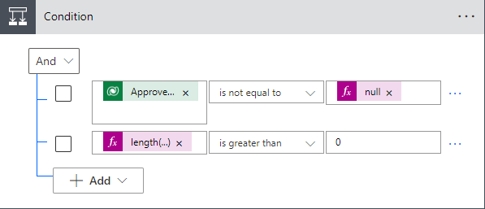
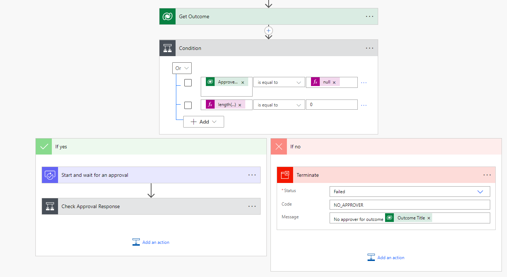
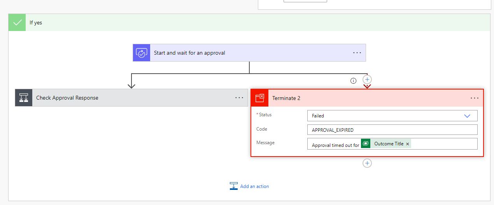

---
lab:
    title: 'Lab 6.1: Cloud flows'
    module: 'Module 6: Build automation with Power Automate'
---

## Practice Lab 6.1 – Cloud flows

## Scenario

You are a Power Platform functional consultant and have been assigned to the Fabrikam project for the next stage of the project.

In this practice lab, you change an existing approvals flow and add error handling. You will also set the value of the environment variable used by the flow. You will also create a new flow to automatically set the actual end date on projects.

## Exercise 1 – Edit approval cloud flow

In this exercise, you will enhance the existing approvals flow.

### Task 1.1 – Change the approver in flow

In this task, you will perform the following changes to the flow:

- Replace the Get Approver row with the calculated column for Approver Email Address

1. Navigate to the Power Apps Maker portal <https://make.powerapps.com>.

1. Make sure you are in the **Development** environment.

1. Select **Solutions**.

1. Click to open the **Fabrikam Environmental** solution.

1. In the **Objects** pane on the left, select **Cloud flows**.

1. Select the **Request Approval** flow, click on the ellipses (...), and select **Edit**.

1. Select the **Start and wait for an approval** step.

    > NOTE: The Item link field use an environment variable, **Outcome form link**.

1. Click in the **Assigned To** field and clear the current contents.

1. In **Dynamic content**, search for **email** and select **Approver Email**. You may need to scroll down in the Dynamic Content window to see this.

1. On the **Get Approver** step, select the ellipses (...) and select **Delete**.

### Task 1.2– Check if an approver is assigned to the outcome

In this task, you will perform the following changes to the flow:

- Add check for missing approver

1. Hover the mouse between the **Get Outcome** and **Start and wait for an approval** steps and click on **+** (Insert new step) > **Add an action**.

1. Select the **Control** connector and then select **Condition**.

1. Click in the first **Choose a value** field.

1. In **Dynamic content**, search for **approver** and select **Approver Email**.

1. Change the **Operator** to **is not equal to**.

1. Click in the right-hand **Choose a value** field.

1. In **Dynamic content**, select the **Expression** tab.

1. Enter **null** and click **OK**.

1. In the condition step, click **+ Add** and then select **Add row**.

1. Click in the **Choose a value** field.

1. In **Dynamic content**, select the **Expression** tab.

1. Enter **length()** and position the cursor between the brackets.

1. Select the **Dynamic content** tab, select **See more** for **Get Outcome**, and select the **Approver Email** and click **OK**.

1. The expression should be as follows:

    ```length(outputs('Get_Outcome')?['body/contoso_approveremail'])```

1. Change the **Operator** to **is greater than**.

1. Click in the right-hand **Choose a value** field and enter **0**

1. In the condition step, note the **And** drop-down is set to **And**.

    

1. Drag the **Start and wait for an approval** step into the **If yes** branch of the condition.

1. Drag the **Check Approval response** step into the **If yes** branch of the condition.

1. In the **If no** branch of the condition, click **Add an action**.

1. Select the **Control** connector and then select **Terminate**.

1. Select **Failed** for the **Status** drop down.

1. Enter **NO_APPROVER** for **Code**.

1. Enter **No approver for outcome** and in **Dynamic content** select **Outcome Title**.

1. Click **Save**.

    

### Task 1.3 – Error handling

In this task, you will perform the following changes to the flow:

- Add error handing to the approval step

1. On the **Check Approval Response** step, select the ellipses (...) and select **Configure run after**. Only **is successful** is selected.

1. Click **Cancel**.

1. Hover the mouse between the **Start and wait for an approval** and **Check Approval Response** steps and click on **+** (Insert new step) and then select **Add a parallel branch**.

1. Select the **Control** connector and then select **Terminate**.

1. Select **Failed** for the **Status** drop down.

1. Enter **APPROVAL_EXPIRED** for **Code**.

1. Enter **Approval timed out for ** and in **Dynamic content**, select **Outcome Title**. 

1. On the **Terminate 2** step, select the ellipses (...) and select **Configure run after**.

1. Uncheck **is successful**.

1. Check the other three boxes.

1. Click **Done**.

1. Click **Save**

    

### Task 1.4 – Set status to rejected

In this task, you will perform the following changes to the flow:

- Set status to rejected if the approval is rejected

1. Select and expand the **Check Approval Response** step.

1. In the **If no** branch of the condition, click **Add an action**.

1. Select the **Microsoft Dataverse** connector and then select **Update a row**.

1. On the **Update a row** step, select the ellipses (...) and select **Rename**.

1. Enter **Set Outcome to rejected**.

1. Select **Outcomes** for **Table name**.

1. Click in the **Row ID** field.

In **Dynamic content**, search for outcome and select **Outcome** under the **Get Outcome** section.

1. Expand **Show advanced options**.

1. Select **No** for **Approved**.

1. Select **Rejected** for **Status Reason**.

1. Click **Save**

1. Click the back arrow icon in the top-left of the flow editor.

## Exercise 2 – Edit environment variable

In this exercise, you will find the URL for your environment and update the environment variable.

### Task 2.1 – Find the URL for your environment

In this task, you will:

- Discover the URL for the outcome form in the model-driven app

1. Navigate to the Power Apps Maker portal <https://make.powerapps.com>.

1. Make sure you are in the **Development** environment.

1. Select **Solutions**.

1. Click to open the **Fabrikam Environmental** solution.

1. In the **Objects** pane on the left, select **Apps**.

1. Select the **Environmental Project Delivery** app, click on the ellipses (...), and select **Play**.

1. In the left-hand navigation, select **Outcomes**.

1. Open any outcome record.

1. Copy the URL of the window.

1. Open Notepad and paste the URL.

1. The URL will look like the link below.

    ```https://practice.crm.dynamics.com/main.aspx?appid=de79a38a-138b-4a89-91fb-b12ca31d227b&pagetype=entityrecord&etn=contoso_outcome&id=717c05a8-2c2c-ed11-9db1-00224820046d```

1. Copy everything before the last GUID.

    ```https://practice.crm.dynamics.com/main.aspx?appid=de79a38a-138b-4a89-91fb-b12ca31d227b&pagetype=entityrecord&etn=contoso_outcome&id=```

### Task 2.2 – Update environment variable

In this task, you will:

- Update the environment variable

1. Navigate to the Power Apps Maker portal <https://make.powerapps.com>.

1. Make sure you are in the **Development** environment.

1. Select **Solutions**.

1. Click to open the **Fabrikam Environmental** solution.

1. In the **Objects** pane on the left, select **Environment variables**.

1. Select the **Outcome form link** variable, click on the ellipses (...), and select **Edit**.

1. Click **+ New value**.

1. Paste the URL from the previous task.

1. Click **Save**.

### Task 2.3 – Restart flow

In this task, you will:

- turn the flow off and on again to pick up the change to the environment variable

1. In the **Objects** pane on the left, select **Cloud flows**.

1. Select the **Request Approval** flow, click on the ellipses (...), and select **Turn off**.

1. Select the **Request Approval** flow, click on the ellipses (...), and select **Turn on**.

## Exercise 3 - Create automatic cloud flow for project status

In this exercise, you will create a new cloud flow that is triggered when the project status is updated. The flow will set the actual end date if the project status is completed.

### Task 3.1 - Create a new cloud flow

In this task, you will perform the following:

- create a new flow that is triggered by project status change
- add an action to set the actual end date

1. Navigate to the Power Apps Maker portal <https://make.powerapps.com>.

1. Make sure you are in the **Development** environment.

1. Select **Solutions**.

1. Click to open the **Fabrikam Environmental** solution.

1. In the **Objects** pane on the left, select **Cloud flows**.

1. Click **+ New** > **Automation** > **Cloud flow** > **Automated**.

1. Enter **Set Project End Date** for **Flow name**

1. Search for Dataverse in **Chose how to trigger this flow** and select the **When a row is added, modified, or deleted** action.

1. Click **Create**.

1. Select **Modified** for **Change type**.

1. Select **Projects** for **Table name**.

1. Select **Organization** for **Scope**.

1. Select the ellipses (...) and select **Rename**.

1. Enter **Project Status changed**.

1. Expand **Show advanced options**.

1. Click into **Select columns** and enter **contoso_projectstatus**. The flow will only trigger when the project status value is changed.

1. Click on **+ New step**.

1. Select the **Microsoft Dataverse** connector and then select **Update a row**.

1. On the **Update a row** step, select the ellipses (...) and select **Rename**.

1. Enter **Set Actual End Date**.

1. Select **Projects** for **Table name**.

1. Click in the **Row ID** field.

1. In **Dynamic content**, search for project and select **Project**.

1. Expand **Show advanced options**.

1. Click in the **Actual End** field.

1. In **Dynamic content**, select the **Expression** tab.

1. Enter **utcNow()** and click **OK**.

1. Click **Save**.

### Task 3.2 - Configure  trigger

In this task, you will perform the following:

- restrict the flow trigger to only fire when the project status is completed and the actual end date has not been entered

1. Select the trigger step (Project Status changed).

1. Expand **Show advanced options** if not already expanded.

1. Click into **Filter rows** and enter the following OData filter expression:

    ```(contoso_projectstatus eq 330650003 and contoso_actualenddate eq null)```

1. Click **Save**.

1. Click the back arrow icon in the top-left of the flow editor.
