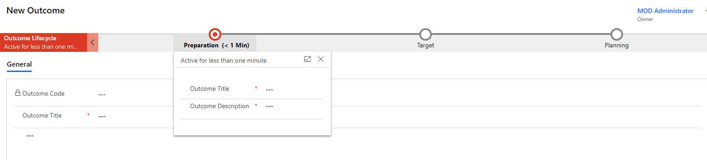
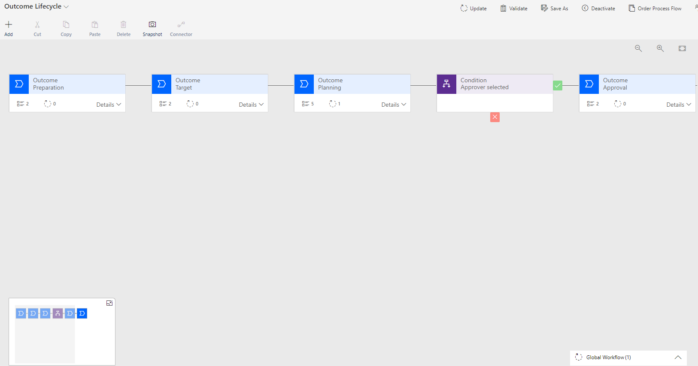

---
lab:
    title: 'Lab 6.2: Business process flows'
    module: 'Module 6: Build automation with Power Automate'
---

# Practice Lab 6.2 – Business process flows

## Scenario

You are a Power Platform functional consultant and have been assigned to the Fabrikam project for the next stage of the project.

In this practice lab, you will review the existing business process flow on the outcome table and add branching on approval. You will also configure security for the business process flow.

## Exercise 1 – Review the business process flow

In this exercise you will run the business process flow to generate an approval. You will approve the request and finish the business process flow. You will then examine the business process flow components in the business process flow designer.

### Task 1.1 - Run the app

1. Navigate to the Power Apps Maker portal <https://make.powerapps.com>.

1. Make sure you are in the **Practice** environment.

1. Select **Solutions**.

1. Click to open the **Fabrikam Environmental** solution.

1. In the **Objects** pane on the left, select **Apps**.

1. Select the **Environmental Environmental Project Delivery** app, click on the ellipses (...), and select **Play**.

1. In the left-hand navigation, select **Outcomes**.

1. Click **+ New**

1. You should see the **Outcome Lifecycle** business process flow at the top of the form.

    

1. The business process flow has 5 stages (3 of which are showing):

    - Preparation
    - Target
    - Planning
    - Approval
    - Review

1. Click on the **Preparation** stage.

1. Enter an **Outcome Title** and an **Outcome Description**.

1. Click **Save**.

1. Click on the **Preparation** stage.

1. Click on **Next Stage**.

1. Click on **Next Stage** again and note that errors are shown for fields must be filled in.

1. Select an **Aim**.

1. Enter a **Goal**.

1. Click on **Next Stage**.

1. Select **Yes** for **Stakeholders identified**, **Tasks created**, and **Tasks assigned**.

1. Enter an **Estimated Completion Date**.

1. Select **MOD Administrator** for **Approver**

1. Note that the other stages appear when an approver is selected.

1. Click on **Next Stage**.

1. Click on **Run Flow**.

1. Click **Continue**.

1. Click **Run flow**.

1. Click **Done**.

1. This starts the **Request approval** cloud flow you enhanced in an earlier lab.

    > NOTE: The first time an approval is created in an environment, the approvals solution is automatically installed. This installation can take up to 10 minutes.

### Task 1.2 - Approve the request

1. Open a new tab in the browser and navigate to Microsoft Teams <https://teams.microsoft.com>.

1. Sign in with your Microsoft 365 credentials.

1. Click **Use the web app instead**.

1. Click on **Apps** in the bottom of the left-hand rail.

1. Search for **Approvals**.

1. Select **Approvals** by Microsoft Corporation.

1. Click **Open**. The approvals app will be added to the left-hand rail. Right click on the app and select **Pin**.

1. Select the **Practice** environment.

1. Select the approval.

1. Click on **Approve**

1. Switch to the model-driven app. In the Outcome form, click **Refresh**

1. Click on the **Approval** stage. The **Approved** step should be set to **Yes**.

1. Click on **Next Stage**.

1. Select **Yes** for **Tasks completed**, and **Impact assessment completed**.

1. Click on **Finish**.

### Task 1.3 - Review the business process flow

1. Navigate to the Power Apps Maker portal <https://make.powerapps.com>.

1. Make sure you are in the **Practice** environment.

1. Select **Solutions**.

1. Click to open the **Fabrikam Environmental** solution.

1. In the **Objects** pane on the left, select **Processes**.

1. Select **Outcome Lifecycle**, click on the ellipses (...), and select **Edit**.

    

1. Expand **Details** on the first stage. There are two data steps for **Outcome Title** and an **Outcome Description**.

1. Select the **Condition** tile. The rule checks that the Approver contains data.

1. Expand **Details** on the **Approval** stage. There is a flow step.

1. Click on the **Flow Step**. The flow run is **Request Approval**.

1. Expand **Details** on the **Planning** stage. Under Trigger Process there is a workflow step.

1. Click on the **Workflow** step. The workflow **Outcome Lifecycle Change Status - On Schedule** is triggered when the stage exits.

1. Click on the caret next to **Global Workflow**. These is a workflow step.

1. Click on the global workflow step. The workflow **Outcome Lifecycle Change Status - Completed** is triggered when the process is completed.

## Exercise 2 – Modify business process flow

In this exercise, you will add branching on the approval to the business process flow.

### Task 2.1 – Add branch

1. Navigate to the Power Apps Maker portal <https://make.powerapps.com>.

1. Make sure you are in the **Practice** environment.

1. Select **Solutions**.

1. Click to open the **Fabrikam Environmental** solution.

1. In the **Objects** pane on the left, select **Processes**.

1. Select **Outcome Lifecycle**, click on the ellipses (...), and select **Edit**.

1. Select the **Components** tab

1. Drag **Condition** and drop it on the white plus icon mark in between the **Approval** and the **Review** stages.

1. Select the **Condition** tile in the canvas and in the Properties pane enter **Check Approval** for **Display Name**.

1. In the **Rule 1** section, select **Approved** for **Field**, select **Equals** for **Operator**, select **Value** for **Type**, and select  **Yes** for **Value**.

1. Click **Apply**.

    > IMPORTANT: The designer does not auto-save. You must click on Apply when editing each element in the process.

1. Click on **+ Add** and select **Add Stage** and then click the white plus icon underneath the **Check Approval** condition tile.

1. Select the **New Stage** tile, click **Connector** and select **Disconnect**.

1. Select the **New Stage** tile in the canvas and in the Properties pane enter **Rejected** for **Display Name** and select **Resolve** for **Category**.

1. Click **Apply**.

1. Expand **Details** on the **Resolve** stage.

1. Select **Data Step #1** and in the Properties pane select **Outcome status** and check the **Required** box.

1. Click **Apply**.

1. Click **Validate**.

1. Click **Update**.

1. Close the business process flow designer.

1. Click **Done**.

## Exercise 3 – Modify the Environmental user security role

In this exercise, you will enable users to use the business process flow.

### Task 3.1 – Add privileges for business process flow

1. Navigate to the Power Apps Maker portal <https://make.powerapps.com>.

1. Make sure you are in the **Practice** environment.

1. Select **Solutions**.

1. Click to open the **Fabrikam Environmental** solution.

1. In the **Objects** pane on the left, select **Security roles**.

1. Select the **Environmental user** role and click **Edit**.

1. Select the **Business Process Flows** tab.

1. Click on **Outcome Lifecycle** name to change all privilege access levels to **Organization**.

1. Click **Save and Close**.

1. Click **Done**.

## Exercise 4 – Solutions

In this exercise, you will export the solution from the Practice environment and import it into the MOD Administrator's environment.

### Task 4.1 – Export managed solution

1. Navigate to the Power Apps Maker portal <https://make.powerapps.com>.

1. Make sure you are in the **Practice** environment.

1. Select **Solutions**.

1. Select the **Fabrikam Environmental** solution but do not open it.

1. Select **Export Solution**.

1. Click **Next**.

1. The version number should have been incremented to **1.1.11.12**.

1. Select **Managed** for **Export As**.

1. Click **Export**.

1. The export will be prepared in the background, when the solution is ready click the **Download** button.

### Task 4.2 – Export unmanaged solution

1. Select the **Fabrikam Environmental** solution.

1. Select **Export Solution**.

1. Click **Next**.

1. The version number should have been incremented to **1.1.11.13**.

1. Select **Unmanaged** for **Export As**.

1. Click **Export**.

1. The export will be prepared in the background, when the solution is ready click the **Download** button.

### Task 4.3 – Import managed solution

1. Switch environments by using the Environment Selector in the upper right corner of the Maker portal.

1. Select the **MOD Administrator's Environment** environment from the list.

1. Select **Solutions**.

1. Select **Import solution**.

1. Select **Browse**, change to the **Downloads** folder and select **FabrikamEnvironmental_1_1_11_12_managed.zip** and select **Open**.

1. Click **Next**.

1. Click **Import**. The solution will import in the background.
