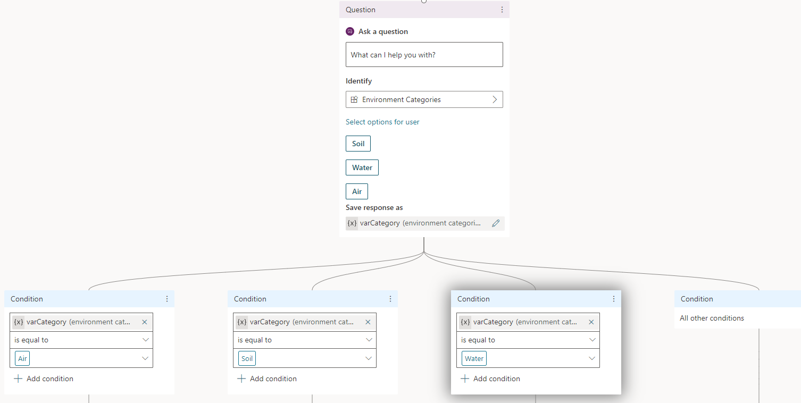
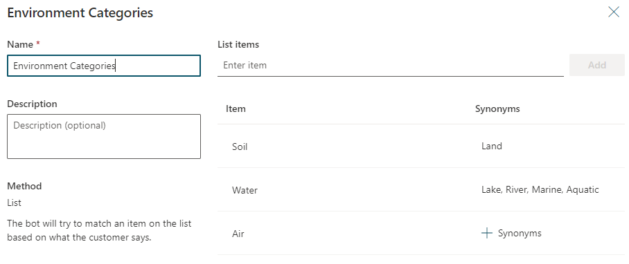
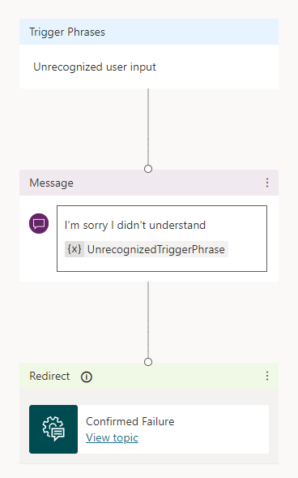

---
lab:
    title: 'Lab 7.1: Power Virtual Agents'
    module: 'Module 7: Build chatbots with Power Virtual Agents'
---

# Practice Lab 7.1 – Power Virtual Agents

## Scenario

You are a Power Platform functional consultant and have been assigned to the Fabrikam project for the next stage of the project.

In this practice lab, you will review the existing chatbot. You will explore and enhance the bot.

## Exercise 1 – Getting started

In this exercise, you will acquire a PVA trial and examine the components in the chatbot.

### Task 1.1 – Sign up for a PVA trial

1. Navigate to the Power Apps Maker portal <https://make.powerapps.com>.

1. Make sure you are in the **Development** environment.

1. Select **Solutions**.

1. Click to open the **Fabrikam Chatbot** solution.

1. In the **Objects** pane on the left, select **Chatbots**.

1. Click on the **Environmental Support Bot** chatbot.

1. If you are prompted to start a trial, sign in with your Microsoft 365 credentials and click **Continue**.

1. Click **Get Started**.

1. Click **Get Started** again.

1. Select  **United States** click **Get Started**.

### Task 1.2 – Test the bot

1. In Power Virtual Agents, select **Topics**. You should see three user topics for Air, Soil, and Water along with the system topics.

1. If the Test bot pane is not showing, click **Test your bot** to show the bot.

1. Type **Hi** and click **Send**.

1. The bot should show the greeting message.

1. Type **How can I be a sustainable farmer?** and click **Send**.

1. Select **Soil**.

1. Select **Soil management practices**.

1. Select **Yes**.

1. Click on a rating.

1. Select **Yes**.

In the list of topics, click on the **Water** topic to open the authoring canvas.

1. In the Text bot pane, type **What are ways of conserving water?** and click **Send**. You should see the authoring canvas show the question node.

1. Type **At home** and click **Send**. You should see the authoring canvas show the message node.

1. Click on a rating.

1. Select **Yes**.

1. Select **Topics** and then click on the **Air** topic to open the authoring canvas.

1. In the Text bot pane, type **How can I reduce air pollution?** and click **Send**.

1. You should see a list of projects in the Test bot pane and in the authoring canvas you should see the Action node that calls a Power Automate flow that retrieves the list of projects from Dataverse.

1. Select **No**.

1. Select **Reprhase**.

1. **Click on Hide bot**.

### Task 1.3 – Review topics

1. Select **Topics** and then click on the **Greeting** topic to open the authoring canvas.

1. You should see 50+ trigger phrases and three message nodes.

1. Review the trigger phrases for this topic.

1. Select **Topics** and then click on the **Soil** topic to open the authoring canvas.

1. Review the trigger phrases for this topic.

1. You should see four message nodes followed by a question node that uses multiple choice options.

1. Select **Topics** and then click on the **Water** topic to open the authoring canvas.

1. Review the trigger phrases for this topic.

1. You should see a message node followed by a question node that uses a custom entity called WaterHelp for choices. Note that the response is saved in a variable.

1. Select **Topics** and then click on the **Air** topic to open the authoring canvas.

1. Review the trigger phrases for this topic.

1. You should see a message node followed by an action node that calls a Power Automate cloud flow.

1. The list of project returned by the flow is stored in a variable that is shown in another message node.

1. Click on **View flow details**.

1. Click **Edit** at the top of the flow and review the actions in the flow.

1. Close the flow editor.

### Task 1.4 – Review entities

1. Select **Entities**

1. Select **WaterHelp**. You should see three items with synonyms.

1. Click on **X** to close the entities pane.

## Exercise 2 – Enhance the chatbot

In this exercise, you make changes to topics and entities.

### Task 2.1 - Change greeting

1. Navigate to the Power Apps Maker portal <https://make.powerapps.com>.

1. Make sure you are in the **Development** environment.

1. Select **Solutions**.

1. Click to open the **Fabrikam Chatbot** solution.

1. In the **Objects** pane on the left, select **Chatbots**.

1. Click on the **Environmental Support Bot** chatbot to edit the chatbot.

1. In Power Virtual Agents, select **Topics**.

1. Click on the **Greeting** topic to open the authoring canvas.

1. Select the first **Message** and replace the message with the text below.

    ```Hi! I'm a virtual agent. I can help you with environmental sustainability options.```

1. Select the second **Message** and replace the message with the text below.

    ```If you would like to speak to a human at any time, just let me know.```

1. Click on the ellipses (...) on the the last message and select  **Delete**.

1. Click **Add node**.

1. Select **Ask a question**.

1. Enter **What can I help you with?** for question.

1. Select the **Environment Categories** entity for **Identify**

1. Click on **Select options for user**.

1. Check all three boxes for **Soil**, **Water**, and **Air**.

1. Under **Save response as**, click on **Var**.

1. In the Variable properties pane, enter **varCategory** for **Name**.

1. Click on **X** to to close the variable pane.

1. Under the question, click **Add node**.

1. Select **Add a condition**.

1. In the condition, select **varCategory** for **Select a variable** and select **Air** for the value.

1. Above the condition, click **Add node** and select **Add a condition**.

1. In the condition, select **varCategory** for **Select a variable** and select **Soil** for the value.

1. Above the condition, click **Add node** and select **Add a condition**.

1. In the condition, select **varCategory** for **Select a variable** and select **Water** for the value.

1. You should have four condition branches.

    

1. Under the **Air** condition, click **Add node** and select **Redirect to another topic**.

1. Select **Air**.

1. Under the **Soil** condition, click **Add node** and select **Redirect to another topic**.

1. Select **Soil**.

1. Under the **Water** condition, click **Add node** and select **Redirect to another topic**.

1. Select **Water**.

1. Under the **All other conditions** condition, click **Add node** and select **Redirect to another topic**.

1. Select **Confirmed Failure**.

1. Click **Save**.

1. If the Test bot pane is not showing, click **Test your bot** to show the bot.

1. Type **Hey** and click **Send**.

1. The bot should now use your updated greeting message and a prompt to select the category.

### Task 2.2 - Trigger phrases

1. Select **Topics** and then click on the **Soil** topic to open the authoring canvas.

1. In the action bar, click **Trigger phrases**.

1. Type  **How can I farm sustainably?** and click on the **+** icon.

1. Click on **X** to to close the Trigger phrases pane.

1. Click **Save**.

### Task 2.3 - Entity

1. Select **Entities**

1. Select **Environment Categories**.

1. Click **+ Synonyms** for **Soil**.

1. Type **Land** and click **Add**.

1. Click **Done**.

1. Click **+ Synonyms** for **Water**.

1. Type **Aquatic** and click **Add**.

1. Type **Marine** and click **Add**.

1. Type **River** and click **Add**.

1. Type **Lake** and click **Add**.

1. Click **Done**.

    

1. Click **Save**.

1. Click on **X** to to close the Environment categories phrases pane.

### Task 2.4 - Fallback

1. Click **Settings** in the top-right of Power Virtual Agents.

1. Click **General Settings**.

1. Select **System fallback**.

1. Click **+ Add**.

1. Click **Go to fallback topic**. The authoring canvas for the Fallback topic will open.

1. Select the first **Message** node and replace the message with the text below.

    ```I'm sorry I didn't understand```

1. Click on caret in the message, select variables **{x}** and select **UnrecognizedTriggerPhrase**.

1. Click on the ellipses (...) on the the Redirect node and select  **Delete**.

1. Click on **+ Add** node and select **Redirect to another topic**.

1. Select **Confirmed Failure**.

    

1. Click **Save**.

## Exercise 3 – Publish the bot

In this exercise you will publish the chatbot.

### Task 3.1: Publish

1. Navigate to the Power Apps Maker portal <https://make.powerapps.com>.

1. Make sure you are in the **Development** environment.

1. Select **Solutions**.

1. Click to open the **Fabrikam Chatbot** solution.

1. In the **Objects** pane on the left, select **Chatbots**.

1. Click on the **Environmental Support Bot** chatbot to edit the chatbot.

1. In Power Virtual Agents, select **Publish**.

1. Click **Publish** and then click **Publish** again wait for publishing to complete.

### Task 3.2: Demo website

1. Click on the **demo website** link under **Share your bot**.

1. Interact with chatbot on the demo website and see how it performs.

### Task 3.3: Channels

1. In Power Virtual Agents, on the left-hand pane navigation click and expand **Settings**.

1. Click **Channels**.

1. Select **Custom website** and view the embed code.

1. Click on **X** to to close the Custom website pane.

1. Select **Slack** and view Bot ID and Tenant ID.

1. Click on **X** to to close the Slack pane.

### Task 3.4: Artificial Intelligence

1. Click **AI capabilities**.

1. Check the box for **Topic overlap detection**.

1. Click **Save**.
